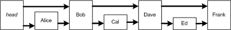
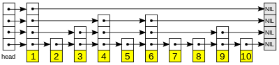

Skip list
---

## Background

Back in 1989, `William Pugh`, a computer science professor at the University of Maryland, was looking at sorted linked lists one day thinking about their running time. Clearly a sorted linked list takes linear time to search since potentially each element must be visited, one right after the other. Pugh thought to himself that if half the elements in a sorted linked list had two neighbor references—one pointing to its immediate neighbor, and another pointing to the neighbor two elements ahead—while the other half just had one, then searching a sorted linked list could be done in half the time. The following figure illustrates a two-reference sorted linked list.





## Introduction

Skip list is a balanced, dynamic data structure that allows fast search within an ordered sequence of elements.





A skip list is built in layers. The bottom layer is an ordinary ordered linked list. Each higher layer acts as an "express lane" for the lists below, where an element in layer `i` appears in layer `i+1` with some fixed probability `p` (two commonly used values for `p` are `1/2` or `1/4`).


The skip list works its magic by giving each element in the linked list a random "height".


Balanced trees (e.g., AVL trees [Knu73] [Wir76]) and self adjusting trees [ST85] can be used for the same problems as skip lists. All three techniques have performance bounds of the same order. A choice among these schemes involves several factors: the difficulty of implementing the algorithms, constant factors, type of bound (amortized, probabilistic or worst-case) and performance on a non-uniform distribution of queries.


## Implementations


### Initialization


### Search


### Insertion


### Deletion


``` python
class Node(object):
    def __init__(self, v=None, level=1):
        """ SkipList node
        """
        self.value = v
        self.level = level
        self.forward = [None] * level


class SkipList(object):
    """
    Refers to William Pugh
        "Skip Lists: A Probabilistic Alternative to Balanced Trees"
    """
    def __init__(self, max_level=16, p=0.5):
        assert max_level >= 1
        self.max_level = max_level

        assert 0 < p < 1
        self.prob = p  # 1/2 or 1/4 are widely used

        self.header = Node()  # the skip list has a dummy header element
        self.count = 0  # the count of nodes

    @classmethod
    def from_list(cls, seq):
        """ A helper method to build Skip-list
        """
        list_ = SkipList()
        for e in seq:
            list_.insert(e)
        return list_

    def __len__(self):
        return self.count

    @property
    def level(self):
        return len(self.header.forward)

    height = level  # alias to level

    def random_level(self):
        """ Choose a random level
        """
        l = 1
        while randint(0, 1) < self.prob and l < self.max_level:
            l += 1
        return l

    def search(self, value):
        """ Returns True if found the given value, otherwise False
        """
        cur = self.header
        for l in reversed(range(self.level)):
            while cur.forward[l]:
                if cur.forward[l].value < value:
                    cur = cur.forward[l]  # move to the next node
                elif cur.forward[l].value == value:
                    return True
                else:
                    break

        return False

    __contains__ = search

    def insert(self, value):
        """ insert a value into the list, note that `None` is not allowed

        Raise ValueError if a duplicate value found
        """
        assert value is not None

        update_vector = self.build_update_vector(value)
        cur = update_vector[0]

        if cur.forward[0] and cur.forward[0].value == value:
            raise ValueError("Duplicated value <%r> found" % value)

        level = self.random_level()

        # increment the list's level
        if level > self.level:
            for l in range(self.level+1, level+1):
                update_vector.append(self.header)
            self.header.forward.extend([None] * (level - self.level))

        # create a new node
        node = Node(value, level)
        self.count += 1

        for i in range(level):
            node.forward[i] = update_vector[i].forward[i]
            update_vector[i].forward[i] = node

    def build_update_vector(self, value):
        """
        Given a skip list of level `h`, in order to thread in a new node,
        `h` references will have to be updated in existing skip list nodes.

        update_vector[i] contains the node whose reference at level i will
         need to be re-threaded to point to the newly inserted node
        """
        update_vector = [None] * self.level

        cur = self.header
        for l in reversed(range(self.level)):
            while cur.forward[l] and cur.forward[l].value < value:
                cur = cur.forward[l]
            update_vector[l] = cur
        return update_vector

    def delete(self, value):
        """
        """
        update_vector = self.build_update_vector(value)
        cur = update_vector[0]

        d_node = cur.forward[0]
        if d_node and d_node.value != value:
            raise ValueError("value %s not found in list" % value)

        self.count -= 1

        for l in range(d_node.level):
            update_vector[l].forward[l] = d_node.forward[l]

        # After deletion, we check if the we have deleted the maximum node
        # of the list and if so, decrease the maximum level of the list
        while self.level > 1 and self.header.forward[-1] is None:
            self.header.forward = self.header.forward[:-1]

    __delitem__ = delete

    def __repr__(self):
        """ print the entire list (at level 1)
        """
        cur = self.header.forward[0]
        seq = []
        while cur:
            seq.append('%s[%s]' % (cur.value, cur.level))
            cur = cur.forward[0]
        return '-->'.join(seq)

    __str__ = __repr__
```

A smoke test case

``` python
def test_insert():
    input = [90, 100, 120]
    list = SkipList.from_list(input)

    assert len(list) == 3
    for e in input:
        assert e in list
```

Using skip lists, it is easy to do most (all?) the sorts of operations you might wish to do with a balanced tree such as use search fingers, merge skip lists and allow ranking operations (e.g., determine the kth element of a skip list)


## Further Readings

* Skip Lists: A Probabilistic Alternative to Balanced Trees, William Pugh

* [Skip Lists: A Linked List with Self-Balancing BST-Like Properties, Part 4, in MSDN](https://msdn.microsoft.com/en-us/library/ms379573(v=vs.80).aspx#datastructures20_4_topic4)
