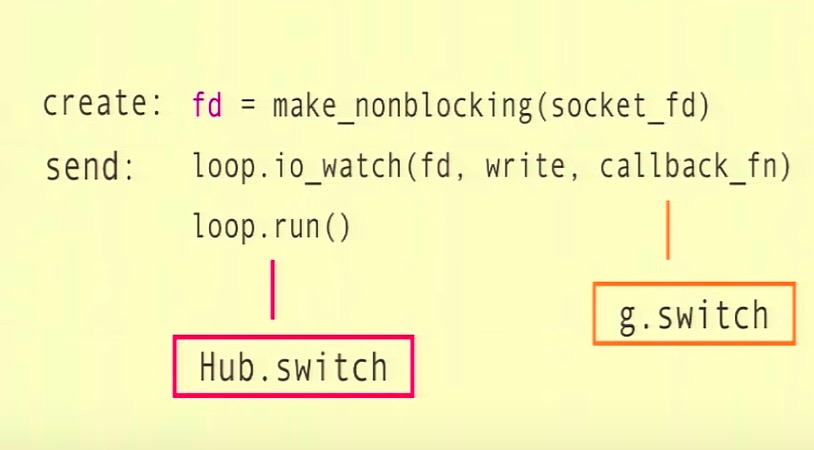

Gevent
---

gevent is a `coroutine-based` Python networking library that uses `greenlet` to provide a high-level synchronous API on top of the `libev` event loop.

gevent 是一个基于协程的 Python 网络库; 基于 `greenlet` 和 `libev` 提供了一个高层次的同步接口; 王爷以为这是 Python 最出色的库之一.


[About Libev](http://pod.tst.eu/http://cvs.schmorp.de/libev/ev.pod)
----
Libev (first released in 2007-11-12) is a high-performance event loop written in C, supporting eight event types

* `I/O`

* `real time timers`

* `wall clock timers`

* `signals`

* `child status changes`

* `idle`

* `check handlers`

* `prepare handlers`


It uses a `priority queue` to manage timers and uses `arrays` as fundamental data structure. It has no artificial limitations on the number of watchers waiting for the same event.

It offers an emulation layer for `libevent` and optionally the same `DNS`, `HTTP` and `buffer management` (by reusing the corresponding `libevent` code through its emulation layer).


Greenlet
---

* user space - the OS does not create or manage them 用户空间 - 操作系统不创建和管理它们

* cooperatively scheduled - the OS does not schedule or preempt them
协作式调度, 操作系统并不调度和抢占它们

* lightweight 轻量


#### Create a Greenlet
New greenlets are spawned by creating a `Greenlet` instance and calling its `start` method. (The `gevent.spawn()` function is a shortcut that does exactly that).

The `start` method schedules a switch to the greenlet that will happen as soon as the current greenlet gives up control.


#### Error Handling

If there is an error during execution it won’t escape the greenlet’s boundaries. An unhandled error results in a stacktrace being printed, annotated by the failed function’s signature and arguments:

<div class="alert alert-info">The traceback is asynchronously printed to `sys.stderr` when the greenlet dies.
</div>

#### Customization

To subclass a `gevent.Greenlet`, override its `gevent.Greenlet._run()` method and call `Greenlet.__init__(self)` in `__init__`


#### Terminating a Greenlet

Greenlets can be killed synchronously from another greenlet. Killing will resume the sleeping greenlet, but instead of continuing execution, a `GreenletExit` will be raised.

Greenlets 可以被其他 greenlet kill 掉. kill 操作会唤醒休眠 greenlet 的执行, 准确的说是, 此时会抛出 `GreenletExit` 异常

**Caution:** Use care when killing greenlets, especially arbitrary greenlets spawned by a library or otherwise executing code you are not familiar with. If the code being executed is not prepared to deal with exceptions, object state may be corrupted.

**小心** 当 kill greenlets 时要小心, 尤其是那些你并不熟悉的库创建的 greenlet. 如果执行的代码没有很好的处理异常, 那么对象的状态可能已经混乱了.


[Hub](http://www.gevent.org/gevent.hub.html)
---
`Hub`, a special greenlet that runs the `event loop`.

<pre>
               +-------+
               |  Main |
               +-------+
                   ^
                   |
               +-------+
               |  Hub  |
               +-------+
                ^  ^  ^
      +--->-----+  |  +-----<-----+
      |            |              |
+----------+  +----------+  +----------+
| Greenlet |  | Greenlet |  | Greenlet |
+----------+  +----------+  +----------+

</pre>


#### Event loop
...


Cooperative multitasking
---
It is using cooperative scheduling of the greenlets in a single OS process/thread.

Note that the greenlet need to voluntarily switch back to the event loop, any blocking call would block the event loop

在单进程/线程内使用协作式的调度; 注意 greenlet 需要自愿地切回到主事件循环, 另所有阻塞操作都会阻塞整个事件循环


Monkey Patch
---

``` Python
from gevent import monkey

monkey.patch_socket()
```





<div class="alert alert-primary">
<p>When monkey patching, <b>it is recommended to do so as early as possible in the lifetime of the process</b>. If possible, monkey patching should be the first lines executed. Monkey patching later, especially if native threads have been created, `atexit` or `signal handlers` have been installed, or sockets have been created, may lead to unpredictable results including unexpected `LoopExit` errors.
</p>
<hr>

<p> <b>建议在整个程序的生命周期中尽可能早地执行 monkey patching</b>. 如果有可能, monkey patch 应该作为程序的第一行代码执行. 越晚执行, 尤其是当创建了原生线程,此时可能 `atexit` 或者信号处理函数已经被注册, 又或者 socket 被创建, 这些都会导致包括 `LoopExit` 在内的不期望的错误出现.
</p>
</div>


Multi-process
---
The combination of `multiprocessing` and `gevent` brings along certain OS-dependent pitfalls, among others

多进程和 gevent 的组合使用, 可能会带来一些操作系统依赖的错误, 比如

* After forking on POSIX-compliant systems gevent's state in the child is ill-posed. One side effect is that greenlets spawned before `multiprocessing.Process` creation run in both, parent and child process.

* `a.send()` in `put_msg()` above might still block the calling thread non-cooperatively: a ready-to-write event only ensures that one byte can be written. The underlying buffer might be full before the attempted write is complete.

* The `wait_write()` / `wait_read()-based` approach as indicated above does not work on Windows (`IOError: 3 is not a socket (files are not supported)`), because Windows cannot watch pipes for events.


Be sure you understand these consequences before using this functionality, especially late in a program’s lifecycle. For a more robust solution to certain uses of child process, consider `gipc`.


**Caution:** Forking a child process that uses `gevent`, `greenlets`, and `libev` can have some unexpected consequences if the child does not immediately `exec` a new binary.

**小心** 如果 `fork` 一个使用了 `gevent` 的子进程, 且没有立即使用 `exec` 加载一个新程序, 那么 `greenlet` 和 `libev` 可能会导致一些不期望的结果


As an example, `do_magic` will be called both in parent and child process.

```python
import gevent

from gevent import monkey
monkey.patch_all()

import os, time


def do_magic():
    print 'magic...'

def main():
    g = gevent.spawn_later(1, do_magic)

    pid = os.fork()
    if pid != 0:  # parent
        g.join()
    else:
        time.sleep(3)

main()
```

#### [Subprocess support](http://www.gevent.org/gevent.subprocess.html#module-gevent.subprocess)


Utility
---
To limit concurrency, use the `gevent.pool.Pool` class


Pros & Cons
---
### pros

* excellent for workloads that are IO/bound, highly concurrent 非常适用于 I/O 密集型工作, 高并发


### cons

+ no parallelism 没有并行

+ non-cooperative code will block the entire process 非协作式的代码会阻塞整个程序

    * C Extensions -> use pure Python libraries C 扩展库需替换成纯 Python 库

    * compute-bound greenlets -> use `gevent.sleep(0)` 计算密集型 greenlets 使用  `gevent.sleep(0)`

+ use greenlet blocking detection (greenlet `settrace`) 使用 greenlet 提供的阻塞检测方法


Further Reading
---

* [Github Official Document](http://www.gevent.org/intro.html)

* [gevent For the Working Python Developer](http://sdiehl.github.io/gevent-tutorial/)

* [Gevent source code](https://github.com/gevent/gevent)

- - -

* [Kavya Joshi - A tale of concurrency through creativity in Python: a deep dive into how gevent works](https://www.youtube.com/watch?v=GunMToxbE0E)
