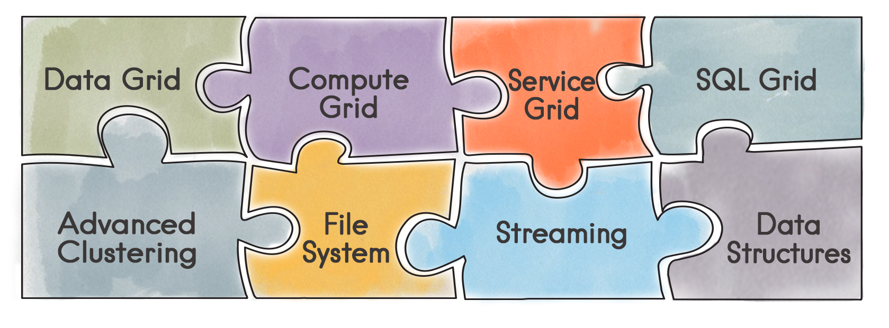

Apache Ignite
---

The **Apache Ignite** In-Memory Data Fabric is a high-performance, integrated and distributed in-memory platform for computing and transacting on large-scale data sets in real-time, orders of magnitude faster than possible with traditional disk-based or flash technologies.

Further Reading
---

* [Github Source Code](https://github.com/apache/ignite)

