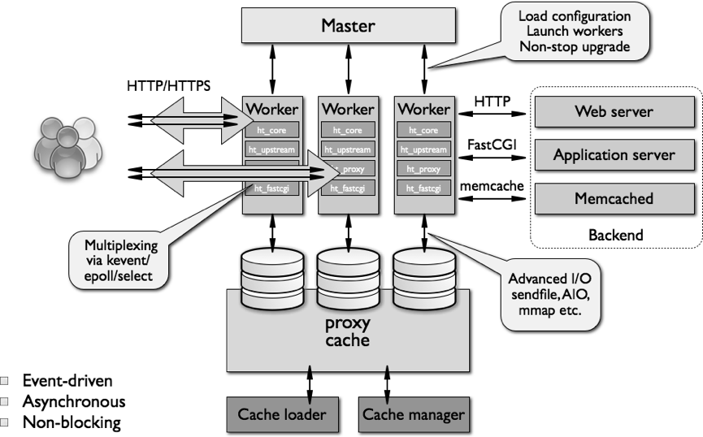

Architecture
---

nginx uses `multiplexing` and `event notifications` heavily, and dedicates specific tasks to separate processes.

Connections are processed in a highly efficient run-loop in a limited number of single-threaded processes called workers. Within each worker nginx can handle many thousands of concurrent connections and requests per second.

