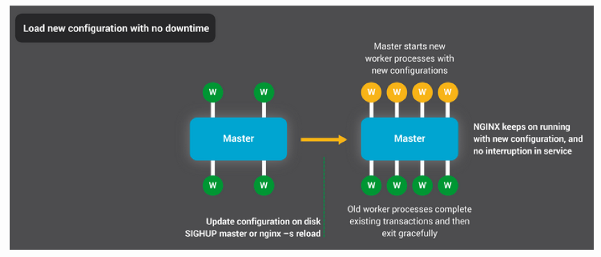
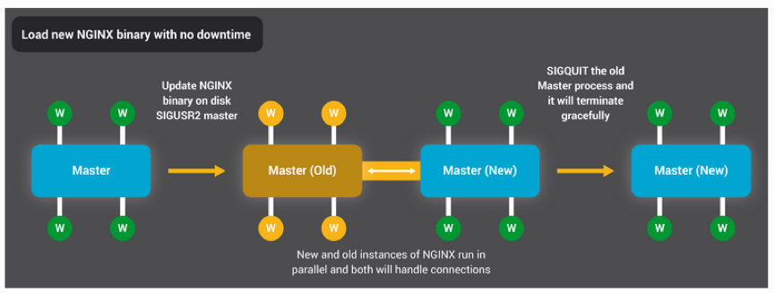

Controlling nginx
---

nginx can be controlled with signals. The process ID of the master process is written to the file `/usr/local/nginx/logs/nginx.pid` by default. This name may be changed at configuration time, or in `nginx.conf` using the pid directive.

The master process supports the following signals:

* `TERM, INT`	fast shutdown

* `QUIT`	graceful shutdown

* `HUP`

    changing configuration, keeping up with a changed time zone (only for FreeBSD and Linux), starting new worker processes with a new configuration, graceful shutdown of old worker processes

* `USR1`	re-opening log files

* `USR2`	upgrading an executable file

* `WINCH`	graceful shutdown of worker processes

Individual worker processes can be controlled with signals as well, though it is not required. The supported signals are:

* `TERM, INT`	fast shutdown

* `QUIT`	graceful shutdown

* `USR1`	re-opening log files

* `WINCH`

    abnormal termination for debugging (requires debug_points to be enabled)

### Updating Configuration and Upgrading Nginx

Updating NGINX configuration is a very simple, lightweight, and reliable operation. It typically just means running the `nginx –s reload` command, which checks the configuration on disk and sends the master process a `SIGHUP` signal.

When the master process receives a `SIGHUP`, it does two things:

1. Reloads the configuration and forks a new set of worker processes. These new worker processes immediately begin accepting connections and processing traffic (using the new configuration settings).

2. Signals the old worker processes to gracefully exit. The worker processes stop accepting new connections. As soon as each current HTTP request completes, the worker process cleanly shuts down the connection (that is, there are no lingering keepalives). Once all connections are closed, the worker processes exit.

## References

* http://nginx.org/en/docs/control.html

