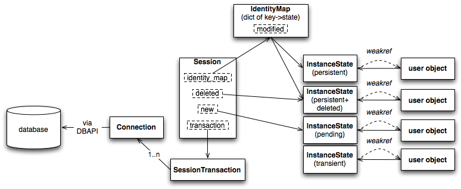

SQLALchemy is a database toolkit and Object Relational Mapper for the Python, first introduced in 2005.

SQLALchemy 是在 2005 年开始的一个 ORM 库, 使用 Python 实现. 支持 MySQL, Postgresql, Oracle, MS-SQL, SQLite 等众多数据库


Overview
---


SQLALchemy consists of a `Core` and separate `ORM` component.

The Core offers a full SQL expression language that allows Pythonic construction of SQL constructs that render directly to SQL strings for a target database, returning result sets that are essentially enhanced DBAPI cursors.


ORM
---

<pre>
+---------------------------------------+
|           Session                     |
|                                       |
|                +----------+           |
|  new           |          |           |
|                +----------+           |
|                                       |
|                +----------+           |
|  dirty         |          |           |
|                +----------+           |                               +------+
|                                       |                               |      |
|                +----------+           |       +------------------+    |      |
|  deleted       |          |           |       | DBAPI Connection |----|      |
|                +----------+           |       +------------------+    |  DB  |
|                                       |       | DBAPI Connection |----|      |
|                +----------+           |       +------------------+    |      |
| identity_map   |          |           |       | DBAPI Connection |----|      |
|                +----------+           |       +------------------+    |      |
|                                       |           ^          ^        +------+
|                +--------------------+ |           |          |
| transaction    |Session Transaction | |           |          |
|                +                    | |           |          |
|                | < Connection > ------------->----+          |
|                +--------------------+ |                      |
|                                       |                      |
|                +----------+           |                      |
|  bind          |< Engine >|           |                      ^
|                +----------+           |                      |
+------------------|--------------------+                      |
                   |                                           |
                   V                                           |
          +----------------+         +--------------------+    |
          |     Engine     |         |   Pool             |    |
          |  +----------+  |         |                    |    |
          |  | < Pool > |----------->+--------------------+    |
          |  +----------+  |         |< DBAPI Connection >|-->-+
          +----------------+         +--------------------+

</pre>


[Session](http://docs.sqlalchemy.org/en/latest/orm/session.html)
---




核心 Features
---

### Separate mapping and class design

``` Python
from sqlalchemy import Integer, Column
from sqlalchemy.ext.declarative import declarative_base

Base = declarative_base()


class A(Base):
    __tablename__ = 'a'

    id = Column(Integer, primary_key=True)
    age = Column(Integer)
```

通过以上代码,我们就完成了对表 `a` 的 ORM, 看起来很简单

其中 `declarative_base()` 返回一个 base class (默认通过元类 `DeclarativeMeta` 构造); 这个 base class 会为其子类, 比如上面的 `A`, 提供一个 `__init__`, 它允许我们根据类成员实例化一个对象, 不用再辛苦的手写一个构造函数.

``` Python
a = A(age=27)
```

另当创建新的子类继承自 Base 时, `DeclarativeMeta` 的构造函数会被调用, 后者将 `A` 中 `Column` 类型的成员替换成 `InstrumentedAttribute` (一个 `data descriptor` 数据描述符), 使得对类成员的访问最终演变成对 instance dictionary 的访问

``` Python
# a.age = 23  ==>  A.age.__set__(a, 23) ==> a.__dict__['age'] = 23

a.age = 23
```

借助于 Python 中的元类 metaclass 和数据描述符 data descriptor, 我们可以很轻易的定义一个 Model. 相对于 Java 中 mybatis 所做的繁琐工作, 此处省略一百字... :-)


### Unit Of Work
...
This pattern is where the system transparently keeps track of changes to objects and periodically flushes all those pending changes out to the database.


Further Reading
---

* [Sqlalchemy Official Site](http://www.sqlalchemy.org/) - 官方文档

* [SQLALchemy - The Architecture of Open Source Applications](http://www.aosabook.org/en/sqlalchemy.html) - SQLALchemy 架构

* [Sqlalchemy Source Code](https://github.com/zzzeek/sqlalchemy) - 源码
