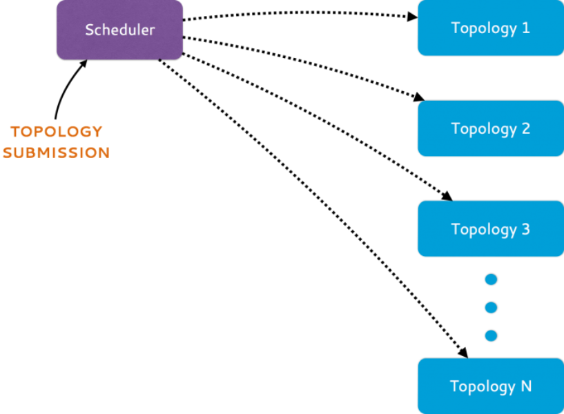
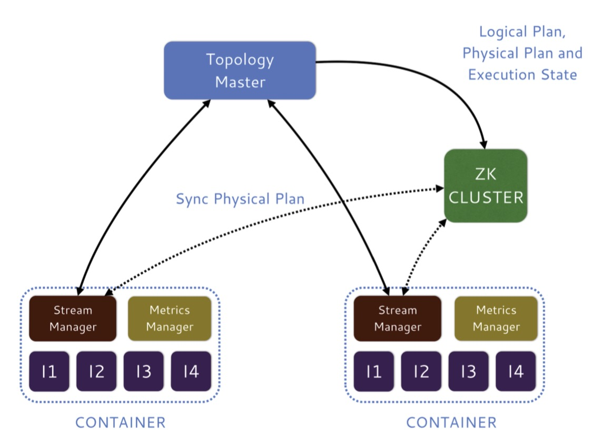

writing...

Heron, a real-time, distributed, fault-tolerant stream processing engine from Twitter.

Architecture
---

### Heron Architecture

### Topology Architecture

1 Users employ the Storm API to submit topologies to a scheduler.

2 The scheduler runs each topology as a job consisting of several **containers**.
   * One of containers runs the **topology master**, responsible for managing the topology.

   * The remaining containers each run a **stream manager** responsible for data routing, a **metric manager** that collects and report various metrics and a number of processes called **Heron instances** which run the user-defined spout/bolt code

These containers and allocated and scheduled by scheduler based on resource availability across the nodes in the cluster.

The metadata for the topology, such as physical plan and execution details, are kept in Zookeeper.

### Core components of Heron

* Topology Master

* Container

* Stream Manager

* Metrics Manager

* Heron Instance

* Heron Tracker

Schedulers
---
...

State Managers
---
...

Further Reading
---

* [Heron Official Document](http://twitter.github.io/heron/docs)

* [Twitter Heron: Stream Processing at Scale](http://dl.acm.org/citation.cfm?id=2742788)

* [Twitter Heron Project - Github](https://github.com/twitter/heron)

* [Optimizing Twitter Heron - Twitter blog](https://blog.twitter.com/engineering/en_us/topics/open-source/2017/optimizing-twitter-heron.html)
