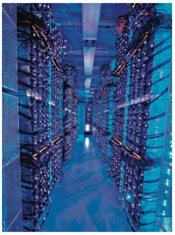
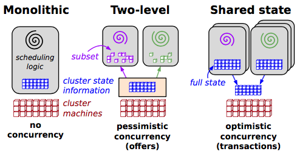

Big Data
---

*A view of Microsoft Data Center, 来源: Armando Fox, Cloud Computing What’s in It
for Me as a Scientist?*

### Batch Processing (offline systems)

* [HDFS](hdfs/intro.md)

* [MapReduce](mapreduce/intro.md)

### Stream Processing (near-real-time systems)

* [A Apache Storm](storm/intro.md)

* [P Twitter Heron](heron/intro.md)

* [P Apache Flink](flink/intro.md)

* [P Spark](spark/intro.md)

### Resource Management & Scheduling

* Apache YARN

* Mesos

    An execution platform for hosting applications

* Kubernetes

*来源: Omega: flexible, scalable schedulers for large compute clusters*

### Messaging Systems

* [A Apache Kafka](kafka/intro.md)

    log based message broker

* [D RabbitMQ](rabbitmq/intro.md)

    AMQP-style message broker

## Further Readings

Google

* [MapReduce: Simplified Data Processing on Large Clusters](http://research.google.com/archive/mapreduce.html)

    MapReduce is a programming model and an associated implementation for processing and generating large data sets.

* [Dremel: Interactive Analysis of Web-Scale Datasets](http://research.google.com/pubs/pub36632.html)

    Dremel is a scalable, interactive ad-hoc query system for analysis of read-only nested data.

* [Pregel: A System for Large-Scale Graph Processing](http://kowshik.github.io/JPregel/pregel_paper.pdf)

* [Distributed Large-scale Natural Graph Factorization](http://static.googleusercontent.com/media/research.google.com/en//pubs/archive/40839.pdf)

    For large-scale graph decomposition and inference

* Omega: flexible, scalable schedulers for large compute clusters
