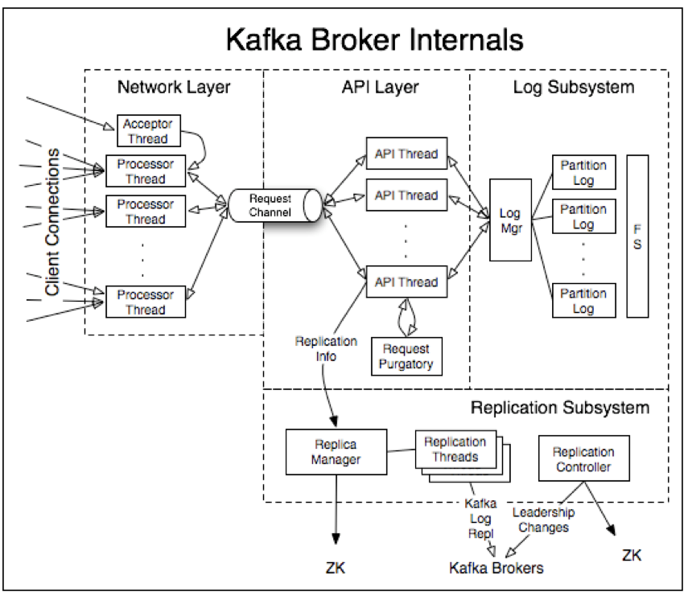

Broker
---

*来源 [Kafka 0.7 Internals](https://cwiki.apache.org/confluence/display/KAFKA/Kafka+Internals)*

## Cluster Membership

When first configure a broker, we would give it a unique `broker.id` in the configuration file.

Kafka uses Apache Zookeeper to maintain the list of brokers that are currently members of the cluster. Every time a broker process starts, it registers itself with its unique id in ZooKeeper by creating an ephemeral node.

Different Kafka components subscribe to the `/brokers/ids` path in ZooKeeper where brokers are registered, so they get notified when brokers are added.

## Controller

The controller is one of the Kafka brokers that, in addition to the usual broker functionality, is responsible for electing partition leaders and other admin related tasks.

The first broker that starts in the cluster becomes the controller by creating an ephemeral node in ZooKeeper called `/controller`.

## [Replication](https://kafka.apache.org/documentation/#replication)

Kafka replication 的实现主要参考了 Microsoft 的 PacificA

The unit of replication is `topic partition`. Under non-failure conditions, each partition in Kafka has a single leader and zero or more followers. The total number of replicas including the leader constitute the `replication factor`.

For each Kafka node, liveness has two conditions

1. A node must be able to maintain its session with ZooKeeper (via ZK's heartbeat mechanism)

2. If it is a slave it must replicate the writes happening on the leader and not fall "too far" behind

We refer to nodes satisfying these two conditions as being `in sync` to avoid the vagueness of `alive` or `failed`.

The leader keeps track of the set of `in sync` nodes. If a follower dies, gets stuck, or falls behind, the leader will remove it from the list of in sync replicas. The determination of stuck and lagging replicas is controlled by the `replica.lag.time.max.ms` configuration.

The guarantee that Kafka offers is that a committed message will not be lost, as long as there is at least one in sync replica alive, at all times.

### Replica Assignment

There are 3 goals of replica management

1. Spread the replicas evenly among brokers

2. For partitions assigned to a particular broker, their other replicas are spread over the other brokers

3. If all brokers have rack information, assign the replicas for each partition to different racks if possible

## Log Compaction
...

## Further Readings

* PacificA: Replication in Log-Based Distributed Storage Systems

* [kafka Detailed Replication Design V3](https://cwiki.apache.org/confluence/display/KAFKA/kafka+Detailed+Replication+Design+V3)

    内容有些过时

* [Kafka 0.8 Request Purgatory](https://cwiki.apache.org/confluence/pages/viewpage.action?pageId=34839465)

    The request purgatory is a holding pen for requests waiting to be satisfied (Delayed).

* [Kafka 0.8 Controller Internals](https://cwiki.apache.org/confluence/display/KAFKA/Kafka+Controller+Internals)

