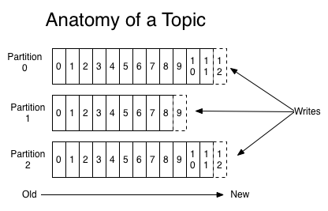

Concept
---

* Kafka is run as a `cluster` on one or more servers

* Kafka `cluster` stores streams of records in categories called `topic`

* Each `record` consists of a key, a value and a timestamp

## Partition

Each `partition` is an ordered, immutable sequence of records that is continually appended to—a structured commit log.

The records in the partitions are each assigned a `sequential id number` called the offset that uniquely identifies each record within the partition.

