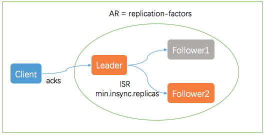

Producer
---
The producer choose which record to send to which partition within the topic.

## Client Configurations

The most important configurations control

* compression

* sync vs async production

* batch size(for async producers)

