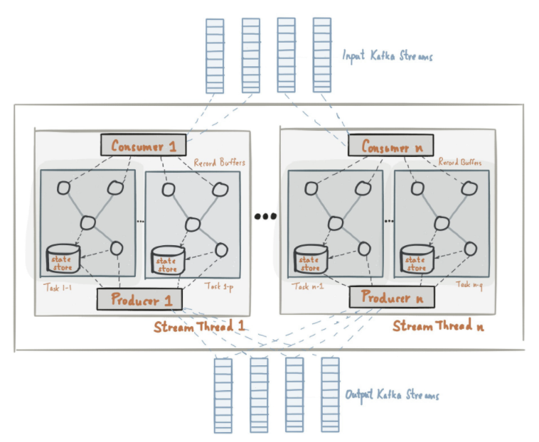
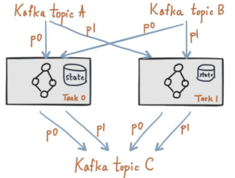

[Kafka Stream](https://kafka.apache.org/documentation/streams)
---

Kafka Streams is a client library for building mission-critical real-time applications and micro-services, where the input and/or output data is stored in Kafka clusters.

## Concepts
...

## [Architecture Overview](https://kafka.apache.org/0110/documentation/streams/architecture)

A topology contains an acyclic graph of sources, processors, and sinks.

* A source is a node in the graph that consumes one or more Kafka topics and forwards them to its child nodes.

* A processor is a node in the graph that receives input records from upstream nodes, processes that records, and optionally forwarding new records to one or all of its children.

* A sink is a node in the graph that receives records from upstream nodes and writes them to a Kafka topic. This builder allows you to construct an acyclic graph of these nodes, and the builder is then passed into a new `KafkaStreams` instance that will then `KafkaStreams.start()` begin consuming, processing, and producing records.

### Local State Stores

### Windowing A Stream
...

## Developer Guide

**Application Id**

An identifier for the stream processing application. Must be unique within the Kafka cluster.

This `id` is used in the following places to isolate resources used by the application from others:

* As the default Kafka consumer and producer `client.id` prefix

* As the Kafka consumer `group.id` for coordination

* As the name of the sub-directory in the state directory (cf. `state.dir`)

* As the prefix of internal Kafka topic names

When an application is updated, it is recommended to change `application.id` unless it is safe to let the updated application re-use the existing data in internal topics and state stores. One pattern could be to embed version information within application.id, e.g., `my-app-v1.0.0` vs. `my-app-v1.0.2`.

**Kafka Bootstrap Servers**

A list of host/port pairs to use for establishing the initial connection to the Kafka cluster

**One Kafka cluster only**: Currently Kafka Streams applications can only talk to a single Kafka cluster specified by this config value. In the future Kafka Streams will be able to support connecting to different Kafka clusters for reading input streams and/or writing output streams.

**ZooKeeper connection**

Zookeeper connection string for Kafka topic management

Before 0.10.0, Kafka Streams needs to access ZooKeeper directly for creating its internal topics. Internal topics are created when a state store is used, or when a stream is repartitioned for aggregation.

In 0.10.0 release, ZooKeeper dependency of Kafka Streams and `zookeeper.connect` is temporary and removed after [KIP-4](https://cwiki.apache.org/confluence/display/KAFKA/KIP-4+-+Command+line+and+centralized+administrative+operations) is incorporated.

## References

* [Developer Manual](https://kafka.apache.org/0110/documentation/streams/developer-guide)

* [Developer Guide on Confluent](https://docs.confluent.io/3.0.0/streams/developer-guide.html)
