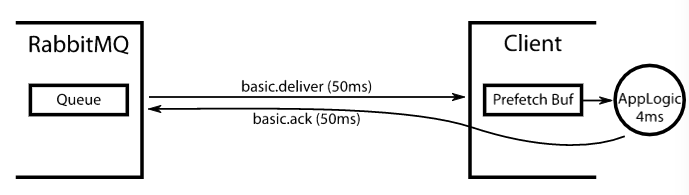

Consumer
---

You have a queue in Rabbit. You have some clients consuming from that queue. If you don't set a QoS setting at all (`basic.qos`), then Rabbit will push all the queue's messages to the clients as fast as the network and the clients will allow. The consumers will balloon in memory as they buffer all the messages in their own RAM.

> what should you set the QoS prefetch buffer size to?

The goal is to

* keep the consumers saturated with work, but to

* minimise the client's buffer size so that more messages stay in Rabbit's queue and are thus available for new consumers or to just be sent out to consumers as they become free.

