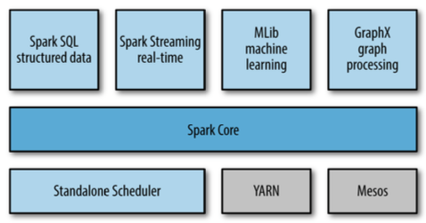

Spark
---

Apache Spark is a fast and general-purpose cluster computing system.

*来源: Learning Spark - Figure 1-1*

- - -

* Cluster Overview

* RDD

* Spark SQL

    for SQL and structured data processing

* Spark Streaming

## Further Readings

Online Articles & Documents

* [Apache Spark Official Document](http://spark.apache.org/docs/latest/)

* Resilient Distributed Datasets: A Fault-Tolerant Abstraction for In-Memory Cluster Computing

* Spark SQL: Relational Data Processing in Spark

* Discretized Streams: An Efficient and Fault-Tolerant Model for Stream Processing on Large Clusters

- - -

Books

* Learning Spark

* Advanced Analytics with Spark

* High Performance Spark

* Spark The Definitive Guide
