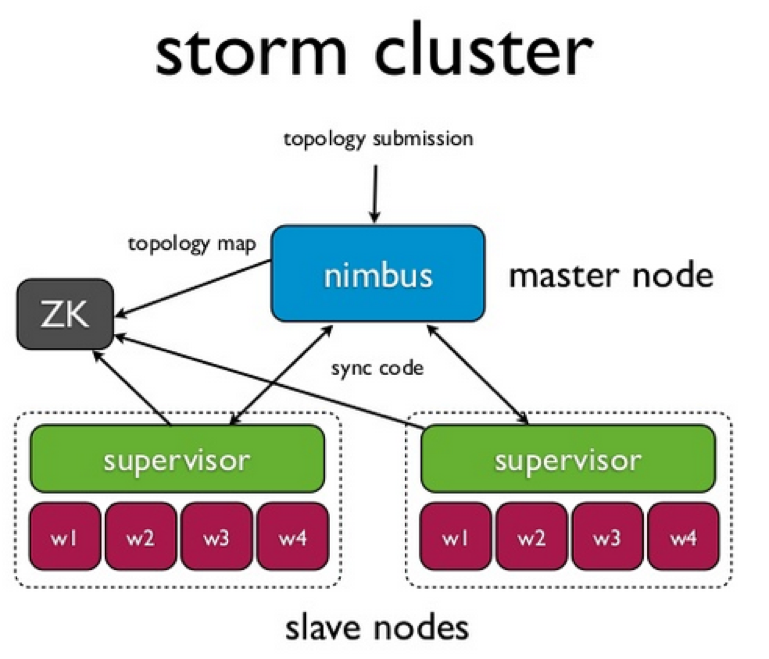
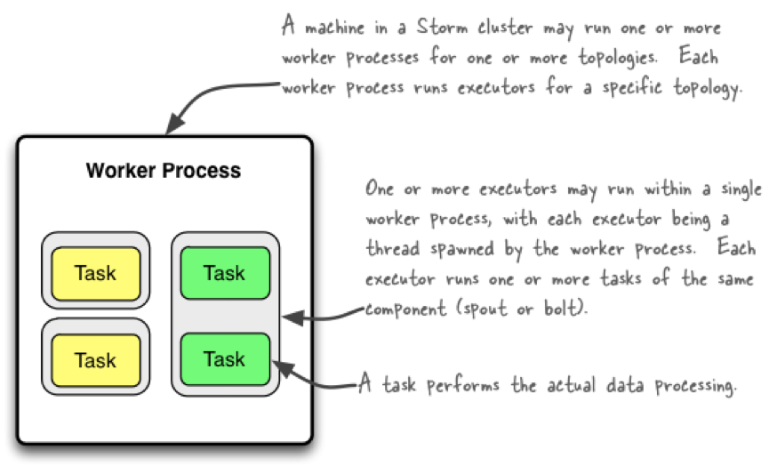
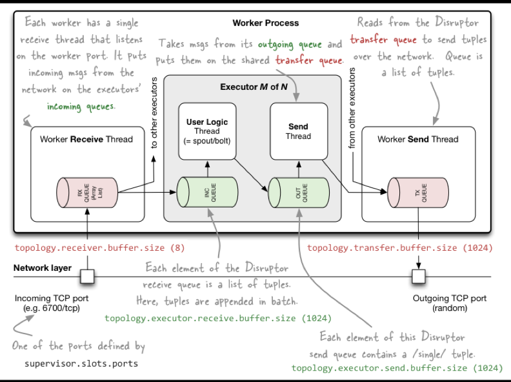

Architecture
----

Storm is designed as a fail fast system. Storm 设计为一个快速失败系统.

* Originated at BackType/Twitter, open sourced in late 2011

* Implemented in Clojure, some Java

* To vastly simplify dealing with queues & workers

## Nimbus

* master node

* manages the topologies

* job tracker

Nimbus is an Apache Thrift Service and Storm topology definitions are Thrift objects.

### HA

Nimbus 存在单点故障问题.

[Nimbus HA Design](http://storm.apache.org/releases/1.0.2/nimbus-ha-design.html)

## Supervisor

* runs on slave nodes

* co-ordinates with zookeeper

* manages workers

All coordination between Nimbus and the Supervisors is done using Zookeeper. Furthermore, Nimbus and the Supervisor daemons are fail-fast and stateless, and all their state is kept in Zookeeper or on the local disk(s).

## Worker

### jvm process

*来源 [Understanding the Parallelism of a Storm Topology](http://storm.apache.org/releases/1.2.2/Understanding-the-parallelism-of-a-Storm-topology.html)*

### Internal messaging within worker processes

*来源 [Understanding the Internal Message Buffers of Storm](http://www.michael-noll.com/blog/2013/06/21/understanding-storm-internal-message-buffers/)*

