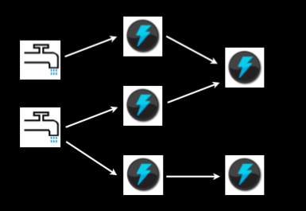
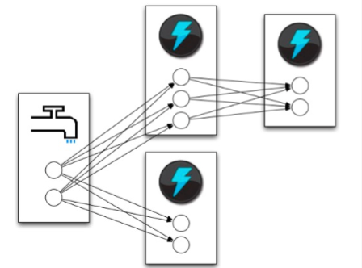

[Concept](http://storm.apache.org/releases/2.0.0-SNAPSHOT/Concepts.html)
----

在 Storm 中, 数据的计算模型是流(stream)的有向图，在 Storm 中名字是 topology, 一个由 Spout (数据源) 和 Bolt (对数据的处理) 组成的网络, 边由 Grouping 定义. 这个抽象背后会自动处理发送/接收消息, 序列化, 部署等任务.

## Stream

A stream is an unbounded sequence of tuples that is processed and created in parallel in a distributed fashion.

Every stream is given an id when declared.

关键点: 流可以被并行的生成与处理.

## Topology

A storm topology is a `directed graph` of spouts and bolts.

*来源 Storm: Distributed and fault-tolerant realtime computation, Nathan Marz, in Twitter*

### Spout

Spouts are source of input data

### Bolt

Bolts are an abstraction to represent computation on the stream.

### Tasks

Spouts and bolts execute as many tasks across the cluster

*来源 Storm: Distributed and fault-tolerant realtime computation, Nathan Marz, in Twitter*

### Grouping

When a tuple is emitted, which task does it go to?

Part of defining a topology is specifying `for each bolt which streams it should receive as input`. A stream grouping defines how that stream should be partitioned among the bolt's tasks.

