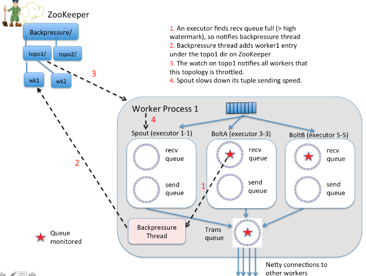

## 容错 Fault Tolerant

Fault-tolerance is essential. These two guarantees are required to be maintained in a general-purpose stream processing platform:

容错是必须的. 通用的流计算平台需保证以下 2 点

* The processing runs infinitely, automatically restarting any workers if there are faults 因为计算会长期执行, 需要能够在 worker 机器故障时自动重启

* The data is guaranteed to be fully processed. 需保证数据能被完整处理

Storm, of course, provides both of these guarantees.

The core of Storm is an **acking** mechanism that can efficiently determine when a source tuple has been fully processed. Storm will replay tuples that fail to be fully processed within a topology-configurable timeout (defaults to 30 seconds). So the core mechanisms in Storm provide an at-least-once processing guarantee for data.

A Storm topology has a set of special "acker" tasks that track the DAG of tuples for every spout tuple. When an `acker` sees that a DAG is complete, it sends a message to the spout task that created the spout tuple to ack the message. You can set the number of `acker` tasks for a topology in the topology configuration using `Config.TOPOLOGY_ACKERS`. Storm defaults `TOPOLOGY_ACKERS` to one task per worker.

When a tuple is created in a topology, whether in a spout or a bolt, it is given a random 64 bit id. These ids are used by `ackers` to track the tuple DAG for every spout tuple.

Storm uses **mod hashing** to map a spout tuple id to an `acker` task. Since every tuple carries with it the spout tuple ids of all the trees they exist within, they know which `acker` tasks to communicate with.

An `acker` task stores a map from a spout tuple id to a pair of values.

* The first value is the task id that created the spout tuple which is used later on to send completion messages.

* The second value is a 64 bit number called the "ack val".

    The `ack val` is a representation of the state of the entire tuple tree, no matter how big or how small. It is simply the xor of all tuple ids that have been created and/or acked in the tree.

## Transactional Topologies

Storm 0.7.0 introduces transactional topologies, which build on Storm's primitives to let you get fully fault-tolerant, exactly-once messaging semantics for your computations. This lets you do things like counting idempotently. More information on transactional topologies here: [Transactional topologies](https://github.com/nathanmarz/storm/wiki/Transactional-topologies)...

Finally, for other details on why Storm is fault-tolerant see this wiki page: [Fault tolerance](https://github.com/nathanmarz/storm/wiki/Fault-tolerance)

## Topology Isolation
...

## Max Spout Pending

以下翻译自 "Storm @Twitter" 3.3.3 小节

Storm topologies 有一个 `max spout pending` 参数. 这个参数可以通过 yaml 文件中的 `topology.max.spout.pending` 参数来配置.

引入这个参数的初衷是做 rate limit, 流量控制;

这个参数限制了在 topologies 的任意时间点, pending tuple (还没有被 acked 或 failed)  的最大数量. 注意这个限制在 single spout task level 上, 而不是整个 topology level.

**Caution 注意**

* 对于不可靠的 spout 这个参数是无效的, 比如它们没有在 tuples 中 emit 一个 message id

* 对于 Trident 来说, max spout pending 指的是 pipelined batches of tuples 的数量

    建议不要为 Trident topologies 设置过大值 (可以尝试从 ~10 开始测试)

### Tuning

Storm 用户遇到的一个问题就是如何设置合适的 max spout pending 值. 如果太小, 容易导致 topology 饥饿; 如果过大, 可能会因大量的失败和重试导致 topology 过载. 我们不得不通过多次调整来发现一个最佳值.

通常情况下, 增加 max spout pending 的值可以提升 topology 的吞吐量. 但在某些场景下, 降低这个值也可能获得吞吐量的提升. 呵呵 :-)

为了解决这个问题....

### Automatic Back Pressure 反压

_Introduced in Storm 1.0.0_

This new feature is aimed for automatic flow control through the topology DAG since different components may have unmatched tuple processing speed. Currently, the tuples may get dropped if the downstream components can not process as quickly, thereby causing a waste of network bandwidth and processing capability.

In addition, it is difficult to tune the `max.spout.pending` parameter for best back-pressure performance. Another big motivation is that using `max.spout.pending` for flow control forces users to enable acking, which does not make sense.

Therefore, an automatic back pressure scheme is highly desirable.

Heron proposed a form of back pressure that does not rely on acking or max spout pending. Instead spouts throttle not only when `max.spout.pending` is hit, but also if any bolt has gone over a high water mark in their input queue, and has not yet gone below a low water mark again.

It is the intention to throttle the entire topology, all spouts. This is what Heron does and is intended to be a last resort, which is better then nothing, but not a truly final solution. The reason for this is that from the level of a single queue it is very difficult to know what is causing that congestion. STORM-907 is intended as a follow on that will analyze the topology, determine where there are loops and provide more of true back-pressure. But in the case of a loop, and storm does support loops, you have no way to determine which upstream part is causing slowness. And in fact it could be the bolt itself, and it needs to increase it's parallelism

*来源 [Storm-886 Automatic Back Pressure](https://issues.apache.org/jira/browse/STORM-886)*

## Further Readings

* [Guaranteeing message processing](http://storm.apache.org/releases/1.0.6/Guaranteeing-message-processing.html)

* [STROM 886: Automatic Back Pressure](https://issues.apache.org/jira/browse/STORM-886)

* [Understanding the Parallelism of a Storm Topology](http://storm.apache.org/releases/current/Understanding-the-parallelism-of-a-Storm-topology.html)

- - -

* [STORM-2306 : Messaging subsystem redesign](https://github.com/apache/storm/pull/2241)
