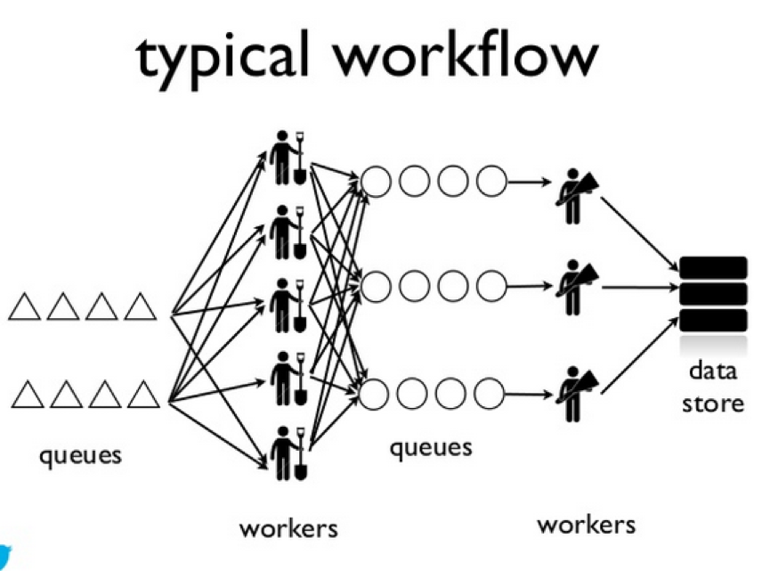

Storm 发展史
---

在没有 Storm 之前, 典型的数据流计算模式是 Workers + Queue

* **scaling is painful** - queue partitioning & worker deploy

* **operational overhead** - worker failures & queue backups

* **no guarantees** on data processing