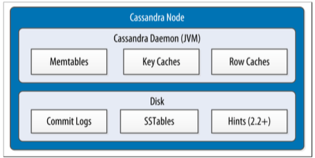

Architecture
---

Cassandra is designed to handle big data workloads across multiple nodes with no single point of failure. Its architecture is based on the understanding that system and hardware failures can and do occur. Cassandra addresses the problem of failures by employing a peer-to-peer distributed system across homogeneous nodes where data is distributed among all nodes in the cluster.

Each node frequently exchanges state information about itself and other nodes across the cluster using peer-to-peer gossip communication protocol.

A sequentially written commit log on each node captures write activity to ensure data durability. Data is then indexed and written to an in-memory structure, called a memtable, which resembles a write-back cache. Each time the memory structure is full, the data is written to disk in an SSTables data file.

All writes are automatically partitioned and replicated throughout the cluster. Cassandra periodically consolidates SSTables using a process called compaction, discarding obsolete data marked for deletion with a tombstone. To ensure all data across the cluster stays consistent, various repair mechanisms are employed.

Cassandra is a partitioned row store database, where rows are organized into tables with a required primary key. Cassandra's architecture allows any authorized user to connect to any node in any data-center and access data using the CQL language. For ease of use, CQL uses a similar syntax to SQL and works with table data. Developers can access CQL through cqlsh, DevCenter, and via drivers for application languages. Typically, a cluster has one keyspace per application composed of many different tables.

Client read or write requests can be sent to any node in the cluster. When a client connects to a node with a request, that node serves as the coordinator for that particular client operation. The coordinator acts as a proxy between the client application and the nodes that own the data being requested. The coordinator determines which nodes in the ring should get the request based on how the cluster is configured.

...

## Partition
...

## Replication
...

## Failure Detection

Failure detection is used to determine if any other node in the system is up or down.

Cassandra uses a modified version of the Accrual Failure Detector.

## Memtables, SSTables and Commit Logs

*来源 Cassandra: The Definitive Guide, Figure 6-4*

## Further Readings

* [Understanding the architecture - DataStax Document](https://docs.datastax.com/en/cassandra/3.0/cassandra/architecture/archTOC.html)
