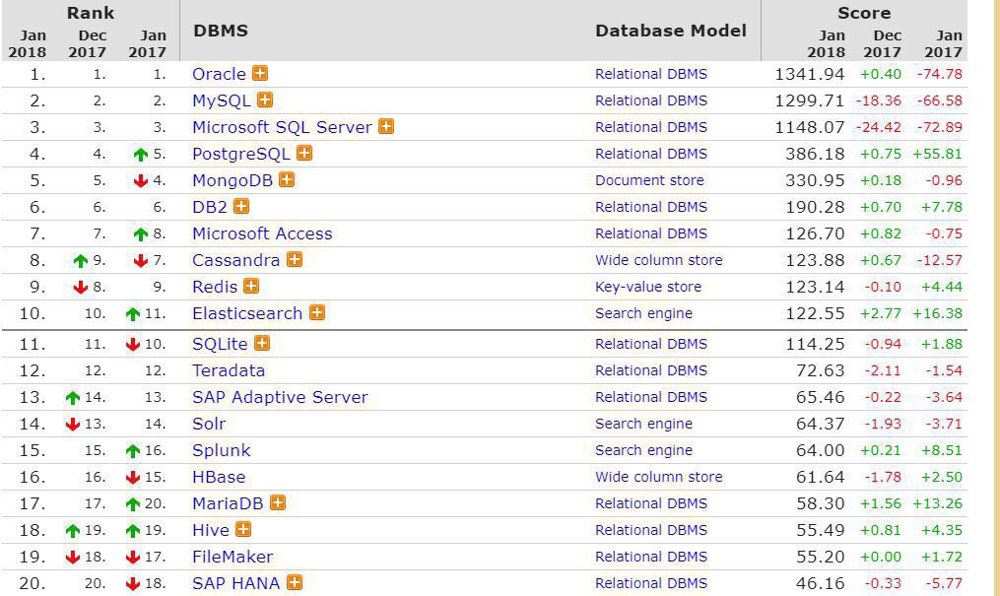

Data Storage
---

On the most fundamental level, a database needs to do two things: when you give it some data, it should store the data, and when you ask it again later, it should give the data back to you

Designing Data-Intensive Applications, Chapter 3, Storage and Retrieval

通常, 我们可以将存储系统分为二大类, 在线事务处理型 transaction processing (OLTP) 和在线分析处理型 analytics processing (OLAP).

* OLTP: 主要面向终端用户, 一般面临着海量请求, 请求通常只涉及到少量记录; 存储引擎使用 index 索引来加速查询速度. 磁盘寻道时间通常是瓶颈所在

* OLAP: 主要用于分析工作, 不面向终端用户. 一般请求频次很低, 但需要在较短时间内处理远超 OLTP 的数据量, 比如上百万条记录. 这里的瓶颈通常是磁盘带宽, 而不是寻道时间. 另外列式存储是处理这类工作的一个越发流行的解决方案.

分析型与事务型的工作负载主要区别是: 当查询需要顺序访问大量行记录的时候, 索引的作用变得无足轻重. 相反, 如何紧凑的对数据进行编码 (encode) 变得更加重要, 以减少查询时所需要从磁盘读取的数据量

进一步, OLTP 又可以分为二类

* 基于日志 (log based) 的存储: 只允许追加数据和删除过期的文件, 不更新已写入的数据. SSTables, LSM-trees, LevelDB, HBase, Cassandra, Lucene 等属于此类

* 本地更新 (update-in-place) 的存储: 将磁盘视为一组固定大小的页面, 页面内容可以被重写. 其中的典型代表是 B 树, 广泛应用于主流关系型数据库, 也包括很多非关系型数据库.

Data Storage often play an important role in establishing a service's SLA, especially when the business logic is relatively lightweight.

一个服务的 SLA 很大程度上取决于它的数据存储, 尤其是当业务逻辑相对较轻的时候.

- - -

Relational Data Store

* [A MySQL](mysql/intro.md) OLTP

* [P SQLite3](sqlite3/intro.md)

- - -

Document Data Store

支持文档型数据模型的最主要观点是语义更灵活, 此外可通过局部性获得更好的性能; 不足之处是对 join 的支持比较弱

* [P MongoDB](mongodb/intro.md)

- - -

Key-Value Stores

* [A Redis](redis/intro.md)

    An in-memory data structure store

* [P RocksDB](rocksdb/intro.md)

    A persistent key-value store for fast storage environments

* Dynamo

    Amazon’s Highly Available Key-value Store

- - -

Column Family Stores

* [HBase](http://hbase.apache.org/book.html) OLAP

* [Cassandra](cassandra/intro.md) partitioned row store

    The Apache Cassandra database is the right choice when you need scalability and high availability without compromising performance.

- - -

Graph Databases

* [Neo4j](https://neo4j.com/developer/graph-database/)

    Neo4j was build to efficiently store, handle and query highly connected elements in your data model.

- - -

*来源 [DB-Engines Ranking](https://db-engines.com/en/ranking)*

## Further Readings

* A Relational Model of Data for Large Shared Data Banks, E.F. CoDD

* Designing Data-Intensive Application, Part I. Foundations of Data Systems
