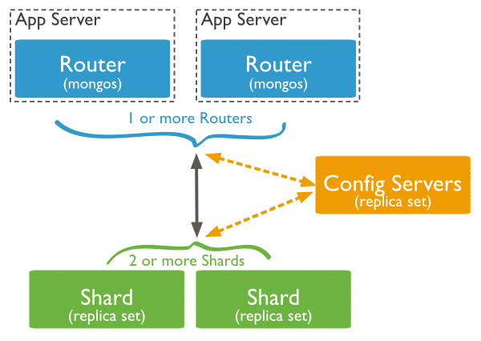

[Sharded Cluster](https://docs.mongodb.com/manual/sharding/)
---

Typically use `key-based` hash or `range` partitioning to assign data to nodes in the cluster.

A MongoDB sharded cluster consists of the following components:

* `shard`: Each `shard` contains a subset of the sharded data. Each shard can be deployed as a `replica set`.

* `mongos`: The `mongos` acts as a query router, providing an interface between client applications and the sharded cluster.

* `config servers`: Config servers store metadata and configuration settings for the cluster. As of MongoDB 3.4, config servers must be deployed as a replica set (CSRS).

## [Shard Key](https://docs.mongodb.com/manual/core/sharding-shard-key/)

A good shard key has

* sufficient cardinality

* distributed writes (avoid `hot spots` on inserts)

* targeted reads ("query isolation")

    Generally, the fastest queries in a sharded environment are those that `mongos` route to a single shard, using the `shard key` and the cluster meta data from `config server`.

**Note:** When choosing a shard key for time series data, consider compound shard key `{arbitrary value, incrementing value}`

## Further Readings

* [MongoDB for Time Series Data](https://www.mongodb.com/presentations/mongodb-time-series-data-part-3-sharding?jmp=docs&_ga=1.41404002.1906263820.1485400801)

