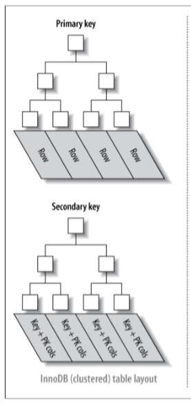

InnoDB
---

InnoDB's job, as a storage engine for MySQL, is to provide:

* Full transaction support: commit-rollback

* Crash recovery

* Row-level locking

* MVCC: consistent non-blocking reads

How? With locks, a paged-file structure with buffer pooling, and undo/redo logs,

## InnoDB Data layout

### InnoDB Database Files

### InnoDB Tablespaces

The InnoDB workspace consists of: `tablespace` and log files.

* A tablespace consists of: `segments`, as many as necessary.

* A segment is usually a file, but might be a raw disk partition. A segment consists of: `extents`.

* An `extent` consists of: 64 `page`s.

* A page's length is always 16KB, for both data and index. A page consists of: a page header, and some rows.

## Indexes

In InnoDB, when a table is created, a `clustered index` (B-tree) is created internally where the data for the rows is stored . This B-tree contains two file segments, one for the non-leaf pages and the other for the leaf pages.

As a result, it provides very fast primary key lookups.

All indexes other than clustered index are known as `secondary indexes`.

Note that, secondary indexes contain primary key columns, so if your primary key is large, the secondary indexes use more space.

Each leaf node in the clustered index contains the primary key value, the transaction ID, and rollback pointer InnoDB uses for transactional and `MVCC` purposes, and the rest of the columns (in the above picture, `col2`).

## MVCC 多版本并发控制

`MVCC` works only with the `REPEATABLE READ` and `READ COMMITTED` isolation levels.

This technique let `InnoDB` transactions with certain `isolation levels` perform `consistent read` operations; that is, to query rows that are being updated by other transactions, and see the values from before those updated occurred.

This is a powerful technique to increase concurrency, by allowing queries to proceed without waiting due to locks held by the other transaction.

Internally, InnoDB adds three fields to each row stored in the database.

* A 6-byte `DB_TRX_ID` field indicates the transaction identifier for the last transaction that inserted or updated the row. Also, a deletion is treated internally as an update where a special bit in the row is set to mark it as deleted.

* Each row also contains a 7-byte `DB_ROLL_PTR` field called the roll pointer. The roll pointer points to an undo log record written to the rollback segment. If the row was updated, the undo log record contains the information necessary to rebuild the content of the row before it was updated.

* A 6-byte `DB_ROW_ID` field contains a row ID that increases monotonically as new rows are inserted. If InnoDB generates a clustered index automatically, the index contains row ID values. Otherwise, the `DB_ROW_ID` column does not appear in any index.

## [Locking]((http://dev.mysql.com/doc/refman/5.5/en/innodb-locking.html))

### Record Lock

A record lock is a lock on an index record. Record lock always lock index records, even if a table is defined with no indexes. For such case, innodb create a hidden clustered index and uses this index for record locking

### Intention Lock

InnoDB supports multiple granularity locking (MGL). So to access rows in a table, intention locks must be taken on the tables.

### Gap Lock

A gap lock is a lock on a gap between index records, or a lock on the gap before the first or a lock after the last index record.

Gap locking is not needed for statements that lock rows using a unique index to search for a unique row

[`innodb_locks_unsafe_for_binlog`](https://dev.mysql.com/doc/refman/5.6/en/innodb-parameters.html#sysvar_innodb_locks_unsafe_for_binlog) affects how InnoDB uses gap locking for searches and index scans. By default, the value of `innodb_locks_unsafe_for_binlog` is `0` (disabled), which means that gap locking is enabled.

Note: Enabling `innodb_locks_unsafe_for_binlog` does not disable the use of gap locking for foreign-key constraint checking or duplicate-key checking. This variable is deprecated since 5.6.3.

### Next-key Lock

A next-key lock is a combination of a record lock on the index record and a gap lock on the gap before the index record.

**[Phantom Rows](https://dev.mysql.com/doc/refman/5.7/en/innodb-next-key-locking.html)**

To prevent phantoms, InnoDB uses next-key locking.

We can use next-key locking to implement a uniqueness check in our application: If read data in share mode and do not see a duplicate for a row we are going to insert, then we can safely insert the row and know

### Locking read

A `SELECT` statement that also performs a locking operation on an InnoDB table.

* SELECT with FOR UPDATE

* SELECT with IN SHARE MODE

* DELETE

* UPDATE

### Anatomy

The locks are kept in bit maps in main memory. Thus InnoDB differs from Oracle in one respect: instead of storing lock information on the page as Oracle does with Interested Transaction Lists, InnoDB keeps it in a separate and more volatile structure. But both Oracle and InnoDB try to achieve a similar goal: **writers don't block readers**. So a typical InnoDB row-read involves:

(a) if the reading is for writing, then check if the row is locked and if so wait;

(b) if according to the information in the row header the row has been changed by some newer transaction, then get the older version from the log.

We call the (b) part "versioning" because it means that a reader can get the older version of a row and thus will have a temporally consistent view of all rows.

## Logging

InnoDB keeps two logs, the `redo log` and the `undo log`.

The redo log is for re-doing data changes that had not been written to disk when a crash occurred. There is one redo log for the entire workspace, it contains multiple files (the number depends on innodb_log_files_in_group), it is circular (that is, after writing to the last file InnoDB starts again on the first file). The file header includes the last successful checkpoint.

A redo log record's contents are: Page Number (4 bytes = page number within tablespace), Offset of change within page (2 bytes), Log Record Type (insert, update, delete, "fill space with blanks", etc.), and the changes on that page (only redo values, not old values).

The undo log is primarily for removing data changes that had been written to disk when a crash occurred, but should not have been written, because they were for uncommitted transactions. Sometimes InnoDB calls the undo log the "rollback segment".

The undo log is inside the tablespace.

* The "insert" section of the undo log is needed only for transaction rollback and can be discarded at COMMIT time.

* The "update/delete" section of the undo log is also useful for consistent reads, and can be discarded when InnoDB has ended all transactions that might need the undo log records to reconstruct earlier versions of rows.

An undo log record's contents are: Primary Key Value (not a page number or physical address), Old Transaction ID (of the transaction that updated the row), and the changes (only old values).

`COMMIT` will write the contents of the log buffer to disk, and put undo log records in a history list.

`ROLLBACK` will delete undo log records that are no longer needed.

`PURGE` (an internal operation that occurs outside user control) will no-longer-necessary undo log records and, for data records that have been marked for deletion and are no longer necessary for consistent read, will remove the records.

## [InnoDB Error Handling](https://dev.mysql.com/doc/refman/5.7/en/innodb-error-handling.html)

InnoDB sometimes rolls back only the statement that failed, other times it rolls back the entire transaction.

## References

* [How Consistent Read View Works](https://blogs.oracle.com/mysqlinnodb/entry/repeatable_read_isolation_level_in)

* [Data Organization in InnoDB](https://blogs.oracle.com/mysqlinnodb/entry/data_organization_in_innodb)

* [InnoDB Source Code Distribution](https://dev.mysql.com/doc/internals/en/files-in-innodb-sources.html)