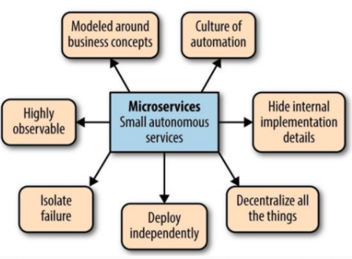

微服务
---

In short, the micro-service architectural style is an approach to developing a single application as a suite of small services, each running in its own process and communicating with lightweight mechanisms, often an HTTP resource API.

Martin Fowler

The term "microservice" was discussed at a workshop of software architects near Venice in May, 2011 to describe what the participants saw as a common architectural style that many of them had been recently exploring. In May 2012, the same group decided on "microservices" as the most appropriate name. James presented some of these ideas as a case study in March 2012 at 33rd Degree in Krakow in Microservices - Java, the Unix Way as did Fred George about the same time. Adrian Cockcroft at Netflix, describing this approach as "fine grained SOA" was pioneering the style at web scale as were many of the others mentioned in this article - Joe Walnes, Dan North, Evan Botcher and Graham Tackley

- - -

*来源 Building Microservices, Chapter 12*

- - -

* [Basic Architecture](basic_architecture.md)

* [Design Patterns](patterns/intro.md)

* [Tracing 链路跟踪](tracing.md)

## References

Blog & Online articles

* [Microservices: a definition of this new architectural term](https://martinfowler.com/articles/microservices.html)

* [Micro Services – Java the Unix way](http://2012.33degree.org/pdf/JamesLewisMicroServices.pdf)

* [Cloud Design Patterns For Microservices](https://azure.microsoft.com/en-us/blog/design-patterns-for-microservices/)

* [Microservices: yesterday, today, and tomorrow](https://arxiv.org/pdf/1606.04036v1.pdf)

- - -

Books

* Building Microservices, Sam Newman

* Microservices for Java Developers

* Spring Microservices In Action, John Carnell
