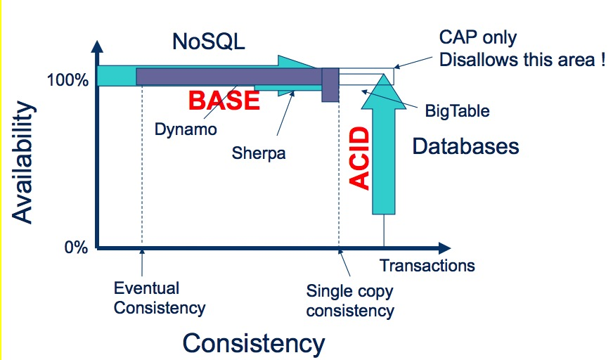

CAP Conjecture or Theorem
---

对于通过网络共享数据的系统, 如果发生网络分区, 只能在数据一致性与可用性之间做选择

## Introduction

[Eric Brewer](https://en.wikipedia.org/wiki/Eric_Brewer_(scientist)) 在长期设计和部署分布式系统的过程中发现, 其中 3 个核心系统需求（systemic requirements）之间存在着某种特殊的关联.（他主要是谈论 Web 类的应用, Lessons from Giant-Scale Services）

这 3 个核心的系统需求分别是：Consistency，Availability 和 Partition Tolerance，造就了该理论的名字 － CAP

* Consistency: Every read receives the most recent write or an error, equivalent to having a single up-to-date copy of data

    数据一致性: 每个读请求都可以获取到最新的数据或者错误, 或者说只有一个版本的最新数据

* Availability: Every (update) request receives a (non-error) response - without guarantee that it contains the most recent write

    可用性: 每一个(更新)请求都能得到响应 - 但不保证总是最新的

* Partition tolerance: The system continues to operate despite an arbitrary number of messages being dropped (or delayed) by the network between nodes

    网络分区容忍性: 在出现任意消息丢失或延迟时, 系统依然可以工作;

    A network partition has long been defined as a communication failure in which the network is split into disjoint sub-networks, with no communication possible across sub-network.

    网络分区定义为: 网络因为通信故障被分割为多个不连通的子网络, 子网络之间无法通信

The CAP theorem asserts that any networked shared-data system can have only two of three desirable properties. However, by explicitly handling partitions, designers can optimize consistency and availability, thereby achieving some tradeoff of all three.

CAP 定理断言任何通过网络的数据共享系统最多只能满足数据一致性, 可用性, 分区容忍性三个属性中的二个. 但是, 设计者可以通过显式的处理分区问题来优化数据一致性和可用性, 从而达到三者之间的一种权衡.

The easiest way to understand CAP is to think of two nodes on opposite sides of a partition. Allowing at least one node to update state will cause the nodes to become inconsistent, thus forfeiting C. Likewise, if the choice is to preserve consistency. one side of the partition must act as if it is unavailable, thus forfeiting A.

理解 CAP 的最容易方式是: 考虑处于网络分区二侧的二个节点, 如果允许至少一个节点更新状态, 就会导致节点间不一致, 也就是放弃 C. 同样的, 如果是选择数据一致性, 节点必须放弃可用性.

No distributed system is safe from network failures, thus **network partitioning generally has to be tolerated**. In the presence of a partition, one is then left with two options: consistency or availability.

所有的分布式系统都有可能出现网络问题, 因此网络分区问题是必须要接受的. 在出现网络分区的情形下, 需要在数据一致性和可用性之间做出选择.

* When choosing consistency over availability, the system will return an error or a time-out if particular information cannot be guaranteed to be up to date due to network partitioning.

* When choosing availability over consistency, the system will always process the query and try to return the most recent available version of the information, even if it cannot guarantee it is up to date due to network partitioning.

In the absence of network failure – that is, when the distributed system is running normally – both availability and consistency can be satisfied.

CAP prohibits only a tiny part of the design space: perfect availability and consistency in the presence of partitions, which are rare

CAP 只限制了设计空间的很小一部分: 仅在出现网络分区时, 才需要选择可用性或者数据一致性, 不过这种情形很少会发生

*来源: NoSQL: Past Present Future*

## History

This section shows the development history of CAP, refers to "NoSQL: Past, Present, Future"

* **1995** Develop modern cluster-based server, scalable, highly available, commodity clusters (Brewer co-founded [Inktomi Corporation](https://en.wikipedia.org/wiki/Inktomi) in 1996)

    Inktomi search engine (1996) and proxy cache (1998)

* **1997** Published _Cluster-Based Scalable Network Services_ on SOSP

    Led to "ACID vs. BASE" spectrum, but BASE was not well received

* **1998** Developed CAP (conjecture) while teaching, appears in 1999

    Eric Brewer felt their design choices were right: sufficient (and faster), necessary (consistency hinders performance/availability). And he started to notice other systems that made similar decisions: Coda, Bayou

* **1999** Published _Harvest, yield, and scalable tolerant systems_

* **2000** Published _Towards Robust Distributed Systems_ on Principles of Distributed Computing (PODC)

* **2002** Seth Gilbert, Nany Lynh of MIT formally proved Brewer to be correct, in paper _Brewer's Conjecture and the Feasibility of Consistent, Available, Partition-Tolerant Web Services_, and thus CAP theorem was born

* **2012** Published _CAP Twelve Years Later: How the "Rules" Have Changed_

## The Significance of the Theorem

...

## Why "2 of 3" is misleading

 CAP is frequently misunderstood as if one had to choose to abandon one of the three properties at all times. In fact, the choice is really between consistency and availability only when a network partition or failure happens; at all other times, no trade-off has to be made

CAP 经常被误解成在任意时间里都必须舍弃其中一个属性; 事实上, 只有在出现网络分区故障时, 才需要在数据一致性和可用性之间做出选择, 除此之外, 不需要做任何取舍.

## ACID, BASE, and CAP - 酸碱平衡与 CAP

ACID 和 BASE 在数据一致性-可用性光谱 (注: Eric Brewer 在 Towards Robust Distributed Systems 中提出) 中代表了二个完全相反的设计理念. ACID 专注于一致性, 是数据库的传统处理方式.

### The BASE Jump

A latency tolerant alternative to ACID

The notion of accepting eventual consistency is supported via an architectural approach known as BASE (Basically Available, Soft-state, Eventually consistent).

`BASE`, as its name indicates, is the logical opposite of `ACID`, though it would be quite wrong to imply that any architecture should (or could) be based wholly on one or the other. This is an important point to remember, given our industry’s habit of "oooh shiny" strategy adoption.

* Basically available indicates that the system does guarantee almost availability, in terms of the CAP theorem.

* Soft state indicates that the state of the system may change over time, even without input. This is because of the eventual consistency model.

* Eventual consistency indicates that the system will become consistent over time, given that the system doesn't receive input during that time.

### CAP & ACID

CAP 和 ACID 的关系比较复杂, 并且经常会导致误解, 部分原因是字母 C 和 A 在 ACID 和 CAP 中代表着不同的含义, 另一部分原因是选择可用性影响了一些 ACID 保证.

**原子性 (A)** 所有系统都从原子操作中受益. 当专注于可用性时, 分区的二部分都应该使用原子操作. 此外, 高级别的原子操作也使得恢复变得简单.

**一致性 (C)** 在 ACID 中, C 意味着一个事务保持着数据库约束, 比如唯一键约束; 相反地, CAP 中 C 只是指数据保持一致, 是 ACID 中 C 的一个真子集

The letter C does not really belong in ACID. Joe Hellerstein has remarked that the C in ACID was "tossed in to make the acronym work" in Harder and Reuter's paper, "Principles of Transcation-Oriented Database recovery"

### ACID & BASE

......

### Automatic Conflict resolution - CRDT

CRDTs (conflict-free replicated data types) are data types on which the same set of operations yields the same outcome, regardless of order of execution and duplication of operations.

This allows data convergence without the need for consensus between replicas. In turn, this allows for easier implementation (no consensus protocol implementation) as well as lower latency (no wait-time for consensus).

Operations on CRDTs need to adhere to the following rules:

* Associativity: `a + (b + c) = (a + b) + c`, so that grouping does not matter.

* Commutativity: `a + b = b + a`, so that order of application does not matter.

* Idempotent: `a + a = a`, so that duplication does not matter.

Some examples of the different data types specified as CRDT's include:

* Counters

    * Grow-only counter (merge = max(values); payload = single integer)

    * Positive-negative counter (consists of two grow counters, one for increments and another for decrements)

* Registers

    * Last Write Wins register (timestamps or version numbers; merge = max(ts); payload = blob)

    * Multi-valued register (vector clocks; merge = take both)

* Sets

    * Grow-only set (merge = union(items); payload = set; no removal)

    * Two-phase set (consists of two sets, one for adding, and another for removing; elements can be added once and removed once)

    * Unique set (an optimized version of the two-phase set)

    * Last write wins set (merge = max(ts); payload = set)

    * Positive-negative set (consists of one PN-counter per set item)

    * Observed-remove set

    * Graphs and text sequences (see the paper)

## Further Readings

* Cluster-Based Scalable Network Services, Operating Systems Principles (SOSP 97), ACM, 1997, pp. 78-91

* Harvest, Yield, and Scalable Tolerant Systems, 1999

* Eric Brewer: Towards Robust Distributed Systems, PODC 2000 keynote

* Eric Brewer: Lessons from Giant-Scale Services, 2001

* Brewer's Conjecture and the Feasibility of Consistent, Available, Partition-Tolerant Web Services, 2002

    Seth Gilbert, Nany Lynh of MIT formally proved Brewer to be correct

* Dan Pritchett: Architecting for Latency, eBay, 2007

* HP's talk on CAP theorem, titled [There is no free lunch with distributed data](http://disi.unitn.it/~montreso/ds/papers/NoFreeLunchDS.pdf)

    Consistency, availability, and partition-tolerance trade-offs on distributed
data access systems

* [Brewer's CAP Theorum: The kool aid Amazon and Ebay have been drinking](http://www.julianbrowne.com/article/brewers-cap-theorem), 2009, julian

* Nathan Marz: How to beat the CAP theorem, October 13, 2011

* Eric Brewer: CAP Twelve Years Later: How the "Rules" Have Changed, 2012, on IEEE

    中文翻译 [CAP 十二年回顾："规则"变了](http://www.infoq.com/cn/articles/cap-twelve-years-later-how-the-rules-have-changed)

* Eric Brewer: [NoSQL: Past, Present, Future](https://www.infoq.com/presentations/NoSQL-History) , November 8, 2012

* Martin Kleppmann: A Critique of the CAP Theorem, September 17, 2015
