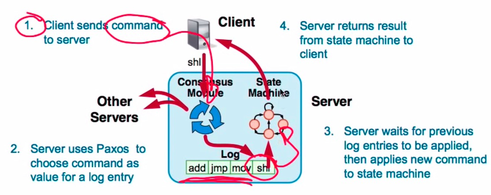

Multi-Paxos
---
Combine several instances of Basic Paxos to agree on a series of values forming the long.

Practical systems use Paxos as a building block to achieve consensus on a sequence of values, such as in a replicated log. The simple way to implement this is to repeatedly execute the Paxos algorithm.

We term **each execution an instance of Paxos**. We refer to submitting a value to Paxos (or equivalently, to the log) to mean executing an instance of Paxos while submitting that value.

## Issues

### Which log entry to use for a given client request

### Performance optimizations

