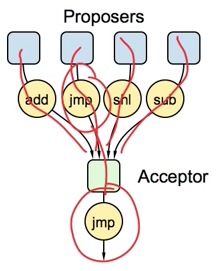
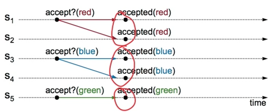
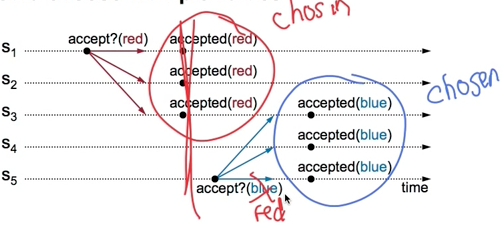
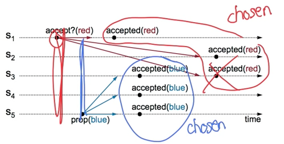
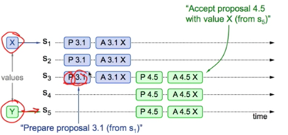
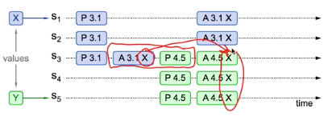
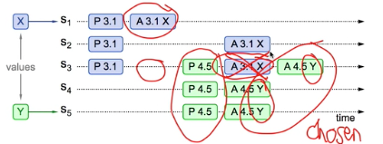
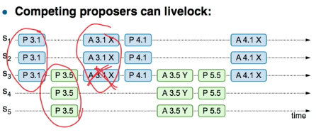
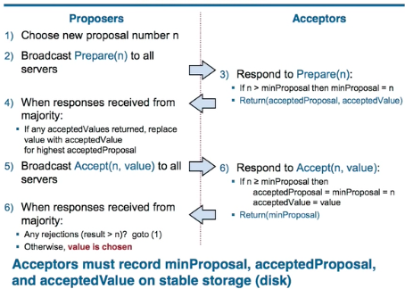

Simple Paxos
----

## Choosing a Value

#### 安全 Safety

* only a single value may be chosen

* A server never learn a value has been chosen unless it really has been

#### 活性 Liveness

* Some proposed value is eventually chosen

* If a value is chosen, servers eventually learn about it

Among three roles, Acceptor is most important, they decide how to choose a single value.

Safety and liveness properties and system models are very useful for reasoning about the correctness of a distributed system

### Problem A: Single Acceptor

The easiest way to choose a value is to have a single acceptor agent. A proposer sends a proposal to the acceptor, who chooses the first proposed value that it receives.

最简单的实现就是只有一个 acceptor. proposer 发送提案给 acceptor, acceptor 选择它接收到的第一个提案 value

*来源: Paxos Lecture*

What if acceptor crashes after choosing? 问题是如果 acceptor 在选择一个 value 后崩溃了, 该怎么办?

**Solution**

So, instead of a single acceptor, we use multiple Acceptors - If one acceptor crashes, chosen value still available.

所以, 为了避免单点故障, 我们使用多个 Acceptors; 如果一个 acceptor 故障, 依然可以继续选择 value.

### Problem B: Split Votes

*来源: Paxos Lecture*

* Acceptors accepts only first value if receives?

* If simultaneous proposals, no value might be chosen

有了多个 acceptors 之后, 出现的几个问题是

1. 每个 acceptor 都只接受它收到的第一个 value 吗?

2. 如果出现多个 proposal, 可能出现 split vote (split brain?)

**Solution**

* Acceptors must sometimes accept multiple (different) values

    Acceptor 有时必须要接受多个(可能不同) value

* Value is chosen if accepted by **majority** of acceptors

    value `v` 被选择仅当它被过半数的 acceptor 所接受

### Problem C: Conflicting Choices

* Acceptor accepts every value it receives?

    Accept 应该接受每个它收到的 value 吗?

* Could choose multiple values

    这样会导致有多个不同 value 被选中

*来源: Paxos Lecture*

**Solution**

Once a value has been chosen, future proposals must propose/choose the same value (2-phase protocol)

### Conflicting Choice Cont'd

*来源: Paxos Lecture*

Once we choose one value, any competing proposals have to somehow be aborted that is in this case we somehow need for server 3 to actually reject that red acceptance request after it has already accepted blue and the way we will do this is that we are going to place an order on the proposals where newer proposals take precedence over older proposals.

**Solution**

* Must order proposals, reject old ones

### Proposal Numbers - A way to order proposals

* Each proposal has a unique number

    * Higher number take priority over lower numbers

    * It must be possible for a proposer to choose a new proposal number higher than anything it has seen/used before

* One simple approach

    * Each server stores `maxRound`: the largest Round Number it has seen so far

    * To generate a new proposal number: increment `maxRound`, concatenate with server id

    * Proposers must persistent `maxRound` on stable storage: must not reuse proposal numbers after crash/restart

### Two Phase approach 二阶段算法

* Phase 1: broadcast **Prepare** RPCs 广播 **Prepare** RPC

    * Find out about any chosen values 获取任何已被选定的 value

    * Block older proposals that have not yet completed 阻止未完结的旧提议

* Phase 2: broadcast **Accept** RPCs 广播 **Accept** RPC

    * Ask acceptors to accept a specific value 要求 Acceptor 接收 value

### Proof

考虑二组 Proposal/Accept, P3.1 A3.1 P4.5 A4.5 交叉的三种可能情形(枚取所有可能的排列)

#### 1 Previous value already chosen

P.3.1 -> A3.1 -> P4.5 -> A4.5

* New Proposer will find it and use it

*来源: Paxos Lecture*

#### 2 Previous value not chosen, but new proposers sees it

P.3.1 -> P4.5 -> A3.1 -> A4.5

* New proposer will use existing value

* Both proposers can succeed

*来源: Paxos Lecture*

#### 3 Previous value not chosen, and new proposers does not see it

P.3.1 -> P4.5 -> A4.5 -> A3.1

* New proposer chooses its own value

* Old proposal blocked (or rejected)

*来源: Paxos Lecture*

### Liveness

*来源: Paxos Lecture*

* One solution: randomized delay before restarting

* Multi-Paxos will use leader election instead

## Configuration Change

**Safety requirement**

During configuration changes, it must not be possible for different majorities to choose different values for the same log entry.

## Leader Election

* Select one of the servers to act as leader

* Detect crashes, choose new leader

....

## Implementation

*来源: Paxos Lecture*

Stable storage, preserved during failures, is used to maintain the information that the acceptor must remember.

Each proposer remember the highest-numbered proposal it has tried to issue, and begins phase 1 with a higher proposal number than it has already used.

