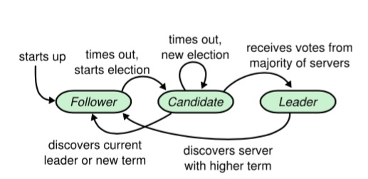

Raft
---

Raft is a consensus algorithm that is designed to be easy to understand.

Raft 是一个一致性算法, 同 (multi-)Paxos 做同样的事情; 但它设计的更易理解, 更易于实现.

以下节选自 [Diego Ongaro 的一封邮件](https://groups.google.com/forum/#!topic/raft-dev/95rZqptGpmU), 其中解释了 Raft 这个名字的来源

There's a few reasons we came up with the name Raft:

* It's not quite an acronym, but we were thinking about the words `reliable`, `replicated`, `redundant`, and `fault-tolerant`.

* We were thinking about logs and what can be built using them.

* We were thinking about the island of Paxos and how to escape it.

Raft Basics
---
Raft implements consensus by first electing a server as leader, then giving the leader complete responsibility for managing the replicated log.

The leader accepts log entries from clients, replicates them on other servers, and tells servers when it is safe to apply log entries to their state machines. Having a leader simplifies the management of the replicated log.

Raft divides time into `terms` of arbitrary length. Each term begins with an `election`.

- - -

Raft 通过将问题分解成若干个子问题来解决

* [Leader Election](leader_election.md)

* [Log Replication](log_replication.md)

* [Safety](safety.md)

- - -

* [Log Compaction](log_compaction.md)

* [Membership changes](membership.md)

- - -

**Implementations**

* [Logcabin](logcabin.md)

* [etcd](etcd.md)

Further Readings
----

* [Raft Official Site](https://raft.github.io/)

* [In Search of an Understandable Consensus Algorithm](https://raft.github.io/raft.pdf)

- - -

* Diego Ongaro: Consensus: Bridging Theory And Practice, PhD Thesis, August 2014

