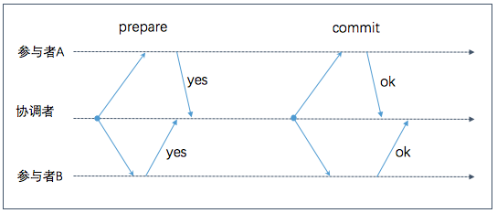
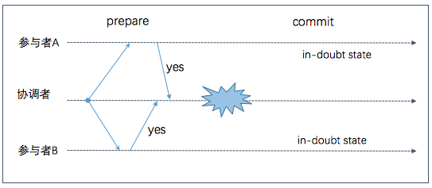
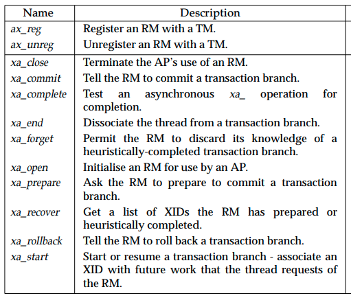
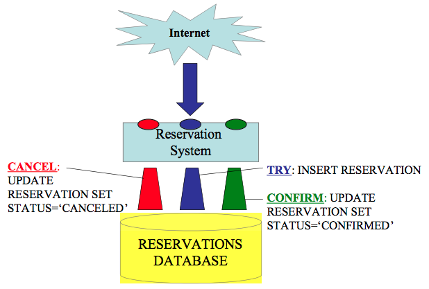

Distributed Transaction
---

## Introduction

分布式事务: 事务需要跨多个节点或者分区, 我们期望所有节点就事务结果达成一致(共识): 要么全部中止/回滚, 要么全部提交. 这类问题, 也被称为原子提交 (atomic commit) 问题. 原子性可以帮助我们简化错误处理，事务要么全部完成，要么全部中止，不会出现部分完成或更新的中间状态.

在单节点数据库中执行的事务，原子性由存储引擎实现. 当客户端向数据库服务器发送 commit 请求，数据库会保证事务的写持久化（事务数据会被顺序写入一个日志文件，比如 MySQL中的 redo log）. 如果数据库在此过程中崩溃，在数据库重启时，会从日志文件中恢复，以保证事务的原子性. 

_注:对单机事务的实现细节感兴趣的同学, 可以阅读 Nine Algorithms that Changed the future 中译名: 改变未来的九大算法 第八章_ 

可以看出, 在单节点事务中，单个节点就可以保证提交的原子性. 但是当一个事务由多个节点参与时， 比如在一个分库的数据系统或是一个分片的数据库中，简单的给所有节点发送一个 commit 请求并不能解决问题. 因为很可能一部分节点会成功，另一部分节点会失败，这破坏了原子性

* 一些节点可能发现请求破坏了某些约束，比如唯一约束或外键约束，导致它们需要中止请求

* 一些 commit 请求可能因网络问题（延迟或者分区）丢失了，最终导致超时

* 一些节点可能在成功 commit 之前崩溃了

如果一部分节点成功提交了事务，而另一部分节点中止了事务，节点间会存在数据不一致性. 此外，节点上的事务一旦提交，就不能再撤销，因为它的结果可能已经对其他事务可见. 因此，一个不错的想法是: 让一个节点在确认所有其他节点都同意提交事务时再提交事务.

## Two Phase Commit (2PC)

二阶段提交 Strong Consistency

该算法是解决分布式事务的最常用方法; 数据库厂商在很早之前就意识到数据库分片的必要性, 因此引入了2PC 算法以便在多个数据库节点间实现 ACID, 其中包括 MySQL, PostgreSQL

### 基本流程

2PC 相对于单节点的事务, 引入了一个新组件: 协调者 (coordinator), 也被称为事务管理者 (transaction manager, 简称 TM). 协调者通常被实现为一个 SDK 库, 也有作为一个独立进程或者服务的例子, 比如 JOTM, BTM 以及 MSDTC.

*2PC 成功执行流程*

2PC 算法包含二个阶段

当应用程序想要开始一个分布式事务时, 它向协调者请求一个全局唯一的 transaction ID; 协调者向所有参与者（节点）发送 Prepare 请求, 附带 transaction ID. 如果请求失败或者超时, 协调者将向所有参与者发送 Abort 请求

* Prepare Phase 准备阶段

    当参与者接收到 Prepare 请求, 它需要确认是否可以提交该事务; 一旦决定回复协调者 yes, 就必须保证之后该事务一定可以提交, 不论是进程崩溃, 发生断电, 磁盘耗尽等. 参与者在同意提交后, 需要一直阻塞等待第二阶段的决定请求(Commit or Abort)

    **这是第一个不能撤销点 no return of point**, 注意在此步参与者并没有实际提交该事务

* Commit Phase (Commit or Abort) 提交阶段

    当协调者收到所有参与者的回复, 它将做一个最终决定, 提交或中止事务(只向回复 yes 的参与者发送). 协调者需要将此决定持久化到事务日志中以保证不会因后面的故障而丢失此决定.

    注意协调者一旦作出决定，就不能再撤销，这是**第二个不能撤销点** 这也是 2PC 的提交点 (commit point), **2PC 的提交点归结为协调者单节点上的原子提交**

    当决定被写入磁盘, 协调者会发送 Decision (Commit or Abort) 请求; 如果此时请求失败或者超时, 协调者会一直重试直到成功.

### 协调者故障

我们上面讨论了对于参与者或者网络故障的处理方法

* 当 Prepare 请求失败或者超时, 协调者会中止事务

* 当 Decision 请求失败或超时, 协调者会一直重试直至成功

如果参与者在接收到 Prepare 请求, 并同意提交后, 它将无法再中止事务, 必须等待协调者发送 Decision 请求; 如果此时协调者出现故障或者网络发生故障, 参与者什么也不能做, 只能等待. 参与者事务在此种情形下状态称为 in doubt 或 uncertain(不确定状态). 这也是为什么算法第二阶段中协调者需要先将决定写入事务日志而后发送 Decision 请求.

*协调者在第一阶段参与者回复 yes 后崩溃*

因为这个原因, 2PC 通常被称为同步阻塞算法. 一个改进的 3PC, 但因为它对网络的延迟时间，节点的响应时间有一定假设，在实践中用的不多，所以这里不做介绍.

## 实践中的分布式事务

分布式事务, 尤其是那些通过 2PC 实现的事务, 大多毁誉参半. 一方面它们的确解决了实际中重要的问题，保证多个参与者数据保持一致，但它们也经常被批评容错性差(系统可用性降低, 因为系统的可用性依赖于事务所有参与者的可用性, 等于参与者可用性的乘积), 性能不高（主要影响性能点在于为了故障恢复而做的 disk fsync 以及额外的网络通信). 2PC 的主要实现有 XA, TCC

另外, 一些人放弃使用 2PC, 其中包括 eBay 的 Dan Pritchett 在 Base: An Acid Alternative 中采用本地消息表来实现最终一致性, 以及 Gregor Hohpe 在 2005 年发表的 Your Coffee Shop Doesn’t Use Two-Phase Commit 中讨论为什么星巴克不使用 2PC.

按照 Martin Kelppmann 在 Designing Data-Intensive Applications 一书 Distributed Transactions in Practice 一节中的分类, 将分布式事务分为二类

* 数据库内部的分布式事务
    
    一些分布式数据库(比如使用了复制和分片的数据库 Mongo Cluster)支持节点间的内部事务，比如 MySQL Cluster 的 NDB 存储引擎; 在这种情形下, 所有的参与节点都运行同一套软件

* 异构系统的分布式事务

    在一个异构事务中, 参与者们使用不同的技术体系，比如来自二个不同厂商的数据库，或者是非数据库系统，比如消息队列
    

### XA Transaction

X/Open XA (eXtended Architecture 缩写), 是针对于异构事务的制定的一套基于2PC 的标准; 于 1991 年推出，被广泛应用，其中包括许多传统关系型数据库，比如 PostgreSQL, DB2, MySQL, SQL Server, Oracle) 以及消息队列, 比如 ActiveMQ, MSMQ, IBM MQ)

注意它不是一个网络协议，只是一套用来和协调者交互的 C API. 在 Java 中是用 Java Transaction API (JTA) 来实现的 XA. 

The X/Open 分布式事务处理 (DTP) 模型包含 3 个组件

* 应用程序 (AP) 定义事务边界, 指定参与事务的动作

* 资源管理器 Resource managers (RMs, 比如数据库或者文件系统) 提供对共享资源的访问

* 事务管理器 transaction manager (TM) 分配事务标识符, 监控它们的进度

 XA 假设应用程序可以通过网络驱动或者客户端库与其他参与者(数据库或者消息队列)通信, 以及要求事务的参与者都支持 XA

### TCC

Try-Cancel/Confirm, 是 Atomikos 公司针对于 Web 服务(也适用于微服务架构的系统)提出的一个 2PC 优化版的解决方案, 相关文章见 Business Transactions, Compensation and the TryCancel/Confirm (TCC) Approach for Web Services

TCC 与 2PC 的思路基本一致, 主要的改进体现在参与者上, 在 2PC 中参与者一旦在 Prepare 阶段同意提交, 就需要一直阻塞等待第二阶段的 Decision 请求; TCC 要求参与者实现 3 个接口 Try, Cancel, Confirm, 以避免参与者的阻塞等待

*来源: Business Transactions, Compensation and the TryCancel/Confirm (TCC) Approach for Web Services, Figure 4*

* TRY 代表着正常的业务逻辑, 比如预留资源

* CANCEL 代表着可能的取消策略, 比如说补偿

* CONFIRM 通常是另一个 ACID 事务, 用来将 TRY 中预留的资源更新

TCC 方法适用于本身就是二阶段的业务模型, 比如说已存在的业务中本身就存在预订(预约)环节, 服务提供者需要提供额外的接口来处理 CANCEL 和 CONFIRM

国内应用的 TCC 的知名大厂有阿里云 GTS 和蚂蚁金服 DTX

### 协调者故障

如果协调者作为 SDK 集成到应用程序中, 可能需要将事务日志持久化到磁盘, 这将影响应用程序无状态化的设计. 另一方面也存在单点故障.

在理论上, 如果协调者崩溃而后重启, 它应该可以从日志中恢复，并解决所有 in-doubt 事务. 然而, 在实践中, in-doubt 事务是可能存在的, 即使协调者已经实现了高可用(通过 master/slave, paxos...)

在调研, 应用基于 2PC 的解决方案时，一定要深入了解其对于协调者故障的处理细节

### Spanner

Google 出品的一款高可用, 强一致性的分布式数据库. 
...

### Not 2PC

放弃 2PC!!!

在深入细节之前, 我们先讨论一致性问题; 通常我们会按 Timeliness (及时性) 和 Integrity (完整性) 将一致性分为 3 类 (参考 Transactions Across Data-centers)

#### 强一致性 (Strong consistency)

写操作完成后, 就可以读到值

* 文件系统 File systems

* 关系型数据库 (MySQL, PostgreSQL)

The tendency of both business stakeholders and developers is to assert that consistency is paramount to the success of the application.

BASE - An Acid Alternative

    
#### 最终一致性 (Eventual consistency)

写操作完成后, 最终可以读到值 (数据不一致是暂时的, 一段时间后数据会达成一致)

* 搜索引擎

* DNS, SMTP, mail

* Amazon S3, Dynamo, Cassandra

#### 弱一致性 (Weak consistency)

写操作完成后, 可能读到也可能读不到(尽最大努力)

* redis, memcache

* 多人实时在线游戏

Gregor Hohpe 在 Your Coffee Shop Doesn’t Use Two-Phase Commit 一文中针对于异步系统的异常处理给出了 4 种可选的策略, 具体选择何种策略取决于具体的应用场景; 前 3 种策略与 2PC 的不同点在于它们满足最终一致性或弱一致性, 而 2PC 满足强一致性

* Write-off Weak Consistency

    这是最简单的策略: 什么都不做, 丢弃已做的; 这看起来像是个很差的方案, 但在实际的业务中, 是可能被接受的

* Retry 重试
    ...

* Compensating action 补偿
    ...

* Transaction coordinator 事务协调
    ...

## Further Readings

* Designing Data Intensive Applications, Chapter 9, Consistency and Consensus

- - -

* [Distributed Transaction Processing: The XA Specification](http://pubs.opengroup.org/onlinepubs/009680699/toc.pdf)

- - -

* Guy Pardon: [Business Transactions, Compensation and the TryCancel/Confirm (TCC) Approach for Web Services](https://cdn.ttgtmedia.com/searchWebServices/downloads/Business_Activities.pdf)

* [Towards Distributed Atomic Transactions over RESTful Services](http://www.pautasso.info/biblio-pdf/rest-tcc.pdf)

    以上二篇文章是对 TCC 的描述

- - -

* Dan Pritchett: [Base: An Acid Alternative](https://queue.acm.org/detail.cfm?id=1394128)

    In partitioned databases, trading some consistency for availability can lead to dramatic improvements in scalability 在做了分区的数据库中, 为了可用性舍弃一些一致性可以让系统在可伸缩性方面获得巨大提升   

* Gregor Hohpe: Your Coffee Shop Doesn’t Use Two-Phase Commit, March 2005

    趣谈为什么星巴克不用 2PC

* Ryan Barrett: Transactions Across Data-centers, May 27, 2009

    讨论跨数据中心的事务

* Pat Helland (Position Paper): Life beyond Distributed Transactions

    初版 2007 年, 2016 年有个修订版

- - -

* Clemens Vasters: [Achieving Transactional Behavior with Messaging](https://blogs.msdn.microsoft.com/clemensv/2011/10/06/achieving-transactional-behavior-with-messaging/)

* [Transactions in Windows Azure (with Service Bus) - An Email Discussion](https://blogs.msdn.microsoft.com/clemensv/2012/07/30/transactions-in-windows-azure-with-service-bus-an-email-discussion/)

- - -

* [MySQL XA Transactions](https://dev.mysql.com/doc/refman/8.0/en/xa.html)

* [阿里云 GTS](https://help.aliyun.com/product/48444.html?spm=5176.8135549.918380.btn5.37306ddcnKyqvE)

* [蚂蚁金服 DTX](https://www.cloud.alipay.com/products/DTX)
