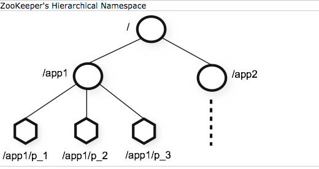

Data model and hierarchical namespace
---
The name space provided by ZooKeeper is much like that of a standard file system. The main differences between ZooKeeper and standard file systems are that

* every `znode` can have data associated with it (every file can also be a directory and vice-versa) and

* `znodes` are limited to the amount of data that they can have.

*来源 ZooKeeper Documentation: Overview*

ZooKeeper was designed to store coordination data: status information, configuration, location information, etc.

## ZNode

Unlike files in file systems, `znodes` are not designed for general data storage. Instead, `znodes` map to abstractions of the client application, typically corresponding to meta-data used for coordination purposes.

There are two types of `znodes` that a client can create:

* `Regular`: Clients manipulate regular `znodes` by creating and deleting them explicitly;

* `Ephemeral`: Clients create such `znodes`, and they either delete them explicitly, or let the system remove them automatically when the session that creates them terminates (deliberately or due to a failure).

