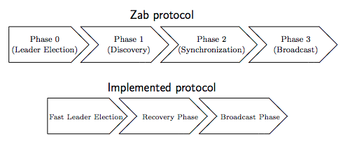

Zab
---
Zab is the Zookeeper Atomic Board-cast protocol.

Critical to the design of Zab is the observation that each state change is incremental with respect to the previous state, so there is an implicit dependence on the order of the state changes.

Two important requirements for Zab are

* handling multiple outstanding client operations and

* efficient recovery from crashes.

An outstanding transaction is one that has been proposed but not yet delivered. For high-performance, it is important that ZooKeeper can handle multiple outstanding state changes requested by the client and that a prefix of operations submitted concurrently are committed according to FIFO order. Moreover, it is useful that the system can recover efficiently after the leader has crashed.


## Zab vs. Paxos

Zab at a high level is a leader based protocol similar to Paxos. Some of the aspects that distinguish Zab from Paxos is that Zab recovers histories rather than single instances of protocols.

Zab is a different protocol than Paxos, although it shares with it some key aspects, as for example:

* A leader proposes values to the followers

* Leaders wait for acknowledgements from a quorum of followers before considering a proposal committed (learned)

* Proposals include epoch numbers, which are similar to ballot numbers in Paxos

<div class="alert alert-warn">
The main conceptual difference between Zab and Paxos is that it is primarily designed for primary-backup systems, like Zookeeper, rather than for state machine replication.
</div>


## Protocol

The `proposals` are communicated between follower and leader using a single data structure

``` java
class QuorumPacket {
    int type; // Request, Ack, Commit, Ping, etc
    long zxid;
    buffer data;
    List<Id> authinfo; // only used for requests
}
```


Zab servers have the following state

* **history**: an on disk log of proposals accepted

* **lastZxid**: zxid of the last proposal in the history

* **acceptedEpoch**: the epoch number of the last `NEWEPOCH` packet accepted

* **currentEpoch**: the epoch number of the last `NEWLEADER` packet accepted


### Implementation assumptions

* Use a best-effort leader election algorithm that will elect a leader with the latest history from a quorum of servers.

* An observer or follower will only connect to a single leader at a time.

* Servers must process packets in the order that they are received. Since TCP maintains ordering when sending packets, this means that packets will be processed in the order defined by the sender.


## Zab Implementation





### Phase 1: Establish an epoch (Leader election)

All servers start off looking for a leader. Once the instance of leader election at a given server indicates a leader has emerged it will move to phase 1. If the leader election instance indicates that the server is the leader, it moves to phase 1 as a leader, otherwise it moves to phase 1 as a follower.


In this phase an elected leader makes sure that previous leaders cannot commit new proposals and decides on an initial history. (Note a leader is also considered a follower of itself.)


...


### Phase 2: Sync with followers

The Synchronization phase concludes the recovery part of the protocol, synchronizing the replicas in the ensemble using the leader’s updated history from the previous phase. The leader communicates with the followers, proposing transactions from its history. Followers acknowledge the proposals if their own history is behind the leader’s history. When the leader sees acknowledgements from a quorum, it issues a commit message to them. At that point, the leader is said to be established, and not anymore prospective.

...


### Phase 3: Broadcast

The leader and followers can have multiple proposals in process and at various stages in the pipeline. The leader will remain active as long as there is a quorum of followers acknowledging its proposals or pings within a timeout interval. The follower will continue to support a leader as long as it receives proposals or pings within a timeout interval. Any failures or timeouts will result in the server going back to leader election.


...


## References

* [Architecture of ZAB – ZooKeeper Atomic Broadcast protocol](https://distributedalgorithm.wordpress.com/2015/06/20/architecture-of-zab-zookeeper-atomic-broadcast-protocol/)

* Zab: High-performance broadcast for primary-backup systems

    Flavio P. Junqueira, Benjamin C. Reed, and Marco Serafini, Yahoo! Research

* Andr ́e Medeiros, ZooKeeper’s atomic broadcast protocol: Theory and practice, March 20, 2012

- - -

* [Wiki: Zab vs. Paxos](https://cwiki.apache.org/confluence/display/ZOOKEEPER/Zab+vs.+Paxos)

* [Wiki: Zab 1.0](https://cwiki.apache.org/confluence/display/ZOOKEEPER/Zab1.0)

