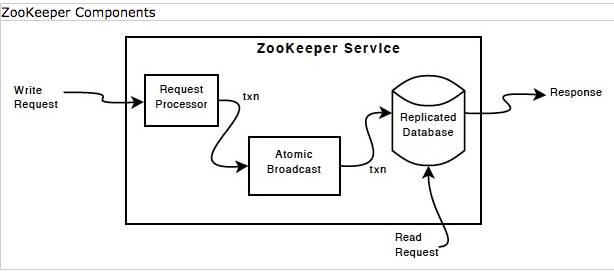

Zookeeper Server
---
ZooKeeper Server is designed to work in standalone mode and also be extensible so that it can be used to implement the quorum based version of ZooKeeper.

ZooKeeper 服务最初设计成以独立模式工作并且可以被扩展用于实现集群 quorum 版本.

ZooKeeper maintains a order when processing requests:

* All requests will be processed in order.

* All responses will return in order.

* All watches will be sent in the order that the update takes place.

*来源: [Zookeeper Document: Overview - Implementation](https://zookeeper.apache.org/doc/r3.4.12/zookeeperOver.html#Implementation)*

### Request processing

Requests are received by the `ServerCnxn`. Demarshalling of a request is done by `ClientRequestHandler`. After a request has been demarshalled, `ClientRequestHandler` invokes the relevant method in ZooKeeper and marshals the result.

If the request is just a query, it will be processed by ZooKeeper and returned. Otherwise, the request will be validated and a transaction will be generated and logged. This the request will then wait until the request has been logged before continuing processing.

All requests that update ZooKeeper state are forwarded to the leader. The leader executes the request and broadcasts the change to the ZooKeeper state through Zab, an atomic broadcast protocol.

Requests are logged as a group. Transactions are queued up and the `SyncThread` will process them at predefined intervals. (Currently `20ms`) The `SyncThread` interacts with ZooKeeperServer the txnQueue. Transactions are added to the txnQueue of `SyncThread` via queueItem. When the transaction has been synced to disk, its callback will be invoked which will cause the request processing to be completed.

### Data structure maintenance

ZooKeeper data is stored in-memory. Each znode is stored in a `DataNode` object. This object is accessed through a hash table that maps paths to DataNodes. DataNodes also organize themselves into a tree. This tree is only used for serializing nodes.

ZooKeeper 的数据存放在内存中. 每个 znode 被存储为一个 `DataNode` object. 这个 object 在一个 hash 表中通过路径来访问. 同时 `DataNode` 也组织成一个树, 用于序列化节点.

We guarantee that changes to nodes are stored to non-volatile media before responding to a client. We do this quickly by writing changes as a sequence of transactions in a log file. Even though we flush transactions as a group, we need to avoid seeks as much as possible. Also, since the server can fail at any point, we need to be careful of partial records.

我们确保在响应客户端之前将 nodes 的更新持久化到非易失性存储介质上. 我们是通过将更新操作作为一系列事务写入 log 文件来实现的. 虽然我们以组为单位刷新事务, 但我们仍需尽量避免寻道. 此外, 因为服务器可能在任意时间点失败, 我们需要小心的处理残缺(不完整)记录.

We address the above problems by

* Pre-allocating 1M chunks of file space. This allows us to append to the file without causing seeks to update file size. It also means that we need to check for the end of the log by looking for a zero length transaction rather than simply end of file.

* Writing a signature at the end of each transaction. When processing transactions, we only use transactions that have a valid signature at the end.

As the server runs, the log file will grow quite large. To avoid long startup times we periodically take a snapshot of the tree of DataNodes. We cannot take the snapshot synchronously as the data takes a while to write out, so instead we asynchronously write out the tree. This means that we end up with a "corrupt" snapshot of the data tree.

随着服务长时间运行, 日志文件会变得非常庞大. 为了避免启动时时间过长, 我们周期性地对 `DataNode` Tree 做快照. 因为完整的数据需要一些时间才能写出, 所以我们不能同步的做快照, 而是使用异步方式. 这意味着这我们最终得到的是一个 "混乱" 的快照.

More formally if we define `T` to be the real snapshot of the tree at the time we begin taking the snapshot and `l` as the sequence of transactions that are applied to the tree between the time the snapshot begins and the time the snapshot completes, we write to disk `T+l'` where `l'` is a subset of the transactions in `l`. While we do not have a way of figuring out which transactions make up `l'`, it doesn't really matter. `T+l'+l = T+l` since the transactions we log are idempotent (applying the transaction multiple times has the same result as applying the transaction once).

So when we restore the snapshot we also play all transactions in the log that occur after the snapshot was begun. We can easily figure out where to start the replay because we start a new logfile when we start a snapshot. Both the snapshot file and log file have a numeric suffix that represent the transaction id that created the respective files.

