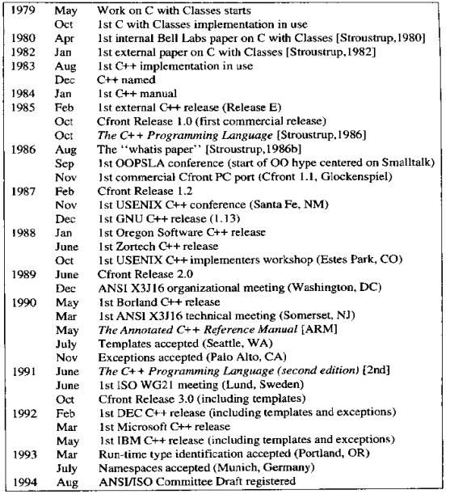

C++
---

C++ implementations obey the zero-overhead principle: What you don’t use, you don’t pay for. And further, what you do use, you couldn’t hand code any better.
                                                              - Bjarne Stroustrup

## Timeline

## Features

### STL

* [Al Stevens Interviews Alex Stepanov](https://www.sgi.com/tech/stl/drdobbs-interview.html)

## Further Readings

Books

* The Design and Evolution of C++  老头子的心血历程

* The C++ Programming Language

* (More) Effective C++  专家经验

* Effective Modern C++: 42 Specific Ways to Improve Your Use of C++11 and C++14

* Modern C++ Design: Generic Programming and Design Patterns Applied

* Inside the C++ Object Model  技术内幕

