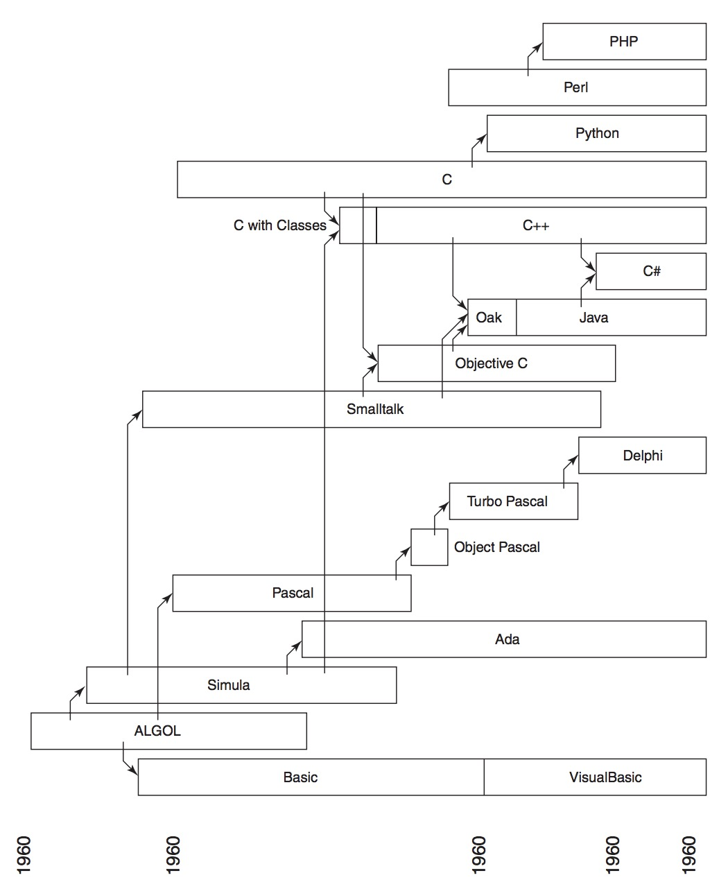

Languages
---

A powerful programming language is more than just a means for instructing a computer to perform tasks. The language also serves as a framework within which we organize our ideas about processes.

我们希望建立起这样一种看法: 一门编程语言

* 不仅仅是让计算机去执行操作的一种方式

* 它还是一种表述有关方法学的思想的新颖的媒介； 因此, 程序应该写的能够让人阅读

- - -

*来源: Object-Oriented Analysis and Desigh with Applications 附录 A-1 有影响力的计算机语言谱系*

> 注：以下语言的排名是按小子学习的先后顺序，无其他含义

* [C](c.md)

    一门“接近机器”的语言，使机器的所有重要方面都能简单而有效的处理，而且是以程序员比较容易理解的方式

* [C++](c++/intro.md)

    C++ 是一门通用的程序设计语言，其设计目的是为了让程序员能够更愉快的写程序 - Stroustrup
    
    在低/高级系统程序设计、嵌入式系统、数值／科学计算等领域，C++ 有着很好的优势

* [Python](Python/intro.md)
   
   一门“接近需要解决问题”的语言，可以直接而简洁的描述好要解决的问题
   
   在 Web 和机器学习领域，应用广泛；建议作为入门语言，只需要简单的初等数学基础

- - -

* [Java](java/intro.md)

* [Go](go.md)

* Future Languages 未来的语言

- - -

* [编译原理](compiler/intro.md)

## Further Readings 进一步阅读

**Books**

* Structure and Interpretation of Computer Program

    中译本：计算机程序的构造与解释；本书曾用于 MIT 的计算机导论课程，建议在有一定编程经验后阅读

* Masterminds of programming
