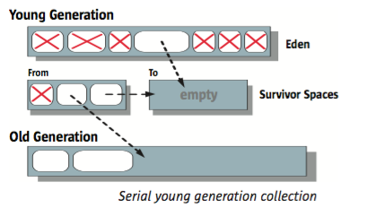
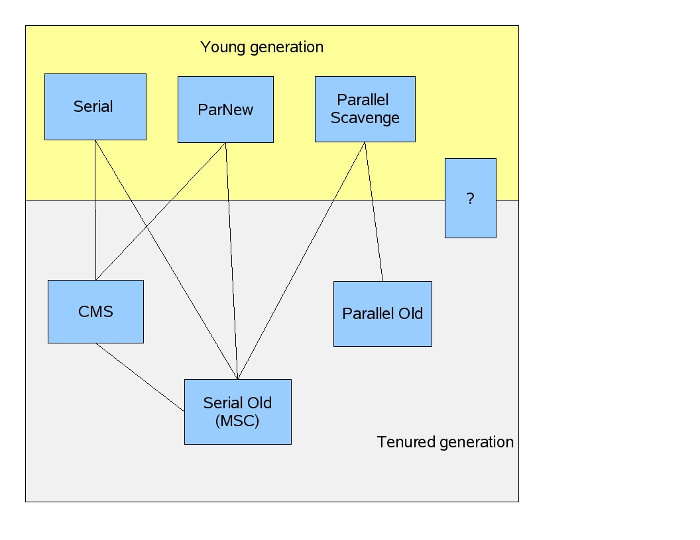

Garbage Collection
---
...

针对于 Hotspot JVM

The JVM knows exactly what objects and arrays it has allocated.

## Generations

*来源 Java Garbage Collection Basics*

### Why Generational Garbage Collection?

*来源 Java Garbage Collection Basics*

The heap is divided into two generations, **young** and **old**. The young generation comprises three spaces, `Eden` and two survivor spaces, whereas the old generation has just one memory space.

### Young Generation

*来源: Sun Microsystems: Memory Management in the Java HotSpot™ Virtual Machine. 2006*

The Young generation is meant to hold short-lived objects while the Old generation is intended for objects with longer lifetimes.

Objects are created in `Eden` by application threads, and are removed by a non-deterministic garbage collection cycle. The GC cycle runs when necessary (i.e., when available memory is getting low).

A simplified description of the garbage collection procedure: When `Eden` is full, a minor GC is run on `Eden` and objects that are alive from `Eden` and `Survivor1` are copied to `Survivor2`. The Survivor regions are swapped.

If an object is old enough or `Survivor2` is full, it is moved to `Old`. Finally when `Old` is close to full, a full GC is invoked.

*来源: Sun Microsystems: Memory Management in the Java HotSpot™ Virtual Machine. 2006*

After a young generation collection

*来源: Sun Microsystems: Memory Management in the Java HotSpot™ Virtual Machine. 2006*

### Changed On Java8

### Heap sizes

#### Initial and Maximum Heap Sizes

The maximum heap size is not actually used by the JVM unless the program creates enough objects to require it. A much smaller amount, called the initial heap size, is allocated during JVM initialization.

To verify the default values, use the `-XX:+PrintFlagsFinal` option and look for MaxHeapSize in the output. For example, on Linux or Solaris, we can run the following: `java -XX:+PrintFlagsFinal <GC options> -version | grep MaxHeapSize`

#### Common Heap settings

* **-Xms**	Sets the initial heap size for when the JVM starts.

* **-Xmx**	Sets the maximum heap size.

* **-Xmn**	Sets the size of the Young Generation.

* **-XX:PermSize**	Sets the starting size of the Permanent Generation.

* **-XX:MaxPermSize**	Sets the maximum size of the Permanent Generation

#### Guidelines

The following are general guidelines regarding heap sizes for server applications:

* Unless you have problems with pauses, try granting as much memory as possible to the virtual machine. The default size is often too small.

* Setting `-Xms` and `-Xmx` to the same value increases predictability by removing the most important sizing decision from the virtual machine. If not, the JVM will start by using the initial heap size and will then grow the Java heap until it finds a balance between heap usage and performance. However, the virtual machine is then unable to compensate if you make a poor choice.

* In general, increase the memory as you increase the number of processors, since allocation can be parallalized.

## Garbage Collectors

*来源 https://blogs.oracle.com/jonthecollector/our-collectors*

### The Serial GC

The serial collector is the default for client style machines in Java SE 5 and 6. With the serial collector, both minor and major garbage collections are done serially (using a single virtual CPU).

In addition, it uses a mark-compact collection method. This method moves older memory to the beginning of the heap so that new memory allocations are made into a single continuous chunk of memory at the end of the heap. This compacting of memory makes it faster to allocate new chunks of memory to the heap.

#### When to Use

The Serial GC is the garbage collector of choice for most applications that do not have low pause time requirements and run on client-style machines. It takes advantage of only a single virtual processor for garbage collection work (therefore, its name)

To enable the Serial Collector use: `-XX:+UseSerialGC`

### The Parallel GC

The parallel garbage collector uses multiple threads to perform the young generation garbage collection.

 By default on a host with N CPUs, the parallel garbage collector uses N garbage collector threads in the collection. The number of garbage collector threads can be controlled with command-line options: `-XX:ParallelGCThreads=<desired number>`

**-XX:+UseParallelGC**

With this command line option we get a multi-thread young generation collector with a single-threaded old generation collector. The option also does single-threaded compaction of old generation.

**-XX:+UseParallelOldGC**

With the `-XX:+UseParallelOldGC` option, the GC is both a multi-threaded young generation collector and multi-threaded old generation collector. It is also a multi-threaded compacting collector.

HotSpot does compaction only in the old generation. Young generation in HotSpot is considered a copy collector; therefore, there is no need for compaction.

#### When to use

The Parallel collector is also called a throughput collector. Since it can use multiple CPUs to speed up application throughput. This collector should be used when a lot of work need to be done and long pauses are acceptable. For example, batch processing like printing reports or bills or performing a large number of database queries.

### Concurrent Mark Sweep (CMS) Collector

The Concurrent Mark Sweep (CMS) collector (also referred to as the concurrent low pause collector) collects the tenured generation. It attempts to minimize the pauses due to garbage collection by doing most of the garbage collection work concurrently with the application threads.

Normally the concurrent low pause collector does not copy or compact the live objects. A garbage collection is done without moving the live objects. If fragmentation becomes a problem, allocate a larger heap.

The CMS collector attempts to reduce pause times due to major collections by using separate garbage collector threads to trace the reachable objects concurrently with the execution of the application threads.

During each major collection cycle, the CMS collector pauses all the application threads for a brief period at the beginning of the collection and again toward the middle of the collection.

The second pause tends to be the longer of the two pauses. Multiple threads are used to do the collection work during both pauses.

The remainder of the collection (including most of the tracing of live objects and sweeping of unreachable objects is done with one or more garbage collector threads that run concurrently with the application. Minor collections can interleave with an ongoing major cycle, and are done in a manner similar to the parallel collector (in particular, the application threads are stopped during minor collections).

#### When to use

The CMS collector should be used for applications that require low pause times and can share resources with the garbage collector. Examples include desktop UI application that respond to events, a web server responding to a request or a database responding to queries.

To enable the CMS Collector use: `-XX:+UseConcMarkSweepGC` and to set the number of threads use: `-XX:ParallelCMSThreads=<n>`

### The G1 Garbage Collection

The Garbage First or G1 garbage collector is available in Java 7 and is designed to be the long term replacement for the CMS collector. The G1 collector is a parallel, concurrent, and incrementally compacting low-pause garbage collector that has quite a different layout from the other garbage collectors.

To enable the G1 Collector use: `-XX:+UseG1GC`

## Garbage Collection Tuning

### Priority of Goals

The goals are addressed in the following order:

* **Maximum pause time goal** - the length of time during which application execution is stopped while garbage collection is occurring

* **Throughput goal** - the percentage of total time not spent in garbage collection, considered over long periods of time.

* **Minimum footprint goal** - a measure of size, such as heap size

### Measuring the Impact of GC

The first step in GC tuning is to collect statistics on how frequently garbage collection occurs and the amount of time spent GC. This can be done by adding `-verbose:gc -XX:+PrintGCDetails`,  `-XX:+PrintGCTimeStamps` to the Java options.

### Advanced GC Tuning

The goal of GC tuning is to ensure that only long-lived objects are stored in the Old generation and that the Young generation is sufficiently sized to store short-lived objects.

Some steps which may be useful are:

* Check if there are too many garbage collections by collecting GC stats. If a full GC is invoked multiple times for before a task completes, it means that there isn’t enough memory available for executing tasks.

* If there are too many minor collections but not many major GCs, allocating more memory for `Eden` would help. You can set the size of the `Eden` to be an over-estimate of how much memory will need. If the size of `Eden` is determined to be `E`, then you can set the size of the Young generation using the option `-Xmn=4/3*E`. (The scaling up by `4/3` is to account for space used by survivor regions as well.)

* In the GC stats that are printed, if the OldGen is close to being full, consider decreasing the size of the Young generation. This means lowering `-Xmn` if you’ve set it as above. If not, try changing the value of the JVM’s `NewRatio` parameter. Many JVMs default this to 2, meaning that the Old generation occupies 2/3 of the heap.

* Try the `G1GC` garbage collector with `-XX:+UseG1GC`. It can improve performance in some situations where garbage collection is a bottleneck. Note that with large executor heap sizes, it may be important to increase the G1 region size with `-XX:G1HeapRegionSize`

* Monitor how the frequency and time taken by garbage collection changes with the new settings.

Someone's experience suggests that the effect of GC tuning depends on your application and the amount of memory available. There are many more tuning options described online, but **at a high level, managing how frequently full GC takes place can help in reducing the overhead**.

## Further Readings

Online Articles

* [Java Garbage Collection Basics](http://www.oracle.com/webfolder/technetwork/tutorials/obe/java/gc01/index.html)

    入门指导

* [Java Documentation: HotSpot Virtual Machine Garbage Collection Tuning Guide](https://docs.oracle.com/javase/8/docs/technotes/guides/vm/gctuning/index.html)

    官方文档

* Sun Microsystems: Memory Management in the Java HotSpot™ Virtual Machine. 2006

* Martin Thompson: [Java Garbage Collection Distilled, July 2013](https://mechanical-sympathy.blogspot.com/2013/07/java-garbage-collection-distilled.html)

    Mechanical Sympathy 系列

- - -

Books

* The Garbage Collection Handbook : The Art of Automatic Memory Management
