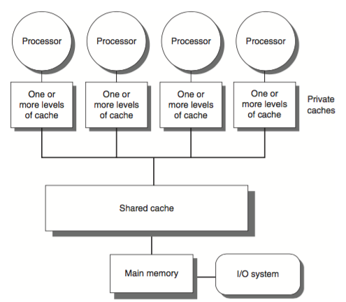
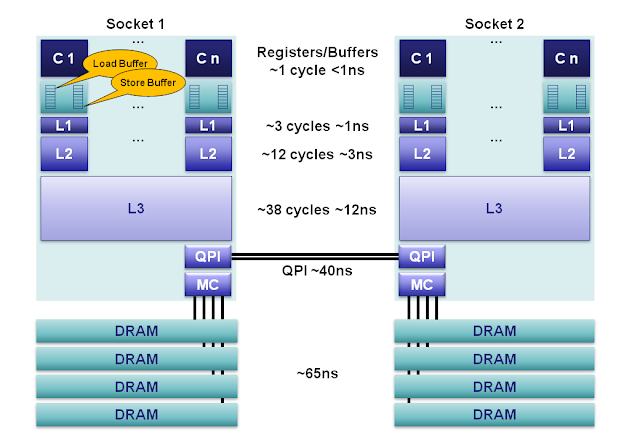
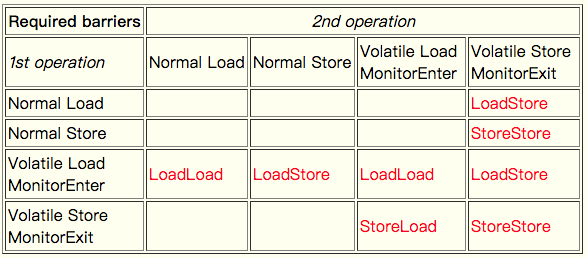

Java Memory Model 内存模型
---

编写中...


## 前言

为了追求更快的速度, 多处理器编程是并行的一个方向(另一个是分布式集群, 其中以 G 公司为代表).

但编写并行程序更加困难, 一方面是我们必须在多处理器上以并行程序获得更高的性能, 必须考虑程序的可伸缩性 (增加更多的硬件资源, 程序的性能应该能够得到进一步提升);

另一方面是我们需要对硬件有足够深入的了解 (CPU 流水线, 乱序, 冒险执行指令..; 多处理器中的亲和调度..; 层次存储结构: 伪共享, 内存屏障...)


以下讨论的内存模型都假定在共享存储多处理器下讨论


*来源:*


### 层次存储结构

In shard-memory multiprocessor systems, processors generally have one or more layers of memory cache, which improves performance both by speeding access to data and reducing traffic on the shared memory bus.


在共享存储多处理器系统中, 每个处理器都有一级或多级缓存, 用来提高访问性能以及减少对共享内存总线的访问.


<div class="alert alert-info">
<p>The issue of exactly when a written value must be seen by a reader is defined by a memory consistency model</p>
<hr>
<p>内存一致性模型定义了一个 writer 写入的值何时必须被其他 reader 看到</p>
</div>


At the processor level, a memory model defines necessary and sufficient conditions for knowing that writes to memory by other processors are visible to the current processor, and writes by the current processor are visible to other processors.

在处理器级别, 内存模型定义了

* 其它处理器的内存写入对当前处理器可见以及

* 当前处理器的写入何时对其他处理器是可见的



*来源 [Martin Thompson: CPU Cache Flushing Fallacy](https://mechanical-sympathy.blogspot.com/2013/02/cpu-cache-flushing-fallacy.html)*

...


如果我们的缓存总是可以保证一致性, 为什么在写并发程序的时候还需要关心可见性呢?


### 重排序/乱序

There are a number of cases in which accesses to program variables (object instance fields, class static fields, and array elements) may appear to execute in a different order than was specified by the program. The compiler is free to take liberties with the ordering of instructions in the name of optimization. Processors may execute instructions out of order under certain circumstances. Data may be moved between registers, processor caches, and main memory in different order than specified by the program.

在访问变量(比如对象成员, 类静态成员和数组元素)时, 编译器可以为了优化而重排指令. 处理器可以在特定场景下乱序执行指令. 数据可能在寄存器, 处理器缓存以及主存之间以不同于程序中的顺序移动.


``` java
class VolatileExample {
  int x = 0;
  boolean v = false;

  public void writer() {
    x = 42;
    v = true;
  }

  public void reader() {
    if (v == true) {
      // x might be 0 or 42 here
    }
  }
}
```

The compiler, runtime, and hardware are supposed to conspire to create the illusion of as-if-serial semantics, which means that in a single-threaded program, the program should not be able to observe the effects of reorderings. However, reorderings can come into play in incorrectly synchronized multi-threaded programs, where one thread is able to observe the effects of other threads, and may be able to detect that variable accesses become visible to other threads in a different order than executed or specified in the program.

编译器, 运行时(runtime) 以及硬件协作创建**看起来是串行** (as-if-serial) 的假象, as-if-serial 的语义是在单线程程序中, 程序应该察觉不到发生了重排序. 但是, 在多线程程序中, 重排序可能导致错误的同步问题.

Most of the time, one thread doesn't care what the other is doing. But when it does, that's what synchronization is for.

大部分情况下, 一个线程不关心别的线程在做什么; 但当它需要关心时, 就需要同步机制.

<div class="alert alert-info">
For a compiler writer, the JMM mainly consists of rules disallowing reorderings of certain instructions that access fields (where "fields" include array elements) as well as monitors (locks).
</div>


### Memory Barrier 内存屏障

内存屏障只是一个 CPU 指令. 需要注意的是内存屏障不同于同步屏障. 内存屏障指令只能直接控制 CPU 与缓存的交互.

内存屏障之所以需要是因为现在大多数 CPU 都会通过乱序执行提升性能. 内存操作 (load, stores) 的重排序会导致并发程序出现非预期的行为

<div class="alert alert-info">
Compilers and CPUs can re-order instructions, provided the end result is the same, to try and optimise performance.  Inserting a memory barrier tells the CPU and the compiler that what happened before that command needs to stay before that command, and what happens after needs to stay after.
<hr>
<p>
编译器和 CPU 会重排指令, 在保证最终结果正确的前提下, 优化性能. 插入一个内存屏障指令会告诉 CPU 和编译器在屏障之前的指令不能重排到屏障后, 以及在屏障后的指令不能被重排到屏障之前
</p>
</div>


## Java 内存模型

为了避免在 JVM 上进行并行编程时需要手工管理内存屏障, Java 规范了其内存模型: Happens-Before, 提供了一系列同步机制, volatile, monitor enter/exit..., 用于屏蔽不同处理器体系之间的差异

<div class="alert alert-danger">
Lamport 在论文 "Times, Clock, and the Ordering of Events in a Distributed System" 提出了 Happens Before 概念; Lamport 在论文中阐明: 尽管时钟同步是可能的, 但它不是绝对必要的. 如果二个进程不进行交互, 那么它们的时钟也无需同步, 这是因为即使没有同步也察觉不出来, 并且也不会产生问题. 重点是, 不同进程中的相关事件以正确的顺序发生.
</div>


<div class="alert alert-warn">
The memory model describes possible behaviors of a program. An implementation is free to produce any code it likes, as long as all resulting executions of a program produce a result that can be predicted by the memory model. This provides a great deal of freedom to perform a myriad of code transformations, including the reordering of actions and removal of unnecessary synchronization.
<hr>
内存模型描述了一个程序的可能行为, 实际中编译器可以生成任意代码, 只要所有可能的执行路径产生的结果可以通过内存模型来预测.
</div>

The new memory model semantics create a partial ordering on **memory operations** (read field, write field, lock, unlock) and other **thread operations** (start and join), where some actions are said to happen before other operations.

新的内存模型在内存操作(读取字段, 写字段, 加锁, 解锁)和其他线程操作(start 和 join)在建立了偏序关系, 某些操作先发生于其他操作.

When one action happens before another, the first is guaranteed to be ordered before and visible to the second. The rules of this ordering are as follows:

当一个动作先发生于另一个动作, 那么第一个保证排序在前并且对第二个可见

* Each action in a thread happens before every action in that thread that comes later in the program's order.

* An unlock on a monitor happens before every subsequent lock on that same monitor.

* A write to a `volatile` field happens before every subsequent read of that same `volatile`.

* A call to `start()` on a thread happens before any actions in the started thread.

* All actions in a thread happen before any other thread successfully returns from a `join()` on that thread.


### volatile

volatile 主要用于在不同线程间进行(共享)状态通信. JVM 保证对 volatile 变量的读操作可以看到其他线程的最新写入值.

<div class="alert alert-info">
Note that it is important for both threads to access the same volatile variable in order to properly set up the happens-before relationship. It is not the case that everything visible to thread A when it writes volatile field f becomes visible to thread B after it reads volatile field g. The release and acquire have to "match" (i.e., be performed on the same volatile field) to have the right semantics.
</div>


``` java
class VolatileExample {
  int x = 0;
  volatile boolean v = false;

  public void writer() {
    x = 42;
    v = true;
  }

  public void reader() {
    if (v == true) {
      // uses x - guaranteed to see 42.
    }
  }
}
```

在 JSR 133 新的内存模型中, JVM 不仅要求 volatile 变量间不会重排序, 对于 volatile 与普通变量间是否可以重排序也做了严格限制


*来源: [The JSR-133 Cookbook for Compiler Writers](http://gee.cs.oswego.edu/dl/jmm/cookbook.html)*

注意 JSR-133 规范中提到的内存屏障只是逻辑上的, 并不是真正的 CPU 指令, 具体编译器在生成机器码时是否会插入屏障取决于具体的处理器体系.


## Further Readings

* Java Language Specification, 17.4, Memory Model

* [The Java Memory Model](http://www.cs.umd.edu/~pugh/java/memoryModel/)

    提供了 JMM 的一系列文章和相关讨论的链接

* Jeremy Manson and Brian Goetz: [JSR 133 Java Memory Model FAQ](http://www.cs.umd.edu/~pugh/java/memoryModel/jsr-133-faq.html#whatismm). February 2004

    面向开发同学, 对内存模型的常见问题

* Doug Lea: [The JSR-133 Cookbook for Compiler Writers](http://gee.cs.oswego.edu/dl/jmm/cookbook.html)

    面向 JVM 和编译器的开发同学, 如何实现新的内存模型

- - -

Blogs

* Paul E. McKenney: Memory Barriers: a Hardware View for Software Hackers

* Martin Thompson: [Memory Barriers/Fences](https://mechanical-sympathy.blogspot.com/2011/07/memory-barriersfences.html). July 2011

* Martin Thompson: [CPU Cache Flushing Fallacy](https://mechanical-sympathy.blogspot.com/2013/02/cpu-cache-flushing-fallacy.html). February 2013

* Trisha Gee: [Dissecting the Disruptor: Demystifying Memory Barriers](http://mechanitis.blogspot.com/2011/08/dissecting-disruptor-why-its-so-fast.html). August 2011

* Dennis Byrne: [Memory Barriers and JVM Concurrency](https://www.infoq.com/articles/memory_barriers_jvm_concurrency). Mar 2010

- - -

Questions on Stackoverflow

* [What does a LoadLoad barrier really do?](https://stackoverflow.com/questions/15360598/what-does-a-loadload-barrier-really-do?rq=1) Mar 2013

* [Is volatile expensive?](https://stackoverflow.com/questions/4633866/is-volatile-expensive) Jan 2011

* [Are volatile variable reads as fast as normal reads?](https://stackoverflow.com/questions/1090311/are-volatile-variable-reads-as-fast-as-normal-reads) July 2009

* [Does the java memory model JSR-133 imply that entering a monitor flushes the cache?](https://stackoverflow.com/questions/3054251/does-the-java-memory-model-jsr-133-imply-that-entering-a-monitor-flushes-the-c) Jun 2010

* [Memory effects of synchronization in Java](https://stackoverflow.com/questions/1850270/memory-effects-of-synchronization-in-java) Dec 2009
