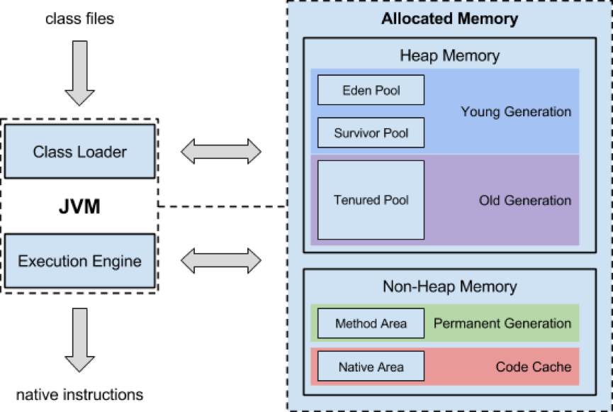

JVM
---

The JVM is a program that provides the runtime environment necessary for Java programs to execute. Java programs cannot run unless there is a JVM available for the appropriate hardware and OS platform we wish to execute on


The Java virtual machine knows nothing of the Java programming language, only of a particular binary format, the class file format. A class file contains Java virtual machine instructions (or byte-codes) and a symbol table, as well as other ancillary information.

## The structure of JVM

The main components of the JVM include the classloader, the runtime data areas, and the execution engine.





### The pc Register

The Java Virtual Machine can support many threads of execution at once. Each Java Virtual Machine thread has its own pc (program counter) register. At any point, each Java Virtual Machine thread is executing the code of a single method, namely the current method for that thread. If that method is not native, the pc register contains the address of the Java Virtual Machine instruction currently being executed. If the method currently being executed by the thread is native, the value of the Java Virtual Machine's pc register is undefined. The Java Virtual Machine's pc register is wide enough to hold a returnAddress or a native pointer on the specific platform.


### JVM Stacks

Each Java Virtual Machine thread has a private Java Virtual Machine stack, created at the same time as the thread. A Java Virtual Machine stack stores frames. A Java Virtual Machine stack is analogous to the stack of a conventional language such as C: it holds local variables and partial results, and plays a part in method invocation and return.


### Heap

The Java Virtual Machine has a heap that is shared among all Java Virtual Machine threads. The heap is the run-time data area from which memory for all class instances and arrays is allocated.

The heap is created on virtual machine start-up. Heap storage for objects is reclaimed by an automatic storage management system (known as a garbage collector); objects are never explicitly deallocated. The Java Virtual Machine assumes no particular type of automatic storage management system, and the storage management technique may be chosen according to the implementor's system requirements. The heap may be of a fixed size or may be expanded as required by the computation and may be contracted if a larger heap becomes unnecessary. The memory for the heap does not need to be contiguous.


### Method Area

The Java Virtual Machine has a method area that is shared among all Java Virtual Machine threads. The method area is analogous to the storage area for compiled code of a conventional language or analogous to the "text" segment in an operating system process. It stores per-class structures such as the run-time constant pool, field and method data, and the code for methods and constructors, including the special methods  used in class and instance initialization and interface initialization.

The method area is created on virtual machine start-up. Although the method area is logically part of the heap, simple implementations may choose not to either garbage collect or compact it.


### Runtime Constant Pool

A run-time constant pool is a per-class or per-interface run-time representation of the constant_pool table in a class file. It contains several kinds of constants, ranging from numeric literals known at compile-time to method and field references that must be resolved at run-time. The run-time constant pool serves a function similar to that of a symbol table for a conventional programming language, although it contains a wider range of data than a typical symbol table.

Each run-time constant pool is allocated from the Java Virtual Machine's method area. The run-time constant pool for a class or interface is constructed when the class or interface is created by the Java Virtual Machine.


### Native Method Stack

An implementation of the Java Virtual Machine may use conventional stacks, colloquially called "C stacks," to support native methods (methods written in a language other than the Java programming language). Native method stacks may also be used by the implementation of an interpreter for the Java Virtual Machine's instruction set in a language such as C.


## Hotspot Architecture


* 来源 [Java Garbage Collection Basics](http://www.oracle.com/webfolder/technetwork/tutorials/obe/java/gc01/index.html)*


## Class Loader

In a JVM, each and every class is loaded by some instance of a `java.lang.ClassLoader`. The `ClassLoader` class is located in the `java.lang` package and developers are free to subclass it to add their own functionality to class loading.


### Multiple namespaces

Once a class is loaded into a JVM, the same class will not be loaded again. This leads to the question of what is meant by "the same class." Similar to the condition that an object has a specific state, an identity, and that an object is always associated with its code (class), a class loaded into a JVM also has a specific identity, which we'll look at now.

In Java, a class is identified by its fully qualified class name. The fully qualified class name consists of the package name and the class name. **But a class is uniquely identified in a JVM using its fully qualified class name along with the instance of the ClassLoader that loaded the class.**

This means that a class loader defines a runtime namespace, which implies the following:

* Your application may use multiple class loaders to load multiple classes that have the same name.

* Two class objects that have different defining loaders are different types even if they are generated from the same class file.


### How class loaders work

All class loaders except the bootstrap class loader have a parent class loader.

The public method `loadClass` is where the loading process starts. The JVM loads all classes by making a call to `loadClass`. The default implementation of `loadClass` performs the following actions:


1. Calls `findLoadedClass` to check if the class has been loaded already. `ClassLoader` tracks classes that it has already loaded. Subclasses inherit this behavior.

2. If step 1 does not find a loaded class, calls `loadClass` on the parent class loader. In this way, the default implementation of `loadClass` supports the delegation model.

3. If the previous two steps do not produce a class, calls `findClass` to find the class, read its byte codes, and create the class object using defineClass.

4. If the above steps fail to produce a class, throws a `ClassNotFoundException`.


``` java
protected synchronized Class<?>
loadClass(String name, boolean resolve) throws ClassNotFoundException {
    // First check if the class is already loaded
    Class c = findLoadedClass(name);
    if (c == null) {
        try {
            if (parent != null) {
                c = parent.loadClass(name, false);
            } else {
                c = findBootstrapClass0(name);
            }
        } catch (ClassNotFoundException e) {
            // If still not found, then invoke
            // findClass to find the class.
            c = findClass(name);
        }
    }

    if (resolve) {
	    resolveClass(c);
    }
    return c;
}
```


## Security

### [Security Manager](http://docs.oracle.com/javase/tutorial/essential/environment/security.html)

A security manager is an object that defines a security policy for an application. This policy specifies actions that are unsafe or sensitive.

Any actions not allowed by the security policy cause a SecurityException to be thrown. An application can also query its security manager to discover which actions are allowed.

The point of the author of `Fluent Python` is:

<div class="alert alert-info"> in Java, access control modifiers are mostly about safety and not security, at least in practice (in the real world, Java applications are rarely deployed with a SecurityManager— except for Java applets)
</div>


## Further Readings

Books

* Java Language and Virtual Machine Specifications

* Understanding the JVM - Advanced Features and Best Practices
