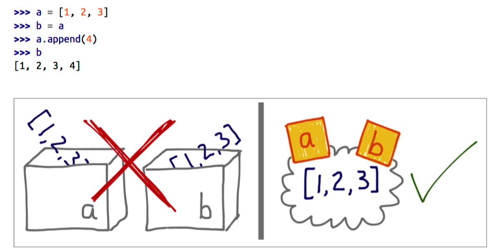
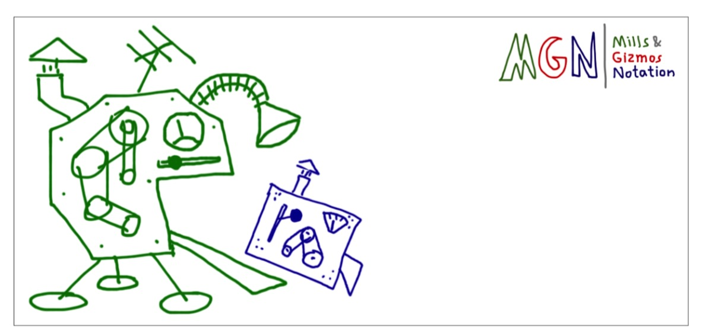

[Data Model 数据模型](https://docs.python.org/3/reference/datamodel.html#data-model)
----

## Objects, Values, Types

Objects are Python's abstraction for data. Every object has an `identity`, a `type` and a `value`.

Object 是 Python 对数据的抽象. 每个 object 都有一个 `identity`, `type` 和 `value`.

An object's identity never changes once it has been created. The `is` operator compares the identity of two objects.

一个 object 的 `identity` 自创建后就不会再变. `is` 操作符用来比较二个 object 是否是同一个.

**Note**: For CPython, `id(x)` is the memory address where x is stored.


An object's type is also unchangeable. An object’s type is accessible as its `__class__` attribute or can be retrieved with `type(obj)`.

一个 object 的类型也是不会变的. 一个 object 的类型可以通过 `__class__` 或者 `type(obj)` 来获得.

The value of some objects can change. Objects whose value can change can said to be `mutable`; objects whose value is unchangeable once they are created are called `immutable`.

某些 object 的值是会变的. 我们把那些值会变的 object 称为`可变的`. 而那些值不会变的称为`不可变的`.

Objects are never explicitly destroyed; when they become unreachable they maybe garbage-collected.

对象从不会显式销毁; 当它们不可达时, 会被自动垃圾回收处理掉 (通常情況下).

Some objects contain references to other objects; these are called `containers`.

如果对象包含了对其它对象的引用, 则称为 `containers`, 容器.


### Variables Are Not Boxes

<div class="alert alert-danger">
Variable are not box
<hr>
Python 中的变量不能理解成一个存储位置, 而应该是一个名字
</div>



*来源 Fluent Python*

<div class="alert alert-info">
<p>To understand an assignment in Python, always read the right-hand side first: that’s where the object is created or retrieved. After that, the variable on the left is bound to the object, like a label stuck to it. Just forget about the boxes.
</p>
<hr>
<p>为了理解 Python 中的赋值, 先从右边开始阅读: 那里是创建或是获取 object 的地方. 之后位于左边的 variable 绑定到 object 上, 像是打个标签. 最后让我们忘记 boxes 吧!</p>
</div>


With reference variables, it makes much more sense to say that the variable is assigned to an object, and not the other way around. After all, the object is created before the assignment.

就引用变量而言, 认为 variable 分配给一个 object 的观点更为合理. 毕竟 object 是在赋值之前创建的

The following byte code proves that the right-hand side of an assignment happens first.

    >>> dis.dis("a = [1, 2, 3]")
    1           0 LOAD_CONST               0 (1)
                2 LOAD_CONST               1 (2)
                4 LOAD_CONST               2 (3)
                6 BUILD_LIST               3
                8 STORE_NAME               0 (a)


## New Style Class & Old Style Class

Classes and instances come in two flavors: old-style (or classic) and new-style.

Classes 和 instances 分为 2 类, 旧式类 (或者经典类) 以及 新式类

Up to Python 2.1 the concept of class was unrelated to the concept of type, and old-style classes were the only flavor available. For an old-style class, the statement `x.__class__` provides the class of `x`, but `type(x)` is always `<type 'instance'>`. This reflects the fact that all old-style instances, independent of their class, are implemented with a single built-in type, called `instance`.

一直到 Python 2.1, class 的概念和 type 的概念一直是没有关联的; 对于一个旧式类来说, `x.__class__` 的结果是 `x` 的 `class`, 而 `type(x)` 的结果却是 `<type'instance'>`. 所有的旧式 instances, 都是独立于它们的 class, 通过一个单独的内置类型 `instance` 实现的.

New-style classes were introduced in Python 2.2 to unify the concepts of class and type. A new-style class is simply a user-defined type, no more, no less. If `x` is an instance of a new-style class, then `type(x)` is typically the same as `x.__class__` (although this is not guaranteed – a new-style class instance is permitted to override the value returned for `x.__class__`).

为了统一 class 和 type 的概念, 新式类是在 Python 2.2 中引入. 新式类就是一个简单的用户定义类型. 如果 `x` 是一个新式类的实例, 那么 `type(x)` 与 `x.__class__` 的结果相同 (不能保证一定是, 因为新式类可以重写 `x.__class__` 的返回结果)

The major motivation for introducing new-style classes is to provide a unified object model with a full meta-model. It also has a number of practical benefits, like the ability to subclass most built-in types, or the introduction of `descriptors`, which enable computed properties.

For compatibility reasons, classes are still old-style by default. New-style classes are created by specifying another new-style class (i.e. a type) as a parent class, or the “top-level type” object if no other parent is needed. The behaviour of new-style classes differs from that of old-style classes in a number of important details in addition to what `type()` returns. Some of these changes are fundamental to the new object model, like the way special methods are invoked. Others are “fixes” that could not be implemented before for compatibility concerns, like the method resolution order in case of multiple inheritance.


Old-style classes are removed in Python 3, leaving only new-style classes.

See More details in **Unifying types and classes in Python 2.2**


### 多继承 Multiple Inheritance & MRO

`C3 Method Resolution Order`, only applied to the new style classes introduced in Python 2.2: classic classes maintain their old method resolution order, _depth first and then left to right_.


<div class="alert alert-info">The C3 method itself has nothing to do with Python, since it was invented by people working on Dylan and it is described in a paper intended for lispers
</div>

Method resolution order algorithm C3 described in "A Monotonic Superclass Linearization for Dylan", by Kim Barrett, Bob Cassel, Paul Haahr, David A. Moon, Keith Playford, and P. Tucker Withington.(OOPSLA 1996)


Some notes about the rules implied by C3:

    No duplicate bases.
    It isn't legal to repeat a class in a list of base classes.

The next three properties are the 3 constraints in "C3".

1. Local precedence order.

    If A precedes B in C's MRO, then A will precede B in the MRO of all subclasses of C.

2. Monotonicity.

    The MRO of a class must be an extension without reordering of the MRO of each of its superclasses.

3. Extended Precedence Graph (EPG).

    Linearization is consistent if there is a path in the EPG from each class to all its successors in the linearization.  See the paper for definition of EPG.


## Basic Customization

#### `object.__new__`

`__new__` is the first step in instance construction, invoked before `__init__`. The `__new__` method is called with the class as its first argument; its responsibility is to return a new instance of that class.


Compare this to `__init__`: `__init__` is called with an instance as its first argument, and it doesn't return anything; its responsibility is to initialize the instance.

There are situations where a new instance is created without calling `__init__` (for example when the instance is loaded from a pickle).

There is no way to create a new instance without calling `__new__` (although in some cases you can get away with calling a base class's `__new__`).

**Recall that you create class instances by calling the class. When the class is a new-style class, the following happens when it is called.**

First, the class's `__new__` method is called, passing the class itself as first argument, followed by any (positional as well as keyword) arguments received by the original call. This returns a new instance.

Then that instance's `__init__` method is called to further initialize it. (This is all controlled by the `__call__` method of the metaclass, by the way.)

`__new__()` is intended mainly to allow subclasses of immutable types (like int, str, or tuple) to customize instance creation. It is also commonly overridden in custom metaclasses in order to customize class creation.

* Factoid: `__new__` is a static method, not a class method. I initially thought it would have to be a class method, and that's why I added the `classmethod` primitive. Unfortunately, with class methods, up-calls don't work right in this case, so I had to make it a static method with an explicit class as its first argument. Ironically, there are now no known uses for class methods in the Python distribution (other than in the test suite). However, class methods are still useful in other places, for example, to program inheritable alternate constructors.


**An example to implement singleton pattern.**

``` python
class Singleton(object):
    """ Note: not thread safe
    """
    def __new__(cls, *args, **kwargs):
        if hasattr(cls, '__it__'):
            return cls.__it__

        obj = object.__new__(cls)
        obj.init(*args, **kwargs)
        setattr(cls, '__it__', obj)
        return obj

    def init(self, *args, **kwargs):
        """ A hook method to initialize
        """
        pass
```


#### `object.__init__(self[, ...])`

Called after the instance has been created (by `__new__()`), but before it is returned to the caller. The arguments are those passed to the class constructor expression.


#### `object.__del__(self)`

Called when the instance is about to be destroyed. This is also called a destructor.

<div class="alert alert-info">
<code>del x</code> does not directly call <code>x.__del__()</code> — the former decrements the reference count for x by one, and the latter is only called when x’s reference count reaches zero.
</div>


## [Customize Attribute Access](https://docs.python.org/2.7/reference/datamodel.html#customizing-attribute-access)

The following methods can be defined to customize the meaning of attribute access for class instances.


#### `object.__getattr__`

The `__getattr__()` method is not really the implementation for the get-attribute operation; it is a hook that only gets invoked when an attribute cannot be found by normal means (i.e. it is not an instance attribute nor is it found in the class tree for self). name is the attribute name. This method should return the (computed) attribute value or raise a `AttributeError` exception.

Note that if the attribute is found through the normal mechanism, `__getattr__()` is not called. (This is an intentional asymmetry between` __getattr__()` and `__setattr__()`.)

注意如果可以通过常规方式 (比如 instance dict) 获取到属性, `__getattr__` 就不会被调用. 这和 `__setattr__` 恰好是相反的.

<div class="alert alert-info"> This has often been cited as a shortcoming - some class designs have a legitimate need for a get-attribute method that gets called for all attribute references, and this problem is solved now by making `__getattribute__()` available.
<hr>
<code>__getattr__</code> 的设计经常被批评成是有缺陷的 - 因为的确有一些类的设计是需要 get-attribute 在所有情况下都应该被调用的; 这个问题最终是通过引入一个新的方法 `__getattribute__()` 来解决的.
</div>

#### `object.__getattribute__`

Called unconditionally to implement attribute accesses for instances of the class. If the class also defines `__getattr__()`, the latter will not be called unless `__getattribute__()` either calls it explicitly or raises an `AttributeError`.

在访问某个 instance 属性时总是会被调用. 如果该类也实现了 `__getattr__`, `__getattr__` 仅会在 `__getattribute__` 显式调用它或者抛出 `AttributeError` 时执行.

This method should return the (computed) attribute value or raise an `AttributeError` exception. In order to avoid infinite recursion in this method, its implementation should always call the base class method with the same name to access any attributes it needs, for example, `object.__getattribute__(self, name)`.


#### `object.__setattr__`

Called when an attribute assignment is attempted. This is called instead of the normal mechanism (i.e. store the value in the instance dictionary). name is the attribute name, value is the value to be assigned to it.

If `__setattr__()` wants to assign to an instance attribute, it should not simply execute `self.name = value` — this would cause a recursive call to itself. Instead, it should insert the value in the dictionary of instance attributes, e.g., `self.__dict__[name] = value`.

For new-style classes, rather than accessing the instance dictionary, it should call the base class method with the same name, for example, `object.__setattr__(self, name, value)`.

对于新式类, 不应该直接访问其 instance dictionary, 应该调用其基类的方法, 比如 `object.__setattr(self, name, value)` (@土豆小朋友, 知道为什么吗?)


#### `object.__delattr__`

Used for attribute deletion. This should only be implemented if del obj.name is meaningful for the object.


#### `hasattr`

This is done by calling `getattr(object, name)` and catching exceptions. Changed in Python 3.


### 描述符 Descriptor

<div class="alert alert-primary"> A new, flexible way to describe attributes
</div>

Descriptors are objects that describe some attribute of an object, whose attribute access has been overridden by methods in the descriptor protocol.

Those methods are

* `__get__(self, obj, type=None) --> value`

* `__set__(self, obj, value) --> None`

* `__delete__(self, obj) --> None`

which only apply when an instance of the class containing the method (a so-called descriptor class) appears in an owner class (the descriptor must be in either the owner’s class dictionary or in the class dictionary for one of its parents).

If an object defines both `__get__()` and `__set__()`, it is considered a data descriptor. Descriptors that only define `__get__()` are called non-data descriptors


如果一个对象同时定义了 `__get__` 和 `__set__`, 那么它就是一个数据描述符. 只定义 `__get__` 称之为非数据描述符.


**The important points to remember are:**

* descriptors are invoked by the `__getattribute__()` method

* overriding `__getattribute__()` prevents automatic descriptor calls

* `__getattribute__()` is only available with new style classes and objects

* `object.__getattribute__()` and `type.__getattribute__()` make different calls to `__get__()`.

* `data descriptors` **always** override `instance dictionaries`.

* `non-data descriptors` **may be** overridden by `instance dictionaries`.


### Super

The object returned by super() also has a custom `__getattribute__()` method for invoking descriptors

**A Pure Python version**

``` python
class Super(object):
    def __init__(self, type_, obj=None):
        self.__type__ = type_
        self.__obj__ = obj

    def __get__(self, obj, cls=None):
        if self.__obj__ is None and obj is not None:
            return Super(self.__type__, obj)
        else:
            return self

    def __getattr__(self, attr):
        if isinstance(self.__obj__, self.__type__):
            start_type = self.__obj__.__class__
        else:
            start_type = self.__obj__

        mro = iter(start_type.__mro__)
        for cls in mro:
            if cls is self.__type__:
                break

        # Note: mro is an iterator, so the second loop
        # picks up where the first one left off!
        for cls in mro:
            if attr in cls.__dict__:
                x = cls.__dict__[attr]
                if hasattr(x, "__get__"):
                    x = x.__get__(self.__obj__)
                return x
        raise AttributeError(attr)
```

The implementation details are in `super_getattro()` in [Objects/typeobject.c](https://github.com/python/cpython/blob/3.6/Objects/typeobject.c#L7270)


### Functions & Methods

Python’s object oriented features are built upon a function based environment. Using non-data descriptors, the two are merged seamlessly.

Class dictionaries store methods as functions. In a class definition, methods are written using def and lambda, the usual tools for creating functions. The only difference from regular functions is that the first argument is reserved for the object instance. By Python convention, the instance reference is called self but may be called this or any other variable name.

To support method calls, functions include the `__get__()` method for binding methods during attribute access. This means that all functions are non-data descriptors which return bound or unbound methods depending whether they are invoked from an object or a class.

**A pure Python 2 version**

``` python
import types

class Function(object):
    "Simulate func_descr_get() in Objects/funcobject.c"

    def __get__(self, obj, cls):
        return types.MethodType(self, obj, cls)
```

**CPython**

``` c
/* Bind a function to an object */
static PyObject *
func_descr_get(PyObject *func, PyObject *obj, PyObject *type)
{
    if (obj == Py_None)
        obj = NULL;
    return PyMethod_New(func, obj, type);
}
```

The following shows how the function descriptor works in practice:

    >>> class D(object):
    ...     def f(self, x):
    ...         return x
    ...
    >>> d = D()
    >>> D.__dict__['f']  # Stored internally as a function
    <function f at 0x00C45070>
    >>> D.f              # Get from a class becomes an unbound method
    <unbound method D.f>
    >>> d.f              # Get from an instance becomes a bound method
    <bound method D.f of <__main__.D object at 0x00B18C90>>


### Properties

``` python
class Property(object):
    "Emulate PyProperty_Type() in Objects/descrobject.c"

    def __init__(self, fget=None, fset=None, fdel=None, doc=None):
        self.fget = fget
        self.fset = fset
        self.fdel = fdel
        if doc is None and fget is not None:
            doc = fget.__doc__
        self.__doc__ = doc

    def __get__(self, obj, objtype=None):
        if obj is None:
            return self
        if self.fget is None:
            raise AttributeError("unreadable attribute")
        return self.fget(obj)

    def __set__(self, obj, value):
        if self.fset is None:
            raise AttributeError("can't set attribute")
        self.fset(obj, value)

    def __delete__(self, obj):
        if self.fdel is None:
            raise AttributeError("can't delete attribute")
        self.fdel(obj)

    def getter(self, fget):
        return type(self)(fget, self.fset, self.fdel, self.__doc__)

    def setter(self, fset):
        return type(self)(self.fget, fset, self.fdel, self.__doc__)

    def deleter(self, fdel):
        return type(self)(self.fget, self.fset, fdel, self.__doc__)
```


### StaticMethods & ClassMethods

Using the non-data descriptor protocol, a pure Python version of `staticmethod()` would look like this:

``` python
class StaticMethod(object):
    "Emulate PyStaticMethod_Type() in Objects/funcobject.c"

    def __init__(self, f):
        self.f = f

    def __get__(self, obj, objtype=None):
        return self.f
```

Using the non-data descriptor protocol, a pure Python version of `classmethod()` would look like this:

``` python
class ClassMethod(object):
    "Emulate PyClassMethod_Type() in Objects/funcobject.c"
    def __init__(self, f):
        self.f = f

    def __get__(self, obj, cls=None):
        def inner(*args, **kwargs):
            if cls is None:
                cls = type(obj)
            return self.f(cls, *args, **kwargs)
        return inner
```

### Some Examples

描述符允许我们对属性访问进行控制 (一个间接层 :-)), 很自然地诞生了一些经典应用; 比如 `cached_property`, 类似于内置 `property`, 不过它只会计算(执行)一次

A non-data descriptor version

``` python
class CachedProperty(object):
    """
    A @property that is only evaluated once
    """
    def __init__(self, fn):
        self.fn = fn
        self.__doc__ = fn.__doc__

    def __get__(self, obj, cls):
        if obj is None:
            return self
        val = obj.__dict__[self.fn.__name__] = self.fn(obj)
        return val


cached_property = CachedProperty
```

A data descriptor version

``` python
class CachedProperty(object):
    __sentinel = object()

    def __init__(self, fget):
        self._fget = fget
        self._value = self.__sentinel

    def __get__(self, obj, cls):
        if obj is None:
            return obj

        if self._value is self.__sentinel:
            self._value = self._fget(obj)
        return self._value

    def __set__(self, obj, value):
        raise NotImplementedError
```


### [`__slots__`](https://docs.python.org/2.7/reference/datamodel.html#slots)

By default, instances of both old and new-style classes have a dictionary for attribute storage. This wastes space for objects having very few instance variables. The space consumption can become acute when creating large numbers of instances.

默认情况下, 旧式类和新式类的实例都会用一个字典 `__dict__` 来存储属性. 因为字典是通过哈希表实现的, 有一定的内存开销. 这对于属性很少的 objects 来说会浪费空间, 尤其是在创建大量的实例的情形下.

The default can be overridden by defining `__slots__` in a new-style class definition. The `__slots__` declaration takes a sequence of instance variables and reserves just enough space in each instance to hold a value for each variable. Space is saved because `__dict__` is not created for each instance.

我们可以通过在新式类中定义 `__slots__`. `__slots__` 的声明中会包含一组 variable, CPython 会使用 `tuple` 而不是 `dict` 来存放属性. 因为不需要再创建 `__dict__` 所以节省了空间.

<div class="alert alert-warn">
A <code>__slots__</code> attribute inherited from a superclass has no effect. Python only takes into account <code>__slots__</code> attributes defined in each class individually.
</div>


## Customizing class creation

Consider Python object model: classes are objects, therefore each class must be an instance of some other class. By default, Python classes are instances of type. In other words, type is the metaclass for most built-in and user-defined classes

回顾下 Python 对象模型: classes 是 objects, 因此每个 class 必然也是某些 class 的 instance. 默认情况下, Python class 是 `type` 的 instance. 也就是说, `type` 是大多数内置以及用户自定义类的元类.

A class definition is read into a separate namespace and the value of class name is bound to the result of `type(name, bases, dict)`.


When the class definition is read, if `__metaclass__` is defined then the callable assigned to it will be called instead of `type()`. This allows classes or functions to be written which monitor or alter the class creation process:

* Modifying the class dictionary prior to the class being created.

* Returning an instance of another class – essentially performing the role of a factory function.



*来源 Fluent Python*

These steps will have to be performed in the metaclass’s `__new__()` method – `type.__new__()` can then be called from this method to create a class with different properties. This example adds a new element to the class dictionary before creating the class:

``` python
class MetaCls(type):
    def __new__(mcs, name, bases, dict_):
        return type.__new__(mcs, name, bases, dict_)
```

The appropriate metaclass is determined by the following precedence rules:

* If `dict['__metaclass__']` exists, it is used.

* Otherwise, if there is at least one base class, its metaclass is used (this looks for a `__class__` attribute first and if not found, uses its type).

* Otherwise, if a global variable named `__metaclass__` exists, it is used.

* Otherwise, the old-style, classic metaclass (`types.ClassType`) is used.


The potential uses for meta-classes are boundless. Some ideas that have been explored including logging, interface checking, automatic delegation, automatic property creation, proxies, frameworks, and automatic resource locking/synchronization.


There are lots of things you could do with meta-classes. Most of these can also be done with creative use of `__getattr__`, but meta-classes make it easier to modify the attribute lookup behavior of classes.


## Dict Object

Python is built around dictionaries.

Python’s dictionaries are implemented as resizable hash tables. Compared to B-trees, this gives better performance for lookup (the most common operation by far) under most circumstances, and the implementation is simpler.

哈希表拥有非常出色的期望查询性能

Dictionaries work by computing a hash code for each key stored in the dictionary using the `hash()` built-in function. The hash code varies widely depending on the key and a per-process seed; for example, “Python” could hash to -539294296 while “python”, a string that differs by a single bit, could hash to 1142331976. The hash code is then used to calculate a location in an internal array where the value will be stored.


### Lookup

1. compute the hash

2. truncate it

3. Look in that slot


**Hash Function**

``` c
j = (5*j) + 1 + perturb;
perturb >>= PERTURB_SHIFT;
use j % 2**i as the next table index;
```

### Key

**Two things to note** about Python’s dictionary type are:

* A single dictionary can contain keys and values of several different data types. It’s legal to store the keys `1`, `3+4j` (a complex number), and `"abc"` (a string) in the same dictionary. Values retain their type; they are not all converted to strings.

* Keys are not ordered. Methods such as `.values()` that return the entire contents of a dictionary will return the data in some arbitrary arrangement, not ordered by value or by insertion time.

<div class="alert alert-primary"> Keys must be hashable objects
</div>

Key 必须是可哈希的对象; 一个对象可哈希, 仅当满足以下要求:

An object is `hashable` if all of these requirements are met:

* It supports the `hash()` function via a `hash()` method that always returns the same value over the lifetime of the object.

* It supports equality via an `eq()` method.

* If `a == b` is True then `hash(a) == hash(b)` must also be True.


User-defined types are `hashable` by default because their hash value is their `id()` and they all compare **not equal**.

用户自定义的类型默认是可哈希的, 它们的哈希值就是自己的 `id()`, 各不相同.

<div class="alert alert-info"> If a custom <code>__eq__</code> depends on mutable state, then <code>__hash__</code> must raise <code>TypeError</code> with a message like <code>unhashable type: 'MyClass'</code>.
</div>


### More compact dictionaries with faster iteration

The current memory layout for dictionaries is unnecessarily inefficient.  It has a sparse table of 24-byte entries containing the hash value, key pointer, and value pointer.

Instead, the 24-byte entries should be stored in a dense table referenced by a sparse table of indices.

For example, the dictionary:

``` python
d = {'timmy': 'red', 'barry': 'green', 'guido': 'blue'}
```

is currently stored as:

``` python
entries = [['--', '--', '--'],
           [-8522787127447073495, 'barry', 'green'],
           ['--', '--', '--'],
           ['--', '--', '--'],
           ['--', '--', '--'],
           [-9092791511155847987, 'timmy', 'red'],
           ['--', '--', '--'],
           [-6480567542315338377, 'guido', 'blue']]
```

Instead, the data should be organized as follows:

``` python
indices =  [None, 1, None, None, None, 0, None, 2]
entries =  [[-9092791511155847987, 'timmy', 'red'],
            [-8522787127447073495, 'barry', 'green'],
            [-6480567542315338377, 'guido', 'blue']]
```

Only the data layout needs to change.  The hash table algorithms would stay the same.  All of the current optimizations would be kept, including key-sharing dicts and custom lookup functions for string-only dicts.  There is no change to the hash functions, the table search order, or collision statistics.

The memory savings are significant (from 30% to 95% compression depending on the how full the table is). Small dicts (size 0, 1, or 2) get the most benefit.

For a sparse table of size `t` with `n` entries, the sizes are:

``` c
curr_size = 24 * t
new_size = 24 * n + sizeof(index) * t
```

In the above timmy/barry/guido example, the current size is 192 bytes (eight 24-byte entries) and the new size is 80 bytes (three 24-byte entries plus eight 1-byte indices).  That gives 58% compression.

Note, the `sizeof(index)` can be as small as a single byte for small dicts, two bytes for bigger dicts and up to sizeof(`Py_ssize_t`) for huge dict (using `array.array`).

In addition to space savings, the new memory layout makes iteration faster.  Currently, `keys()`, `values()`, and `items()` loop over the sparse table, skipping-over free slots in the hash table.  Now, keys/values/items can loop directly over the dense table, using fewer memory accesses.

Another benefit is that resizing is faster and touches fewer pieces of memory.  Currently, every hash/key/value entry is moved or copied during a resize.  In the new layout, only the indices are updated.  For the most part, the hash/key/value entries never move (except for an occasional swap to fill a hole left by a deletion).

With the reduced memory footprint, we can also expect better cache utilization.

For those wanting to experiment with the design, there is a pure Python proof-of-concept here:

    http://code.activestate.com/recipes/578375


## References

* [Defining New Types](https://docs.python.org/release/3.0.1/extending/newtypes.html)

* [New Class VS Classic Class](https://wiki.python.org/moin/NewClassVsClassicClass)

- - -

* [Metaclasses in Python 1.5](https://www.python.org/doc/essays/metaclasses/)

* [Metaclasses in Python 1.5 - The Killer Joke](http://legacy.python.org/doc/essays/metaclasses/)

- - -

* [The Python 2.3 Method Resolution Order](https://www.python.org/download/releases/2.3/mro/)

* [Descriptor How To Guide](https://docs.python.org/2/howto/descriptor.html)

* [Unifying types and classes in Python 2.2, by Guido van Rossum](https://www.python.org/download/releases/2.2.3/descrintro)

- - -

Python Dictionary

* [PyCon 2010: The Mighty Dictionary](https://www.youtube.com/watch?v=C4Kc8xzcA68&feature=youtu.be)

* [Modern Dictionaries by Raymond Hettinger](https://www.youtube.com/watch?v=p33CVV29OG8)

* [How Are dictionaries implemented](https://docs.python.org/3/faq/design.html#how-are-dictionaries-implemented)

* [Why Must dictionary keys be immutable](https://docs.python.org/3/faq/design.html#how-are-dictionaries-implemented)

* Python’s Dictionary Implementation: Being All Things to All People, Beautiful Code, Chapter 18

* [Python-Dev More compact dictionaries with faster iteration](https://mail.python.org/pipermail/python-dev/2012-December/123028.html)
