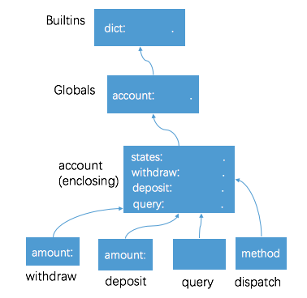
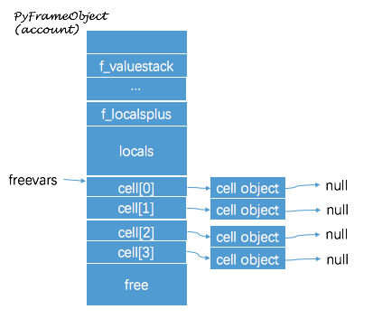
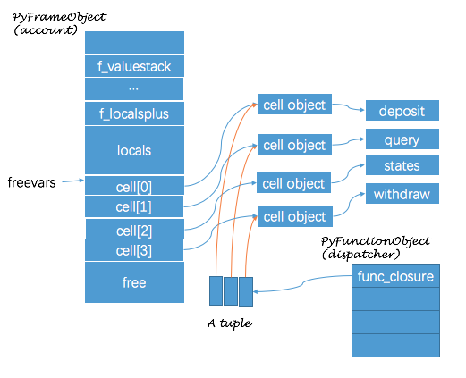

[Function 函数](https://docs.python.org/2/library/functions.html)
---
Functions in Python are first-class objects.

在 Python 中, 函数是第一级对象, 一等公民; 可以作为函数的参数, 也可以作为函数的返回值

<div class="alert alert-info">
A function may change any `mutable` object passed as a parameter, but it cannot change the identity of those objects
</div>


## lambda

An anonymous function 匿名函数


## Closure 闭包

纯函数(无副作用)是函数的输出仅依赖于输入, 不依赖于外部环境, 也不改变外部环境; 但有时函数也需要状态

<div class="alert alert-warn">
状态(或者说上下文) + 函数 = 闭包
</div>

In CPython, a `closure` is a function that retains the bindings of the `free variables` that exist when the function is defined.

引入闭包后, Python 的作用域规则成了 **LEGB** (Local -> Enclosing -> Global -> Builtin)

下面举一个极度简化版的银行账户例子, 通常我们会用 OO 中类来模拟; 这里我们尝试用闭包来实现: `account()` 来模拟账户, `balance` 是账户余额, 即为状态; 其支持存款 deposit, 取款 withdraw, 查询 query 操作.

``` python
def account(balance):
    # In Python 2.x, the nested function only could modify mutable variables
    states = {'balance': balance}

    def withdraw(amount):
        if states['balance'] > amount:
            states['balance'] -= amount
        else:
            raise RuntimeError('No sufficient balance!')

    def deposit(amount):
        states['balance'] += amount

    def query():
        return states['balance']

    def dispatch(method):
        if method == 'withdraw':
            return withdraw
        elif method == 'deposit':
            return deposit
        elif method == 'query':
            return query
        else:
            raise RuntimeError('Unsupported method ' + method)

    return dispatch
```

因为在 Python2.x 中内部函数不能直接给 enclosing 作用域里的变量赋值(或者说绑定新值), 所以上面的代码中用 `states` 包装了一下 `balance`. Python3 中可以使用 [nonlocal](https://www.python.org/dev/peps/pep-3104/) 关键字;

对于 `withdraw` 来说, `amount` 是参数, 作为函数的局部变量; 而 `states` 是在函数外部定义的, 属于自由变量 free vars; 同理, 对于 `dispatch` 来说, 参数 `method` 是局部变量, 而 `withdraw`, `deposit`, `query` 则是自由变量;


执行以下代码

``` python
>>> tom = account(100)
<function dispatch at 0x101a1c668>

>>> tom('withdraw')(20)
```

在 `withdraw`, `deposit`, `query`, `dispatch` 函数的内部求值环境(作用域)如下图示, 想想为什么状态(上下文)在内部函数间是共享的?




### How CPython implements closure

在执行 `account(100)` 时, CPython 首先会基于 `account` function 创建一个新的 Frame; CPython 会在 Frame free vars 区域分配 4 个 cell object, 正是通过这 4 个 cell object, 使得内部函数 `withdraw` 等可以引用到上下文

``` python
>>> account.func_code.co_cellvars
('deposit', 'query', 'states', 'withdraw')
```




我们可以通过 `dis.dis(account)` 看到 `account` 函数体对应的字节码

``` c
  3           0 BUILD_MAP                1
              3 LOAD_FAST                0 (balance)
              6 LOAD_CONST               1 ('balance')
              9 STORE_MAP
             10 STORE_DEREF              2 (states)

  5          13 LOAD_CLOSURE             2 (states)
             16 BUILD_TUPLE              1
             19 LOAD_CONST               2 (<code object withdraw at 0x10029ce30...>)
             22 MAKE_CLOSURE             0
             25 STORE_DEREF              3 (withdraw)

 11          28 LOAD_CLOSURE             2 (states)
             31 BUILD_TUPLE              1
             34 LOAD_CONST               3 (<code object deposit at 0x100722630...>)
             37 MAKE_CLOSURE             0
             40 STORE_DEREF              0 (deposit)

 14          43 LOAD_CLOSURE             2 (states)
             46 BUILD_TUPLE              1
             49 LOAD_CONST               4 (<code object query at 0x100722130...>)
             52 MAKE_CLOSURE             0
             55 STORE_DEREF              1 (query)

 17          58 LOAD_CLOSURE             0 (deposit)
             61 LOAD_CLOSURE             1 (query)
             64 LOAD_CLOSURE             3 (withdraw)
             67 BUILD_TUPLE              3
             70 LOAD_CONST               5 (<code object dispatch at 0x1007ce1b0...>)
             73 MAKE_CLOSURE             0
             76 STORE_FAST               1 (dispatch)

 27          79 LOAD_FAST                1 (dispatch)
             82 RETURN_VALUE
```

可以看到指令 10, 25, 40, 55 处使用 `STORE_DEREF` 来依次填充 cell 0 ~ 3

``` c
TARGET(STORE_DEREF)
{
    w = POP();
    x = freevars[oparg];
    PyCell_Set(x, w);
    Py_DECREF(w);
    DISPATCH();
}
```

指令 58 - 76 对应的是 `def dispatch`, 首先执行 `LOAD_CLOSURE` 获取 `deposit`, `query`, `withdraw` 关联的 `cell object`, 而后创建一个 tuple 来存储这些 cell

``` c
TARGET(LOAD_CLOSURE)
{
    x = freevars[oparg];
    Py_INCREF(x);
    PUSH(x);
    if (x != NULL) DISPATCH();
    break;
}
```

接着 `MAKE_CLOSURE` 会创建一个闭包 (函数代码 + 上下文); `MAKE_CLOSURE` 会设置函数对应的 `func_closure`, 其取值可为 `Null` 或者 `tuple`, 包含一组 `Cell object`; 在上例中, `tom.func_closure` 里存储着 3 个 cell, 分别对应着 `deposit`, `query`, `withdraw`.

``` python
>>> tom.func_closure
(<cell at 0x1007e3bb0: function object at 0x10191c320>, <cell at 0x1007e3be8: function object at 0x10191c398>, <cell at 0x1007e3c58: function object at 0x10191c2a8>)

>>> for e in tom.func_closure: print e.cell_contents
<function deposit at 0x10221c320>
<function query at 0x10221c398>
<function withdraw at 0x10221c2a8>
```




到目前为止, 我们理解了闭包的实现机制, 猜猜下面的代码块会输出什么呢? 简单提示: lambda 的函数体是 `i * i`, 且 `i` 是自由变量

```
def calc_square():
    return [lambda: i * i for i in range(3)]

for e in calc_square():
    print e()
```


## Decorator 装饰器

A `decorator` is a `callable` that takes another function as argument, use the `@syntax`. Mastering it requires understanding closures.

``` python
@dec2
@dec1
def func(arg1, arg2, ...):
    pass
```

This is equivalent to:

``` python
def func(arg1, arg2, ...):
    pass

func = dec2(dec1(func))
```
though without the intermediate creation of a variable named `func`


## References

* [Built-in Functions](https://docs.python.org/2/library/functions.html)

* [PEP 318 -- Decorators for Functions and Methods](https://www.python****.org/dev/peps/pep-0318/)
