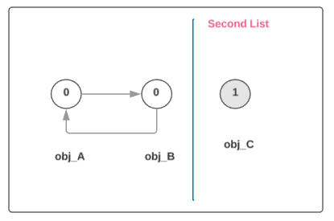

GC
--
The primary algorithm for garbage collection is `reference counting`,  and a `cyclic garbage collector` that is able to detect and break reference cycles

CPython 的垃圾回收算法以引用计数为主, 以循环引用垃圾回收为辅


## Why do we need it

The current version of Python uses reference counting to keep track of allocated memory. Each object in Python has a reference count which indicates how many variables are pointing to it. When this reference count reaches zero the object is freed. This works well for most programs.

当前 Python 实现中, 采用引用计数来跟踪所有分配的 objects. 每一个 object 都有一个引用计数用以记录有多少引用. 当引用计数变为 0 时, 该 object 将会被释放. 这在大多数情况下都可以很好的工作.

However, there is one fundamental flaw with reference counting and it is due to something called `reference cycles`. The simplest example of a reference cycle is one object that refers to itself. For example:

    >>> l = []
    >>> l.append(l)
    >>> del l

The reference count for the list `l` created is now one. However, since it cannot not be reached from inside Python and cannot possibly be used again, it should be considered garbage. In the current version of Python, this list will never be freed.

然而, 引用计数有一个先天的缺点, 称之为循环引用. 一个最简单的形式就是一个 object 引用了它自己.

``` python
class Obj(object): pass

obj_A, obj_B, obj_C = Obj(), Obj(), Obj()

obj_A.neighbor = obj_B
obj_B.neighbor = obj_A

del obj_A, obj_B
```


## How does Garbage Collection work

Note: The following section copied from [Garbage Collection for Python](http://arctrix.com/nas/python/gc/)

Traditional garbage collection (eg. mark and sweep or stop and copy) usually works as follows:

传统的垃圾回收算法 (比如 标记-清除) 通常以如下方式工作


*来源 Computer Systems - A programmer's perspective Figure 9.49*

* Find the root objects of the system. These are things like the global environment (like the `__main__` module in Python) and objects on the stack. 找到全局环境中的 objects (比如在 `__main__` 模块) 和栈中的 objects

* Search from these objects and find all objects reachable from them. This objects are all `alive`. 从它们出发, 找到所有可达的 objects, 标记为 `alive`

* Free all other objects. 释放所有不可达 objects


Unfortunately this approach cannot be used in the current version of Python. Because of the way **extension modules** work, Python can never fully determine the root set. If the root set cannot be determined accurately we risk freeing objects still referenced from somewhere. Even if extension modules were designed differently, the is no portable way of finding what objects are currently on the C stack.

不幸的是, 这一方法在 Python 中并不适用; 主要原因是 C 扩展库, 没法确定 root 集合. 如果 root 集合不能精确的指定, 那么就可能会错误地删除一些仍然存在引用的 objects. 即使扩展库可以以其他的方式来设计, 也没有一种通用的做法用来找到哪些 objects 存在于 C 栈中


Also, reference counting provides some nice benefits in terms of `locality of memory reference` and `finalizer` semantics that Python programmers have come to expect. What would be best is if we could find a way of still using reference counting but also free reference cycles.

此外, 引用计数也带来了诸多好处, 比如内存引用的局部性以及 `finalizer` 特性. 如果我们可以找到一种方法, 既能继续使用引用计数, 又能解决循环引用的问题, 那该多好!

Conceptually, the approach used here does the opposite of traditional garbage collection. Instead of trying to find all reachable objects it tries to find unreachable objects. This is much safer because if the algorithm fails we are no worse off than with no garbage collection (except for the time and space wasted).

理论上, Python 采用的方法与传统的标记-清除方式恰好相反, 不再是找所有可达的 objects, 而是尝试去找不可达的 objects. 相比之下, 这种方式更加安全, 因为即使失败了, 我们也不会错误的删除 objects.

Since we are still using reference counting, **the garbage collector only has to find reference cycles**. The reference counting will handle freeing other types of garbage.

因为我们依然使用引用计数, 所以 gc 唯一需要做的事就是找到循环引用!

<div class="alert alert-primary">
First we observe that reference cycles can only be created by container objects. These are objects which can hold references to other objects. 首先, 我们观察到, 循环引用只会出现在 `container` object (可以引用其他 object) 中.
</div>


In Python `list`, `dictionary`, `instance`, `class`, and `tuples` are all examples of container objects. `Integer` and `string` are not containers. With this observation we realize that non-container objects can be ignored for the purposes of garbage collection. This is a useful optimization because things like integers and strings should be fast and small.

 在 Python 中, `list`, `dictionary`, `instance`, `class` 以及 `tuple` 都是 container objects. `Integer` 和 `string` 不是 container object. 基于这个发现, 我们意识到 non-container objects 可以被忽略. 这是一项不错的优化, 因为像 `integer` 和 `string` 这样的基本类型应该尽可能的小而快.

<div class="alert alert-primary">Our idea now is to keep track of all `container` objects.
</div>

因此 gc 的思路就是跟踪所有的 `container` objects; 其中最简单的做法便是使用双向链表; 此数据结构允许快速的 insert 和 remove 操作, 复杂度都是 O(1), 并且也不需要额外的内存消耗. 当一个 container object 创建时, 会被加入链表; 删除时会被移除

There are several ways that this can be done but one of the best is using `doubly linked lists` with the link fields inside the objects structure. This allows objects to be quickly inserted and removed from the set as well as not requiring extra memory allocations. When a container is created it is inserted into this set and when deleted it is removed.


Now that we have access to all the container objects, how to we find reference cycles?

现在我们可以访问到所有的 container object, 接下来我们怎么发现循环引用呢?


<div class="alert alert-danger">
这里的关键, 是要意识到, 在我们引入一个链表后, 一个 object 的引用计数可以分为二部分; 一部分是来自链表内部的引用, 另一部分是来自链表外部的引用; 如果一个 object, 除了链表内部的引用, 还存在来自外部的引用, 那它一定不能回收, 也就是 root objects. 那如何找出这些 root object 呢?
</div>

First we to add another field to container objects in addition to the two link pointers. We will call this field `gc_refs`. 在开始之前, 我们给 container object 添加一个字段 `gc_ref`

``` c
/* GC information is stored BEFORE the object structure. in objimp.h */

typedef union _gc_head {
    struct {
        union _gc_head *gc_next;
        union _gc_head *gc_prev;
        Py_ssize_t gc_refs;
    } gc;
    long double dummy;  /* force worst-case alignment */
} PyGC_Head;
```

Here are the steps to find reference cycles:

* 1: For each container object, set `gc_refs` equal to the object's reference count. 按序遍历每一个 container object, 将其 gc_refs 初始化为该 object 的引用计数


* 2: For each container object, find which container objects it references and decrement the referenced container's `gc_refs` field.  按序访问列表中的每一个 container object, 找到其引用的所有 container objects, 将后者的 `gc_refs` 减 1


* 3: All container objects that now have a `gc_refs` field greater than one are referenced from outside the set of container objects. We cannot free these objects so we move them to a different set. 此时 `gc_refs = 0` 的 objects 只存在链表内部的引用, 这些有可能是 garbage; 而 `gc_refs > 0` 的 objects 则为 roots, 它们拥有来自其它地方的引用, 比如 globals 或者 stack frames. 此时我们将再次遍历链表, 将所有 gc_refs > 0 的 objects 移到 second 链表中



* 4: Any objects referenced from the objects moved also cannot be freed. We move them and all the objects reachable from them too. 当然, 可能会存在 root objects 引用到一些 non-roots, 导致这些 non-roots alive, 我们也需要移走这些 objects

    We now make a pass over the second list, where for each object on the second list, we look at every object it references. If a referenced object is a container and is still in the first list we **append** it to the second list. Because we append, objects thus added to the second list will eventually be considered by this same pass.
    具体做法是: 我们遍历 second 列表, 对于每一个 object, 查看它所有的引用 object  x, 如果发现 x 既是 container, 又出现在原先链表中, 我们将 x 添加到 second 列表后面; 注意 x 随后也会执行相同的操作. 这是一个值得学习的技巧


* 5: Objects left in our original set are referenced only by objects within that set (ie. they are inaccessible from Python and are garbage). We can now go about freeing these objects. 在原来链表中的 objects 只存在链表内部的引用, 不存在外部(直接或间接地)引用, 我们可以安全的回收它们


## Implementation

CPython 在上面的基础上进一步引入分代技术, 期望获得更好的性能;

The GC classifies objects into **three generations** depending on how many collection sweeps they have survived.

GC 将所有 objects 分为 3 代; 新创建的 objects 放入最年轻的一代, 第 0 代. 如果一个 object 在一次收集后存活下来, 它会被移入下一代; 其中因为第 2 代是最老的一代, 在其中存活的 object 继续保留 (没有其他地方可去).

New objects are placed in the youngest generation (generation 0). If an object survives a collection it is moved into the next older generation. Since generation 2 is the oldest generation, objects in that generation remain there after a collection.

为了决定什么时候执行垃圾收集, 收集器分别记录了 object 的创建和销毁次数. 当创建的次数减去销毁的次数达到第 0 代的阈值时, 将触发收集操作

In order to decide when to run, the collector keeps track of the number object allocations (see `_PyObject_GC_Malloc()` in `gcmodule.c`) and deallocations (see `PyObject_GC_Del()` in `gcmodule.c`) since the last collection. When the number of allocations minus the number of deallocations exceeds threshold0, collection starts.

最开始只有第 0 代中的 objects 会被收集. 如果第 0 代执行收集操作的次数达到了第 1 代里设置的阈值, 第 1 代也会执行收集操作; 同理, 如果第 1 代执行收集操作的次数达到了第 2 代里设置的阈值, 将会执行第 2 代的收集

Initially only generation 0 is examined. If generation 0 has been examined more than threshold1 times since generation 1 has been examined, then generation 1 is examined as well. Similarly, threshold2 controls the number of collections of generation 1 before collecting generation 2.


<div class="alert alert-info">We could use `gc.get_threshold()` returns the current collection thresholds as a tuple of (threshold0, threshold1, threshold2).
</div>


为了控制垃圾回收的开销, 有以下 2 种策略

To limit the cost of garbage collection, there are two strategies

* make each collection faster, e.g. by scanning fewer objects

* do less collections


## How to detect Memory Leak
...


## How about disable gc?

### Background Theory

Linux kernel has a mechanism called Copy-on-Write (CoW) that serves as an optimization for forked processes. A child process starts by sharing every memory page with its parent. A page copied to the child’s memory space only when the page is written to (for more details refer to the [wiki](https://en.wikipedia.org/wiki/Copy-on-write).

But in Python land, because of reference counting, things get interesting. Every time we read a Python object, the interpreter will increase its refcount, which is essentially a write to its underlying data structure. This causes CoW. So with Python, we’re doing Copy-on-Read (CoR)!

``` c
#define PyObject_HEAD                   \
    _PyObject_HEAD_EXTRA                \
    Py_ssize_t ob_refcnt;               \
    struct _typeobject *ob_type;

...

typedef struct _object {
    PyObject_HEAD
} PyObject;
```


### Instagram: Dismissing Python Garbage Collection

By dismissing the Python garbage collection (GC) mechanism, which reclaims memory by collecting and freeing unused data, Instagram can run 10% more efficiently. By disabling GC, they reduce the memory footprint and improve the CPU LLC cache hit ratio. See [Dismissing Python Garbage Collection at Instagram](https://engineering.instagram.com/dismissing-python-garbage-collection-at-instagram-4dca40b29172) for more details


#### Profiling page faults

After some googling on Copy-on-Write, they learned Copy-on-Write is associated with page faults in the system.

Perf tools that come with Linux allow recording hardware/software system events, including page faults, and can even provide stack trace when possible!

    >>> perf record -e page-faults -g -p <PID>


*来源 Dismissing Python Garbage Collection at Instagram*

The result shows that the top suspect is `gc.collect`, so they try to disable GC

The following is what Instagram ended up with in their bootstrapping script:

``` python
# gc.disable() doesn't work, because some random 3rd-party library will
# enable it back implicitly.
# Set threshold0 to zero to disable gc.
gc.set_threshold(0)

# Suicide immediately after other atexit functions finishes.
# CPython will do a bunch of cleanups in Py_Finalize which
# will again cause Copy-on-Write, including a final GC
atexit.register(os._exit, 0)
```

The gain of disabling GC was two fold:

* Instagram freed up about 8GB RAM for each server we used to create more worker processes for memory-bound server generation, or lower the worker respawn rate for CPU-bound server generation;

* CPU throughput also improved as CPU instructions per cycle (IPC) increased by about 10%.


However, as Instagram' engineering team and number of features have continued to grow, so has memory usage. Eventually, they started losing the gains they had achieved by disabling GC


In their load test, they found that memory usage was still becoming their bottleneck. Enabling GC could alleviate this problem and slow down the memory growth, but undesired Copy-on-write (COW) would still increase the overall memory footprint. So they decided to see if could make Python GC work without COW


Instagram wanted to find a solution that could enable the GC without noticeable performance impacts. Since their problem is really only on the shared objects that are created in the master process before the child processes are forked, they tried letting Python GC treat those shared objects differently


For that purpose, they added a simple API as `gc.freeze()` into the Python GC module to remove the objects from the Python GC generation list that's maintained by Python internal for tracking objects for collection. They have upstreamed this change to Python and the new API will be available in the Python3.7 release (https://github.com/python/cpython/pull/3705).

**gc.freeze()**

Freeze all the objects tracked by gc - move them to a permanent generation and ignore all the future collections. This can be used before a POSIX `fork()` call to make the gc copy-on-write friendly or to speed up collection. Also collection before a POSIX `fork()` call may free pages for future allocation which can cause copy-on-write too so it's advised to disable gc in master process and freeze before fork and enable gc in child process.


## References

* [Python-Dev Reference cycle collection for python](https://mail.python.org/pipermail/python-dev/2000-March/002385.html)

* [Supporting Cyclic Garbage Collection](https://docs.python.org/2/c-api/gcsupport.html)

* [PEP 205 -- Weak References](https://www.python.org/dev/peps/pep-0205/)

- - -

Books

* Garbage Collection: Algorithms for Automatic Dynamic Memory Management
