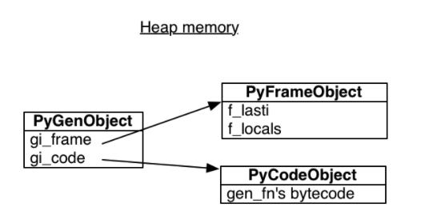

Generator 生成器
---
A generator is a function that produces a sequence of results instead of a single value, using the `yield` keyword.

一个生成器就是一个生成一系列值而不是单个值的函数, 通过 `yield` 关键字实现


### Generator Function

In Python 2.3, `yield` was a statement; it did not return any value. In 2.5 and later, `yield` is an expression, returning a value that can be assigned to a variable


``` python
val = (yield i)
```

在 Python 2.3 中, `yield` 是一个语句; 它没有结果值. 在 2.5 及后续版本, `yield` 是一个表达式, 有一个结果可以赋给一个变量; 这项新设计, 使得生成器可以与外界进行双向交互.


<div class="alert alert-info">
Calling a generator function creates an generator object. However, it does not start running the function 调用一个生成器函数会创建一个生成器 object, 而不是开始执行函数
</div>


* The function only execute on `send()` or `next()`

* `yield` produces a value, but suspends the function; `yield` 生成一个值, 但是会暂停函数;

* Function resumes on next call to `send(?)` or `next()`


A generator function is mainly a more convenient way of writing an `iterator`.


<div class="alert alert-info">
A generator is a one-time operation. We can iterate over the generated data once, but if we want to do it again, we have to call the generator function again
</div>


For example, the following code used to calculate Fibonacci series up to `n`

    >>> def fib(n):
    ...     a, b = 1, 1
    ...     while a < n:
    ...         yield a
    ...         a, b = b, a+b
    ...
    >>> s = fib(3)
    >>> s
    <generator object fib at 0x101a1ef50>
    >>> next(s)
    1
    >>> next(s)
    1
    >>> next(s)
    2
    >>> next(s)
    Traceback (most recent call last):
      File "<stdin>", line 1, in <module>
    StopIteration


A little bit tricky version, in Python 2.7

``` python
def fib_gen(a, b):
    yield a
    for e in fib_gen(b, a+b):
        yield e


fib = fib_gen(1, 1)
```

We could further simplify the code with the new syntax `yield from`, which introduced in Python 3.3

``` python
def fib_gen(a, b):
    yield a
    yield from fib_gen(b, a+b)


fib = fib_gen(1, 1)
```

### 扩展篇, SICP 3.5 Streams

A generator based stream, we need to know it is different from Lips's stream in SICP

``` python
def cons_stream(a, b):
    yield a
    yield from b


def stream_map(func, s):
    car = next(s)
    yield from cons_stream(func(car), stream_map(func, s))


def display_stream(s, n):
    for _, e in zip(range(n), s):
        print(e)
```

With streams, we could rewrite `fib` as following shown, fib is pair whose `car` is 1 and whose `cdr` is a promise to evaluate `fib_fen(1, 1+1)`.

``` python
def fib_gen(a, b):
    yield from cons_stream(a, fib_gen(b, a+b))

display_stream(fib_gen(1, 1), 10)
```


### Generator Expression

A generated version of a list comprehension

    >>> seq = [1, 2, 3, 4]
    >>> pow2 = (e * e for e in seq)
    >>> pow2
    <generator object <genexpr> at 0x101a1edc0>


### Shutting Down

Generator can be shut down using `.close()`

**Question: Can you ignore `GeneratorExit`?**

Answer: No. You'll get a `RuntimeError`


`gen.close()` is defined by the following pseudo-code:

``` python
def close(self):
    try:
        self.throw(GeneratorExit)
    except (GeneratorExit, StopIteration):
        pass
    else:
        raise RuntimeError("generator ignored GeneratorExit")
    # Other exceptions are not caught
```


### Improved Performance

The performance improvement from the use of `generators` is the result of the lazy (on demand) generation of values, which translates to lower memory usage. Furthermore, we do not need to wait until all the elements have been generated before we start to use them. This is similar to the benefits provided by `iterators`, but the `generator` makes building `iterators` easy.

This can be illustrated by comparing the `range` and `xrange` built-ins of Python 2.x.

Both `range` and `xrange` represent a range of numbers, and have the same function signature, but `range` returns a list while `xrange` returns a `generator` (at least in concept; the implementation may differ).


    >>> python -m timeit -n 10 "sum(range(1000000))"
    10 loops, best of 3: 25.4 msec per loop

    >>> python -m timeit -n 10 "sum(xrange(1000000))"
    10 loops, best of 3: 8.62 msec per loop


<div class="alert alert-warn">
Note: a generator will provide performance benefits only if we do not intend to use that set of generated values more than once.
</div>


### How Generators Work

`gen_fn` is a generator function

``` python
def gen_fn():
    result = yield 1
    print 'result 1 is', result

    result2 = yield 2
    print 'result 2 is', result2
```

Here is the bytecode for `gen_fn`

    >>> import dis
    >>> dis.dis(gen_fn)

     6           0 LOAD_CONST               1 (1)
                 3 YIELD_VALUE
                 4 STORE_FAST               0 (result)

     7           7 LOAD_CONST               2 ('result 1 is')
                10 PRINT_ITEM
                11 LOAD_FAST                0 (result)
                14 PRINT_ITEM
                15 PRINT_NEWLINE

     9          16 LOAD_CONST               3 (2)
                19 YIELD_VALUE
                20 STORE_FAST               1 (result2)

    10          23 LOAD_CONST               4 ('result 2 is')
                26 PRINT_ITEM
                27 LOAD_FAST                1 (result2)
                30 PRINT_ITEM
                31 PRINT_NEWLINE
                32 LOAD_CONST               0 (None)
                35 RETURN_VALUE


Note

* 3 `YIELD_VALUE`: pops `TOS` and yields it from a generator

* 4 `STORE_FAST`: Stores `TOS` into the local `co_varnames[var_num]`. The `TOS` is passed via `gen.send(value)`


When Python compiles `gen_fn` to bytecode, it sees the `yield` statement and knows that `gen_fn` is a generator function, not a regular one. It sets a flag to remember this fact: 当 Python 解释器编译 `gen_fn` 成字节码的时候, 它看到了 `yield`, 然后就将 `gen_fn` 标记成生成器, 通过一个标记位

    >>> # The generator flag is bit position 5.
    >>> generator_bit = 1 << 5
    >>> bool(gen_fn.__code__.co_flags & generator_bit)
    True

When you call a generator function, Python sees the generator flag, and it does not actually run the function. Instead, it creates a generator: 当我们调用 generator 函数时, Python 解释器看到标记位, 它不会实际执行该函数, 而是创建了一个生成器

    >>> gen = gen_fn()
    >>> type(gen)
    <class 'generator'>

A Python generator encapsulates a stack frame plus a reference to some code, the body of `gen_fn`: 一个 Python 生成器封装了一个栈帧和一个函数体 Code 的引用

    >>> gen.gi_code.co_name
    'gen_fn'

All generators from calls to `gen_fn` point to this same code. But each has its own stack frame. This stack frame is not on any actual stack, it sits in heap memory waiting to be used. 所有通过调用 `gen_fn` 创建的生成器都指向相同的 code, 但是它们有自己独立的栈帧. 注意, 这个栈帧不在实际的调用栈中, 它位于 C 堆中, 等待使用.



*来源 A Web Crawler With asyncio Coroutines*

The frame has a **last instruction** pointer, the instruction it executed most recently. In the beginning, the last instruction pointer is `-1`, meaning the generator has not begun: 栈帧有一个 last instruction 的指针, 指向最近执行的一条指令. 最初的时候, last instruction 的值是 `-1`, 表示该生成器还未开始执行

    >>> gen.gi_frame.f_lasti
    -1

Values are sent into a generator by calling its `send(value)` method. The generator’s code is then continued (resumed) and the `yield` returns the value.

When we call `send`, the generator reaches its first `yield`, and pauses. The return value of `send` is `1`, since that is what `gen` passes to the `yield` expression:

    >>> gen.send(None)
    1

<div class="alert alert-info">
The generator can be resumed at any time, from any function, because its stack frame is not actually on the stack: it is on the heap. Its position in the call hierarchy is not fixed, and it need not obey the first-in, last-out order of execution that regular functions do. It is liberated, floating free like a cloud. 生成器可以在任意时间, 从任何函数里恢复继续执行, 因为它的栈帧不在调用栈中, 它在 C 堆里. 它在调用栈里的位置不是固定的, 另它不需要遵循先入后出的执行顺序, 就像一片云一样自由飘.
</div>


**A simplified Python version of send(value) 简化版 send 实现**

``` python
def send(gen, value):
    if gen.gi_running:
        raise ValueError("generator already executing")

    f = gen.gi_frame

    if f.f_lasti == -1:
        if value != None:
            raise TypeError("can't send non-None value to a just-started generator")
    else:
        # Push value onto the frame's value stack
        f.f_stacktop++ = value

    # Generators always return to their most recent caller, not their creator
    f.f_back = thread_state.frame

    gen.gi_running = 1
    result = eval_frame(gen.gi_frame)
    gen.gi_running = 0

    # If the generator just returned (as opposed to yielding), signal
    # that the generator is exhausted.
    if f.f_stacktop == None:
        # generator can't be rerun, so release the frame
        gen.gi_frame = None
        raise StopIteration()

    return result
```

<div class="alert alert-warn">
Because generator-iterators begin execution at the top of the generator's function body, there is no `yield` expression to receive a value when the generator has just been created. Therefore, calling `send()` with a non-None argument is prohibited when the generator iterator has just started, and a `TypeError` is raised if this occurs (presumably due to a logic error of some kind). 因为生成器是从函数体最上面的位置开始执行的, 没有 `yield` 表达式来接收 value. 因此对生成器的第一次 `send` 调用, 不能传 non-None, 如果因为某些逻辑错误导致这种情况出现了, 会抛 `TypeError`
</div>


### BDFL Pronouncements

#### Issue 问题描述

Introduce another new keyword (say, `gen` or `generator`) in place of `def`, or otherwise alter the syntax, to distinguish generator-functions from non-generator functions. 引入一个新的关键字 (比如 `gen` 或者 `generator`) 代替 `def`, 或者修改语法以区分生成器函数和非生成器函数.

#### Con

In practice (how you think about them), generators are functions, but with the twist that they're resumable. The mechanics of how they're set up is a comparatively minor technical issue, and introducing a new keyword would unhelpfully overemphasize the mechanics of how generators get started (a vital but tiny part of a generator's life).

实际上, 不论你怎么考虑它们, generators 就是函数, 但不同的是它们可恢复的(暂停而后继续执行). 它们构建的语义, 相对而言, 不是一个重大技术问题, 为此引入一个新的关键字, 用来强调生成器如何开始, 没有多大意义.

#### Pro

In reality (how you think about them), generator-functions are actually factory functions that produce generator-iterators as if by magic. In this respect they're radically different from non-generator functions, acting more like a constructor than a function, so reusing `def` is at best confusing. A `yield` statement buried in the body is not enough warning that the semantics are so different.

事实上, 不论你怎么考虑它们, generator-functions 是一个工厂函数, 用来创建生成器. 从这个角度看, 它们非常不同于 non-generator 函数, 表现的更像是一个构造方法而不是一个函数; 因此复用 `def` 会导致困惑. 在函数体中的 `yield` 不足以体现它们的语义是非常不同的.


#### BDFL

`def` it stays. No argument on either side is totally convincing, so I have consulted my language designer's intuition. It tells me that the syntax proposed in the PEP is exactly right - not too hot, not too cold. But, like the Oracle at Delphi in Greek mythology, it doesn't tell me why, so I don't have a rebuttal for the arguments against the PEP syntax. The best I can come up with (apart from agreeing with the rebuttals ... already made) is "FUD". If this had been part of the language from day one, I very much doubt it would have made Andrew Kuchling's "Python Warts" page.


## 迭代器 Iterator

As you probably noticed, we can iterate over many different kinds of objects

#### Iterating over a Dict

If you loop over a dictionary you get keys

    >>> d = {2: 'a'}
    >>> for k in d: print k
    ...
    2


#### Iterating over a String

If you loop over a string, you get characters

    >>> s = 'hi'
    >>> for e in s:
    ...     print e
    ...
    h
    i


#### Iterating over a File

If you loop over a file you get lines

    >>> for line in open('a.txt'):
    ...     print line
    ...


### Iterator Protocol

Any object that implements the `__next__` no-argument method that returns the next item in a series or raises `StopIteration` when there are no more items. Python iterators also implement the `__iter__` method so they are iterable as well


<div class="alert alert-info">
 <p>A concrete Iterator must implement `next`. The `Iterator.iter` method just returns the instance itself.
</p>
<hr>
<p>`iterator.next` has been renamed to `__next__`, described in [PEP 3114](https://www.python.org/dev/peps/pep-3114/), implemented in Python 3.
</p>
</div>


``` python
next(x) --> internal tp_iternext --> x.__next__()
```

The `iterator` object is responsible for maintaining the state of the iteration.


<pre>
    +-----------+
    | Iterable  |
    |  -----    |-------+
    | __iter__  |       |
    +-----------+       |
         ^              |
         |              | builds
    +-----------+       |
    | Iterator  |       |
    |  -----    |       |
    |  __next__ |<------+
    |  __iter__ |
    +-----------+
</pre>

Note: `iterables` have an `__iter__` method that instantiates a new `iterator` every time. `Iterators` implement a `__next__` method that returns individual items, and an `__iter__` method that returns `self`.


In short, iterators are also iterable, but iterable are not iterators


Whenever the interpreter needs to iterate over an object `x`, it automatically calls `iter(x)`. The `iter` built-in function:

* Checks whether the object implements `__iter__`, and calls that to obtain an iterator.

* If `__iter__` is not implemented, but `__getitem__` is implemented, Python creates an iterator that attempts to fetch items in order, starting from index 0 (zero).

* If that fails, Python raises `TypeError`, usually saying `C object is not iterable,` where `C` is the class of the target object.


## 协程 Coroutine

A coroutine is a subroutine that can be paused and resumed, coroutine multitask cooperatively: they choose when to pause, and which coroutine to run next.

协程就是一个可以暂停和恢复继续执行的子例程

<div class="alert alert-info">
Coroutine is a natural way of expressing many algorithms, such as simulations, games, asynchronous I/O, and other forms of event-driven programming or co-operative multitasking. 协程是实现许多算法, 比如仿真, 游戏, 异步 I/O 以及事件驱动形式编程的一种很自然的方式.
</div>


Since a generator can pause, and it can be resumed with a value, and it has a return value, it is a good primitive upon which to build an async programming model. As in `asyncio`, we will use generators, futures, and the `yield from` statement.

因为生成器可以暂停, 可以接收一个 value 继续执行, 并且它还有一个返回值. 它可以作为构建异步编程模型的一个很好的原语. 正如 `asyncio` 模块一样, 我们使用生成器, `futures` 以及 `yield from`.


<div class="alert alert-info"> In September 2015, Python 3.5 was released with coroutines built in to the language itself. These native coroutinesare declared with the new syntax <code>async def</code>, and instead of <code>yield from</code> they use the new <code>await</code> keyword to delegate to a coroutine or wait for a <code>Future</code>.
</div>


``` python
class Future(object):
    """ Represents the result of an asynchronous computation
    """
    def __init__(self):
        self._is_done = False
        self._result = None
        self._callbacks = []

    def add_done_callback(self, fn):
        if self._is_done:
            fn(self)
        else:
            self._callbacks.append(fn)

    @property
    def result(self):
        return self._result

    def running(self):
        return not self._is_done

    def done(self):
        self._is_done = True

    def set_result(self, result):
        self._result = result
        for cb in self._callbacks:
            try:
                cb(self)
            except:
                pass  # XXX: logging it?
        self.done()
```

But when the future resolves, what resumes the generator? We need a coroutine driver.

``` python
class Task(object):
    """ A simplified version of coroutine Driver
    """
    def __init__(self, gen):
        self.value = None
        self.gen = gen

        self.step()

    def step(self):
        try:
            next_future = self.gen.send(self.value)
        except StopIteration:
            return
        next_future.add_done_callback(self._cb)

    def _cb(self, f):
        self.value = f.result
        self.step()
```

And we need a `Coroutine` decorator to work together with `Task`

``` python
class Coroutine(object):
    def __init__(self, func):
        self._func = func

    def __call__(self, *args, **kwargs):
        gen = self._func(*args, **kwargs)
        assert isinstance(gen, types.GeneratorType)
        Task(gen)

coroutine = Coroutine
```

And now we need to implement a `Scheduler` to schedule Tasks, here I provide a highly simplified version of a timer scheduler, which use a priority queue (heapq) to manage timer

``` python
from heapq import heappush, heappop

class EventLoop(object):
    """ A highly simplified timer scheduler, not thread safe
    """
    _POLL_TIMEOUT = 0.1

    def __init__(self):
        self._timer = []

    @classmethod
    def instance(cls):
        if not hasattr(cls, '_EventLoop__instance'):
            cls.__instance = EventLoop()
        return cls.__instance

    def call_at(self, timestamp, cb):
        heappush(self._timer, TimerCallback(timestamp, cb))

    def call_later(self, interval, cb):
        self.call_at(self._now() + interval, cb)

    def start(self):
        while True:
            self.poll()

            # avoid busy loop
            if self._timer:
                poll_timeout = self._timer[0].deadline - self._now()
                poll_timeout = max(0, min(poll_timeout, self._POLL_TIMEOUT))
            else:
                poll_timeout = self._POLL_TIMEOUT

            time.sleep(poll_timeout)

    def poll(self):
        """ handle timer event
        """
        while self._timer:
            event = self._timer[0]
            if event.deadline > self._now():
                break
            try:
                event.callback()
            except:  # swallow all errors
                logger.warn('Error during timer callback %r', event.callback, exc_info=1)
            heappop(self._timer)

    def _now(self):
        return time.time()


class TimerCallback(object):
    def __init__(self, deadline, callback):
        self.deadline = deadline
        self.callback = callback

    def __lt__(self, other):
        if not isinstance(other, TimerCallback):
            raise ValueError("Invalid type <%r> to compare" % type(other))
        return self.deadline < other.deadline

    def __le__(self, other):
        if not isinstance(other, TimerCallback):
            raise ValueError("Invalid type <%r> to compare" % type(other))
        return self.deadline <= other.deadline
```

The following shows how to use the above framework

``` python
def sleep(interval):
    f = Future()
    EventLoop.instance().call_later(interval, lambda: f.set_result(None))
    return f

@coroutine
def demo():
    logger.info('demo start...')
    yield sleep(2)
    logger.info('demo continue after sleep...')

def test():
    demo()
    EventLoop.instance().start()

if __name__ == '__main__':
    test()
```


A Curious Course on `Coroutines and Concurrency` by `David Beazley`

* `Generators` produce data for iteration

* `Coroutines` are consumers of data

* To keep your brain from exploding, you don’t mix the two concepts together

* `Coroutines` are not related to iteration


**Note:** There is a use of having `yield` produce a value in a coroutine, but it’s not tied to iteration


## Reference

* [PEP 234 Iterators](https://www.python.org/dev/peps/pep-0234/)

* [PEP 255 -- Simple Generators](https://www.python.org/dev/peps/pep-0255/)

* [PEP 289 -- Generator Expressions](https://www.python.org/dev/peps/pep-0289/)

* [PEP 342 -- Coroutines via Enhanced Generators](https://www.python.org/dev/peps/pep-0342/)

- - -

* [Generator Wiki](https://wiki.python.org/moin/Generators)

* [Generator Tricks For Systems Programmers](http://www.dabeaz.com/generators/Generators.pdf)

* [A Web Crawler With asyncio Coroutines](http://www.aosabook.org/en/500L/a-web-crawler-with-asyncio-coroutines.html)
