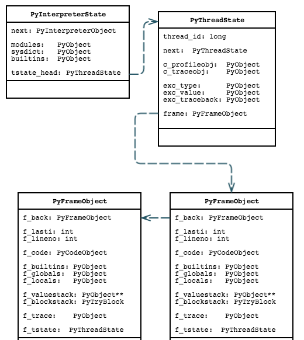
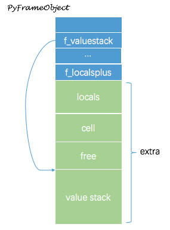

Interpreter
---

## Object

Objects are structures allocated on the heap.

在 CPython 中,对象是在堆中创建的结构体.


## [执行模型](https://docs.python.org/2.7/reference/executionmodel.html)

A Python program is constructed from code blocks. A `block` is a piece of Python program text that is executed as a unit.

The following are blocks: a module, a function body, and a class definition.

Python 程序是由 code block 组成的. 一个 block 是一个作为基本单元执行的程序片段. 模块, 函数体, 类定义等都是 block.

A code block is executed in an `execution frame`. A frame contains some administrative information (used for debugging) and determines where and how execution continues after the code block’s execution has completed.

一个 code block 在一个 execution frame 中执行的. 一个 frame 包含一些管理数据(用于调试)并决定在一个 code block 执行结束后, 从哪以及怎么继续执行

The Python interpreter is a normal C program. It is crucial to understand that Python stack frame are allocated in heap memory.


## Startup

For Python 2.7.12

1. Modules/python.c       **main()**

    Minimal main program everything is loaded from the library


2. Modules/main.c         **Py_Main()**

    1. Python/pythonrun.c   **Py_Initialize() -> Py_InitializeEx(1)**

    2. Python/pythonrun.c   **PyRun_AnyFileExFlags()**

        Parse input from a file and execute it


3. Python/pythonrun.c     **PyRun_AnyFileExFlags()**

    1. **PyParser_ASTFromFile()**

    2. **PyAST_Compile()**

    3. **PyEval_EvalCode(code, globals, locals)**


4. Python/ceval.c  **PyEval_EvalCode(code, globals, locals)**

    1. Python/ceval.c   **PyEval_EvalFrameEx(frame, throw_flag)**

        Interpreter main loop




...


[tp_](http://code.activestate.com/lists/python-dev/144935/) stands for "type". Guido wrote all that in 1990 and indeed made up the term slot -- it's like an entry in a C++ vtable, where apparently they are also called slots by some folks.


## CPython Critical Data Structures

### Object & Type

``` c

typedef struct _object {
    Py_ssize_t ob_refcnt;
    struct _typeobject *ob_type;
} PyObject;


/* in typestruct.h */

typedef struct _typeobject {
    PyObject_VAR_HEAD

    char *tp_name; /* For printing, in format "<module>.<name>" */
    int tp_basicsize, tp_itemsize; /* For allocation */

    /* Methods to implement standard operations */

    destructor tp_dealloc;
    printfunc tp_print;
    getattrfunc tp_getattr;
    setattrfunc tp_setattr;
    cmpfunc tp_compare;
    reprfunc tp_repr;

    /* Method suites for standard classes */

    PyNumberMethods *tp_as_number;
    PySequenceMethods *tp_as_sequence;
    PyMappingMethods *tp_as_mapping;

    /* More standard operations (here for binary compatibility) */

    hashfunc tp_hash;
    ternaryfunc tp_call;
    reprfunc tp_str;
    getattrofunc tp_getattro;
    setattrofunc tp_setattro;

    /* Functions to access object as input/output buffer */
    PyBufferProcs *tp_as_buffer;

    /* Flags to define presence of optional/expanded features */
    long tp_flags;

    char *tp_doc; /* Documentation string */

    /* Assigned meaning in release 2.0 */
    /* call function for all accessible objects */
    traverseproc tp_traverse;

    /* delete references to contained objects */
    inquiry tp_clear;

    /* Assigned meaning in release 2.1 */
    /* rich comparisons */
    richcmpfunc tp_richcompare;

    /* weak reference enabler */
    long tp_weaklistoffset;

    /* Added in release 2.2 */
    /* Iterators */
    getiterfunc tp_iter;
    iternextfunc tp_iternext;

    /* Attribute descriptor and subclassing stuff */
    struct PyMethodDef *tp_methods;
    struct PyMemberDef *tp_members;
    struct PyGetSetDef *tp_getset;
    struct _typeobject *tp_base;
    PyObject *tp_dict;
    descrgetfunc tp_descr_get;
    descrsetfunc tp_descr_set;
    long tp_dictoffset;
    initproc tp_init;
    allocfunc tp_alloc;
    newfunc tp_new;
    freefunc tp_free; /* Low-level free-memory routine */
    inquiry tp_is_gc; /* For PyObject_IS_GC */

    PyObject *tp_bases;
    PyObject *tp_mro; /* method resolution order */
    PyObject *tp_cache;
    PyObject *tp_subclasses;
    PyObject *tp_weaklist;

} PyTypeObject;
```


### Interpreter & Thread State Structure

``` c
/* in pystate.h */
typedef struct _is {

    struct _is *next;
    struct _ts *tstate_head;

    PyObject *modules;
    PyObject *sysdict;
    PyObject *builtins;
    PyObject *modules_reloading;

    PyObject *codec_search_path;
    PyObject *codec_search_cache;
    PyObject *codec_error_registry;

#ifdef HAVE_DLOPEN
    int dlopenflags;
#endif
#ifdef WITH_TSC
    int tscdump;
#endif

} PyInterpreterState;


typedef struct _ts {
    /* See Python/ceval.c for comments explaining most fields */

    struct _ts *next;
    PyInterpreterState *interp;

    struct _frame *frame;
    int recursion_depth;
    /* 'tracing' keeps track of the execution depth when tracing/profiling.
       This is to prevent the actual trace/profile code from being recorded in
       the trace/profile. */
    int tracing;
    int use_tracing;

    Py_tracefunc c_profilefunc;
    Py_tracefunc c_tracefunc;
    PyObject *c_profileobj;
    PyObject *c_traceobj;

    PyObject *curexc_type;
    PyObject *curexc_value;
    PyObject *curexc_traceback;

    PyObject *exc_type;
    PyObject *exc_value;
    PyObject *exc_traceback;

    PyObject *dict;  /* Stores per-thread state */

    /* tick_counter is incremented whenever the check_interval ticker
     * reaches zero. The purpose is to give a useful measure of the number
     * of interpreted bytecode instructions in a given thread.  This
     * extremely lightweight statistic collector may be of interest to
     * profilers (like psyco.jit()), although nothing in the core uses it.
     */
    int tick_counter;

    int gilstate_counter;

    PyObject *async_exc; /* Asynchronous exception to raise */
    long thread_id; /* Thread id where this tstate was created */

    int trash_delete_nesting;
    PyObject *trash_delete_later;

    /* XXX signal handlers should also be here */

} PyThreadState;
```

### Frame Structure

``` c
/* in frameobject.h */

typedef struct {
    int b_type;			/* what kind of block this is */
    int b_handler;		/* where to jump to find handler */
    int b_level;		/* value stack level to pop to */
} PyTryBlock;

typedef struct _frame {
    PyObject_VAR_HEAD
    struct _frame *f_back;	/* previous frame, or NULL */
    PyCodeObject *f_code;	/* code segment */
    PyObject *f_builtins;	/* builtin symbol table (PyDictObject) */
    PyObject *f_globals;	/* global symbol table (PyDictObject) */
    PyObject *f_locals;		/* local symbol table (any mapping) */
    PyObject **f_valuestack;	/* points after the last local */
    /* Next free slot in f_valuestack.  Frame creation sets to f_valuestack.
       Frame evaluation usually NULLs it, but a frame that yields sets it
       to the current stack top. */
    PyObject **f_stacktop;
    PyObject *f_trace;		/* Trace function */

    /* If an exception is raised in this frame, the next three are used to
     * record the exception info (if any) originally in the thread state.  See
     * comments before set_exc_info() -- it's not obvious.
     * Invariant:  if _type is NULL, then so are _value and _traceback.
     * Desired invariant:  all three are NULL, or all three are non-NULL.  That
     * one isn't currently true, but "should be".
     */
    PyObject *f_exc_type, *f_exc_value, *f_exc_traceback;

    PyThreadState *f_tstate;
    int f_lasti;		/* Last instruction if called */
    /* Call PyFrame_GetLineNumber() instead of reading this field
       directly.  As of 2.3 f_lineno is only valid when tracing is
       active (i.e. when f_trace is set).  At other times we use
       PyCode_Addr2Line to calculate the line from the current
       bytecode index. */
    int f_lineno;		/* Current line number */
    int f_iblock;		/* index in f_blockstack */
    PyTryBlock f_blockstack[CO_MAXBLOCKS]; /* for try and loop blocks */
    PyObject *f_localsplus[1];	/* locals+stack, dynamically sized */
} PyFrameObject;
```

At runtime, the actual allocated memory is varied, as the following `frame_sizeof()` shown

``` python
frame_sizeof(PyFrameObject *f)
{
    Py_ssize_t res, extras, ncells, nfrees;

    ncells = PyTuple_GET_SIZE(f->f_code->co_cellvars);
    nfrees = PyTuple_GET_SIZE(f->f_code->co_freevars);
    extras = f->f_code->co_stacksize + f->f_code->co_nlocals +
             ncells + nfrees;
    /* subtract one as it is already included in PyFrameObject */
    res = sizeof(PyFrameObject) + (extras-1) * sizeof(PyObject *);

    return PyInt_FromSsize_t(res);
}
```




### Function Structure

``` c
/* Function object, in funcobject.h */
typedef struct {
    PyObject_HEAD
    PyObject *func_code;	/* A code object */
    PyObject *func_globals;	/* A dictionary (other mappings won't do) */
    PyObject *func_defaults;	/* NULL or a tuple */
    PyObject *func_closure;	/* NULL or a tuple of cell objects */
    PyObject *func_doc;		/* The __doc__ attribute, can be anything */
    PyObject *func_name;	/* The __name__ attribute, a string object */
    PyObject *func_dict;	/* The __dict__ attribute, a dict or NULL */
    PyObject *func_weakreflist;	/* List of weak references */
    PyObject *func_module;	/* The __module__ attribute, can be anything */

    /* Invariant:
     *     func_closure contains the bindings for func_code->co_freevars, so
     *     PyTuple_Size(func_closure) == PyCode_GetNumFree(func_code)
     *     (func_closure may be NULL if PyCode_GetNumFree(func_code) == 0).
     */
} PyFunctionObject;


/* Bytecode object, in code.h */
typedef struct {
    PyObject_HEAD
    int co_argcount;		/* #arguments, except *args */
    int co_nlocals;		/* #local variables */
    int co_stacksize;		/* #entries needed for evaluation stack */
    int co_flags;		/* CO_..., see below */
    PyObject *co_code;		/* instruction opcodes */
    PyObject *co_consts;	/* list (constants used) */
    PyObject *co_names;		/* list of strings (names used) */
    PyObject *co_varnames;	/* tuple of strings (local variable names) */
    PyObject *co_freevars;	/* tuple of strings (free variable names) */
    PyObject *co_cellvars;      /* tuple of strings (cell variable names) */
    /* The rest doesn't count for hash/cmp */
    PyObject *co_filename;	/* string (where it was loaded from) */
    PyObject *co_name;		/* string (name, for reference) */
    int co_firstlineno;		/* first source line number */
    PyObject *co_lnotab;	/* string (encoding addr<->lineno mapping) See
				   Objects/lnotab_notes.txt for details. */
    void *co_zombieframe;     /* for optimization only (see frameobject.c) */
    PyObject *co_weakreflist;   /* to support weakrefs to code objects */
} PyCodeObject;


/* in cellobject.h */

typedef struct {
	PyObject_HEAD
	PyObject *ob_ref;	/* Content of the cell or NULL when empty */
} PyCellObject;

```

Function objects and code objects should not be confused with each other:

Function objects are created by the execution of the `def` statement. They reference a code object in their `func_code` attribute, which is a purely syntactic object, i.e. nothing more than a compiled version of some source code lines.  There is one code object per source code "fragment", but each code object can be referenced by zero or many function objects depending only on how many times the `def` statement in the source was executed so far.


### Class Related Structure

``` c
/* in classobject.h */

typedef struct {
    PyObject_HEAD
    PyObject	*cl_bases;	/* A tuple of class objects */
    PyObject	*cl_dict;	/* A dictionary */
    PyObject	*cl_name;	/* A string */
    /* The following three are functions or NULL */
    PyObject	*cl_getattr;
    PyObject	*cl_setattr;
    PyObject	*cl_delattr;
    PyObject    *cl_weakreflist; /* List of weak references */
} PyClassObject;


typedef struct {
    PyObject_HEAD
    PyClassObject *in_class;	/* The class object */
    PyObject	  *in_dict;	/* A dictionary */
    PyObject	  *in_weakreflist; /* List of weak references */
} PyInstanceObject;


typedef struct {
    PyObject_HEAD
    PyObject *im_func;   /* The callable object implementing the method */
    PyObject *im_self;   /* The instance it is bound to, or NULL */
    PyObject *im_class;  /* The class that asked for the method */
    PyObject *im_weakreflist; /* List of weak references */
} PyMethodObject;
```


## References

* [A Python Interpreter written in Python - Allison Kaptur](http://aosabook.org/en/500L/a-python-interpreter-written-in-python.html)

* [Bytes in the Machine: Inside the CPython](http://www.slideshare.net/akaptur/bytes-in-the-machine-inside-the-cpython-interpreter)

* [Argument Clinic How-To](https://docs.python.org/3/howto/clinic.html)
    Argument Clinic is a preprocessor for CPython C files.
