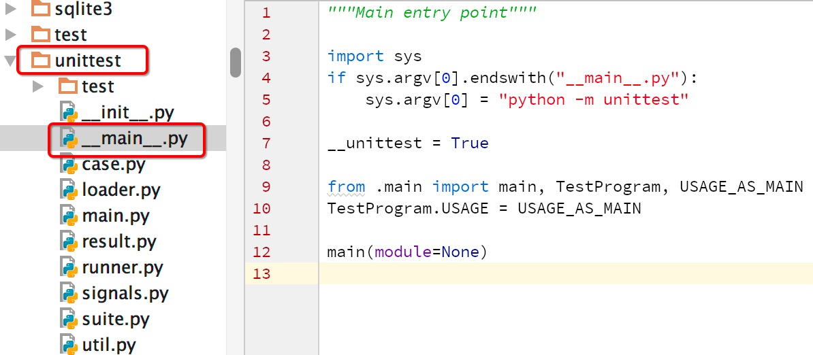

[Modules 模块](https://docs.python.org/2/tutorial/modules.html)
---

A `module` is a file containing Python definitions and statements. Within a module, the module’s name (as a string) is available as the value of the global variable `__name__`.

一个 Python 源文件就是一个 module. 该文件的名字是 module 名字加上 `.py` 后缀. 在一个 module 中, 可以通过全局变量 `__name__` 获取当前 module 的名字.


### Module Name

* File names have to follow the rules, must be a valid identifier name

```
>>> import 2book
           ^
SyntaxError: invalid syntax
```

### Namespaces

Each module has its own `private symbol table`, which is used as the `global symbol table` by all functions defined in the module. The imported module names are placed in the importing module’s global symbol table

每个 module 都有其独立私有的符号表, 可以通过 `globals()` 访问. 被导入的 module 名字存放于当前模块的符号表中.

```
>>> import math
>>> 'math' in globals()
True
```

<div class="alert alert-info">
 Invoke `__import__()` if you want to import a module whose name is only known at runtime
</div>

如果你想要在运行时 import 一个 module, 可以调用 `__import__`; 这通常用于只在运行时才知道需要导入什么模块的场景.


### Global Variables

* Global variables bind inside the same module 全局变量绑定在所属模块中

```
>>> x = 1

>>> def foo():
    print x  # references to global x

>>> print 'x' in foo.func_globals
True
```

* Functions record their definition environment 函数会记录他们的定义环境

```
>>> from math import sin
>>> sin.__module__
'math'
```

### Module Execution

* When a module is imported, all of the statements in the module execute one after another until the end of the file is reached (or error occurred)

    当导入模块时, 模块中的所有语句(和表达式)都会依次执行


### Module Search Path

* If a file is not on the path, it won't import

```
>>> import sys
>>> sys.path
[...
 '/Library/Frameworks/Python.framework/Versions/2.7/lib/python27.zip',
 '/Library/Frameworks/Python.framework/Versions/2.7/lib/python2.7',
 '/Library/Frameworks/Python.framework/Versions/2.7/lib/python2.7/plat-darwin',
 '/Library/Frameworks/Python.framework/Versions/2.7/lib/python2.7/lib-dynload',
 '/Library/Frameworks/Python.framework/Versions/2.7/lib/python2.7/site-packages',
 ...]
```

`sys.path` is a list of strings that specifies the search path for modules. Initialized from the environment variable `PYTHONPATH`, plus an installation-dependent default.

As initialized upon program startup, the first item of this list, `path[0]`, is the directory containing the script that was used to invoke the Python interpreter. If the script directory is not available (e.g. if the interpreter is invoked interactively or if the script is read from standard input), `path[0]` is the empty string, which directs Python to search modules in the current directory first.

Notice that the script directory is inserted before the entries inserted as a result of `PYTHONPATH`.


* Sometimes, we may want to modify the list for some purposes

``` python
import sys

sys.path.insert(0, "/new/path/for/you")
```

### Module Cache

For efficiency reasons, each module is `only imported once` per interpreter session.

考虑到性能问题, 每个 module 在一个解释器中只会被导入一次; 基于这种特性, 我们可以实现 mock

As a result, If you make a change to the source and repeat the import, nothing happens
所以, 如果你修改了源文件, 然后重新导入, 就会发现改动没有生效


### Module Reloading

* We can force reload a module; however, Don't. Do It

```
>>> reload(foo)
<module 'foo' from 'foo.py'>
```


### Main Modules

* `python -m` option

* Runs a module as a main program

There is a wide range of built-in modules and tools that execute in that way. For example, if you want to run a simple Web server on a directory of files, do

    >>> python -m SimpleHTTPServer
    Serving HTTP on 0.0.0.0 port 8000 ...

If you want to run a program under the debugger,

    >>> python -m pdb your_program.py

to profile a program

    >>> python -m cProfile your_program.py

Or to time the execution of simple statements

    >>> python -m timeit --setup="import math" "math.sin(1)"
    10000000 loops, best of 3: 0.114 usec per loop


## Packages 包

`Package`, a collection of modules, is a way of structuring Python’s module namespace by using `dotted module names`

包是由一系列的模块组成, 是组织模块命名空间的一种方式

The `__init__.py` files are required to make Python treat the directories as containing packages;

When importing the package, Python searches through the directories on `sys.path` looking for the package subdirectory.


Packages support one more special attribute, `__path__`. This is initialized to be a list containing the name of the directory holding the package’s `__init__.py` before the code in that file is executed.

 This variable can be modified; doing so affects future searches for modules and subpackages contained in the package.


### Absolute Import & Relative Import

Modules can import other modules with `import` statement. From Python 2.5, Imports are visible as either `absolute import` or `relative import`, see more details in [PEP 328 - Absolute and Relative Imports](https://docs.python.org/2/whatsnew/2.5.html?highlight=absolute#pep-328)

一个 module 可以使用 `import` 语句导入其他 module. 从 Python 2.5 开始, import 分 `absolute import` 和 `relative import`.


#### Implicit (old-style) Relative Imports

* Do not use implicit relative imports in packages, which is highly discouraged

```
spam/
    __init__.py
    foo.py
    bar.py
```

* Example

```
# in bar.py
import foo  # relative import of foo submodule
```

* It works in Python 2, but not Python 3

See more details in python bug tracker, [Withdraw anti-recommendation of relative imports from documentation](https://bugs.python.org/issue10031)


### Main Packages

* `__main__.py` designates main for a package

* Make a package directory executable


细心的骚年会发现标准库中的 unittest 使用了这一技巧;

`python -m unittest xxx`




### Packages in Multiple Directories
...


## Import Hooks: Customize Import

So far, we could control how Python modules are found by modifying search path. But what if we want to import code from somewhere other than local file system? PEP 302 solves it by introducing import hooks.


The new import hooks are not easily integrated in the existing `imp.find_module()` and `imp.load_module()` calls


### The Importer Protocol

When an import statement is encountered, the interpreter looks up the `__import__` function in the built-in name space. `__import__` is then called with four arguments, amongst which are the name of the module being imported (may be a dotted name) and a reference to the current global namespace.

1. First, it checks for the existence of a package, a directory which contains an `__init__.py` file. On import, the `__init__.py` file executes

2. If a package could not be found, the interpreter checks for a compiled C/C++ extension module in the form of a shard library `.so` or `dll`

3. If a package or extension module can not be found, the interpreter would attempt to load a simple Python source file.

    For this, it first checks for a `.pyc` file containing compiled bytecode. If the   format of the `.pyc` matches the correct Python version and the timestamp is        newer than the corresponding `.py` file, then the `.pyc` is loaded. Otherwise, the .py file is loaded and the matching .pyc file is overwritten with a more up-to-date version.


When you type `import foo`, Python starts scanning the list looking for the first match. That is, each directory on the path is checked for a package, extension module, or simple source file that matches the import name

When a `.zip` file is added to the path, Python treats its contents as a logical directory. That is, matching files will be transparently loaded from a zip archive as if the `.zip` file had been unzipped into an actual directory.

Files with an `.egg` type are typically associated with third-party libraries and add-on packages. An egg is either a directory or a `.zip` file in disguise, with some extra metadata stored inside. If you examine the contents of an egg, you’ll find a directory `EGG-INFO` that has this information.


### Registering Hooks

There are two types of import hooks: **Meta hooks** and **Path hooks**.

#### Meta Hooks

Meta hooks are called at the start of import processing, before any other import processing (so that meta hooks can override `sys.path` processing, frozen modules, or even built-in modules). To register a meta hook, simply add the finder object to `sys.meta_path` (the list of registered meta hooks).


#### Path Hooks

Path hooks are called as part of `sys.path` (or `package.__path__`) processing, at the point where their associated path item is encountered. A path hook is registered by adding an importer factory to `sys.path_hooks`.

Each entry on `sys.path` is tested against a list of `path hook` functions.

`sys.path_hooks` is a list of callables, which will be checked in sequence to determine if they can handle a given path item. The callable is called with one argument, the path item. The callable must raise `ImportError` if it is unable to handle the path item, and return an importer object if it can handle the path item. Note that if the callable returns an importer object for a specific `sys.path` entry, the builtin import machinery will not be invoked to handle that entry any longer, even if the importer object later fails to find a specific module.

The callable is typically the class of the import hook, and hence the class `__init__()` method is called. (This is also the reason why it should raise `ImportError`: an `__init__()` method can't return anything. This would be possible with a `__new__()` method in a new style class, but we don't want to require anything about how a hook is implemented.)

The results of path hook checks are cached in `sys.path_importer_cache`, which is a dictionary mapping path entries to importer objects. The cache is checked before `sys.path_hooks` is scanned. If it is necessary to force a rescan of `sys.path_hooks`, it is possible to manually clear all or part of `sys.path_importer_cache`.


Just like `sys.path` itself, the new sys variables must have specific types:

* `sys.meta_path` and `sys.path_hooks` must be Python lists.

* `sys.path_importer_cache` must be a Python dict.


``` python
import sys
import imp

sys.path.append('http://hack')

class RemoteImporter(object):
    def __init__(self, path_item):
        print 'test with %s...' % path_item
        if not path_item.startswith('http'):
            raise ImportError  # mark we do not handle it

    def find_module(self, *args):
        print 'find_module called with %s' % args
        return self

    def load_module(self, *args):
        print 'load_module called with %s' % args

        module = imp.new_module('hack')
        module.__dict__['secret'] = '@#@$$@$@$'
        return module

sys.path_hooks.insert(0, RemoteImporter)

import hack
print hack.secret
```

## References

PEPs

* [PEP 273 -- Import Modules from Zip Archives](https://www.python.org/dev/peps/pep-0273/)

* [PEP 302 - New Import Hooks](https://www.python.org/dev/peps/pep-0302/)

* [PEP 420 - Implicit Namespace Packages](https://www.python.org/dev/peps/pep-0420/)

- - -

Online Articles

* [PyMoTW: Modules and Imports](https://pymotw.com/2/sys/imports.html)

* [Modules and Packages, David Beazley](http://www.dabeaz.com/modulepackage/ModulePackage.pdf)

* [Import That! - David Beazley](https://www.usenix.org/system/files/login/articles/beazley.pdf)

* [PEAK Python Eggs](http://peak.telecommunity.com/DevCenter/PythonEggs)

    Eggs are to Pythons as Jars are to Java...
