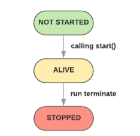

Threading
---

## Thread Objects

This class represents an activity that is run in a separate thread of control.

Once a thread object is created, its activity must be started with calling the thread's `start()` method. This invokes the `run()` method in a separate thread of control.





Once the thread's activity is started, the thread is considered **alive**. It stops being alive when its `run()` method terminates - either normally, or by raising an unhandled exception. The `is_alive()` method tests whether the thread is alive.

A thread has a name. The name can be passed to the constructor, and read or changed through the `name` attribute.


### Daemon Thread

A thread can be flagged as a **daemon thread**. The significance of this flag is that the entire Python program exits when only daemon threads are left.


### Main Thread

There is a special thread, **Main thread**, which corresponding to the initial thread of control in the Python program. It is not a daemon thread.


### Dummy Thread

There is the possibility that **dummy thread objects** are created. These are thread objects corresponding to **alien threads**, which are threads of control started outside the `threading` module, such as directly from C code. Dummy thread objects have limited functionality; they are always considered alive and daemonic, and cannot be `join()`ed. They are never deleted, since it is impossible to detect the termination of alien threads.


### How daemon works

1. `threading` module register a hook function `_shutdown`

A hook method CPython interpreter will use, to allow main thread waiting for all alive non-daemon threads terminated.

``` python
# Create the main thread object,
# and make it available for the interpreter
# (Py_Main) as threading._shutdown.

_shutdown = _MainThread()._exitfunc
```


``` python
def _exitfunc(self):
    self._Thread__stop()
    t = _pickSomeNonDaemonThread()
    if t:
        if __debug__:
            self._note("%s: waiting for other threads", self)
    while t:
        t.join()
        t = _pickSomeNonDaemonThread()
    if __debug__:
        self._note("%s: exiting", self)
    self._Thread__delete()
```

`Threading` module uses some global variables to maintain active threads

``` python
# Active thread administration
_active_limbo_lock = _allocate_lock()
_active = {}    # maps thread id to Thread object
_limbo = {}
```

In the following code, `enumerate` returns a list of all Thread objects currently alive. The list includes daemonic threads, dummy thread objects created by `current_thread()`, and the main thread. It excludes terminated threads and threads that have not yet been started.

``` python
def _pickSomeNonDaemonThread():
    for t in enumerate():
        if not t.daemon and t.is_alive():
            return t
    return None
```


2. During program exit, CPython interpreter will invoke `Py_Exit()` -> `Py_Finalize()` -> `wait_for_thread_shutdown`, which finally invoke `threading._shutdown` to wait all alive non-daemon threads complete.

``` c
/* Wait until threading._shutdown completes, provided
   the threading module was imported in the first place.
   The shutdown routine will wait until all non-daemon
   "threading" threads have completed. */

static void
wait_for_thread_shutdown(void)
{
#ifdef WITH_THREAD
    PyObject *result;
    PyThreadState *tstate = PyThreadState_GET();
    PyObject *threading = PyMapping_GetItemString(tstate->interp->modules,
                                                  "threading");
    if (threading == NULL) {
        /* threading not imported */
        PyErr_Clear();
        return;
    }
    result = PyObject_CallMethod(threading, "_shutdown", "");
    if (result == NULL)
        PyErr_WriteUnraisable(threading);
    else
        Py_DECREF(result);
    Py_DECREF(threading);
#endif
}
```

## Synchronization


### RLock

A reentrant lock must be released by the thread that acquired it. Once a thread has acquired a reentrant lock, the same thread may acquire it again without blocking; the thread must release it once for each time it has acquired it.


### Condition

A condition variable allows one or more threads to wait until they are notified by another thread.

The `wait` method releases the underlying lock, and then blocks until it is awakened by a `notify()` or `notifyAll()` call for the same condition variable in another thread, or until the optional timeout occurs. Once awakened or timed out, it re-acquires the lock and returns.


### Semaphore

Semaphores manage a counter representing the number of `release()` calls minus the number of `acquire()` calls, plus an initial value. The `acquire()` method blocks if necessary until it can return without making the counter negative. If not given, value defaults to 1.


### Event

An event manages a flag that can be set to true with the `set()` method and reset to false with the `clear()` method. The `wait()` method blocks until the flag is true.


### CountDownLatch

...


### CyclicBarrier

``` python
class CyclicBarrier(object):
    """
    A synchronization aid that allows a set of threads to all wait for each
     other to reach a common barrier point.

    Inspired by JUC.CyclicBarrier, no timeout support
    """

    def __init__(self, parties):
        self.parties = parties

        # number of parties still waiting, it is reset on each new generation
        self._n_wait = parties

        # Each use of the barrier is represented as a generation instance.
        # The generation changes whenever the barrier is tripped
        self._generation = object()

        self._lock = RLock()
        self._trip = Condition(self._lock)

    def await(self):
        """ Wait until all parties have invoked await on this barrier
        """
        gen = self._generation

        with self._lock:
            self._n_wait -= 1

            if self._n_wait == 0:
                self.next_generation()
                return

            while self._generation == gen:
                self._trip.wait()

    def next_generation(self):
        """ Updates state on barrier trip and wakes up everyone.
            Called only while holding lock
        """
        self._generation = object()
        self._n_wait = self.parties
        self._trip.notify_all()
```