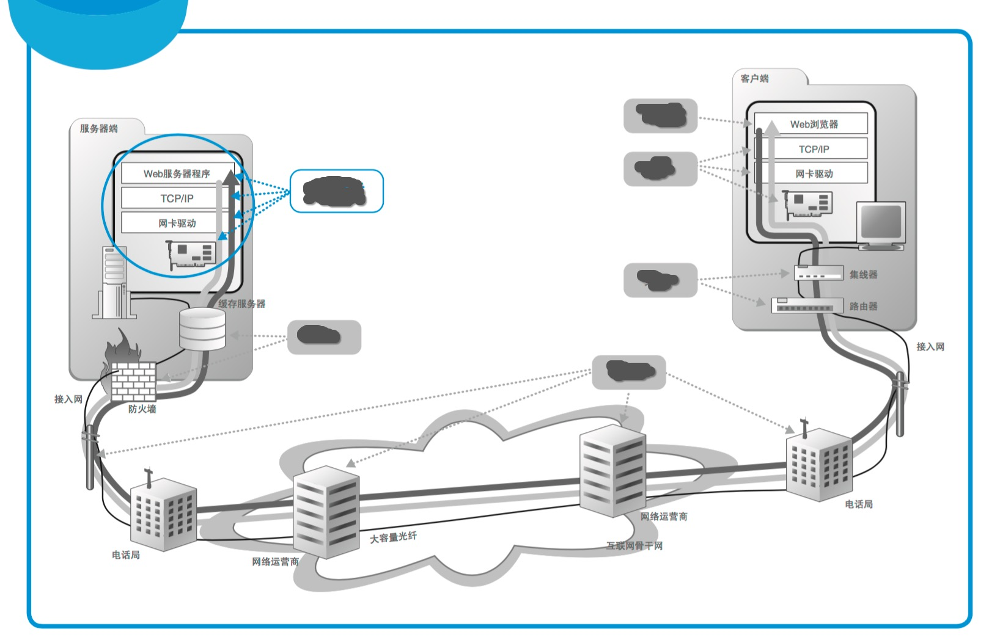
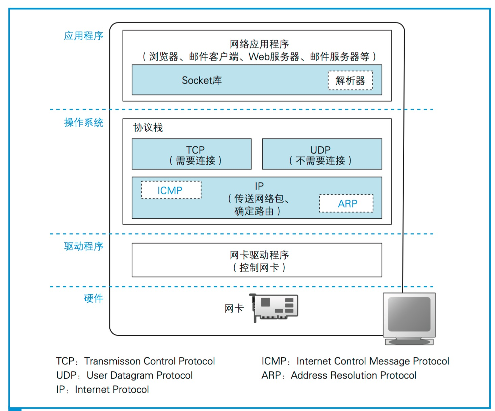

Computer Network
---

writing...

*来源 网络是怎样连接的*

## TCP/IP 协议族

*来源 网络是怎样连接的*

* [应用层 Application Layer](application_layer.md)

* [传输层 Transport Layer](transport_layer.md)

* [网络层 Network Layer](network_layer.md)

* [链路层 Link Layer](link_layer.md)

* [物理层 Physical Layer](physical_layer.md)

- - -

* [Network Programming](socket.md)

## Further Readings

Books

* 网络是怎样连接的 - 户根勤

    网络科普书, 适合网络入门

* Computer Network - A Top-Down Approach

    推荐入门学习, 中译本: 计算机网络 - 自顶向下方法

* Computer Network - Andrew S.Tanenbaum

    偏理论

* TCP/IP Illustrated

    中译本: TCP/IP 协议族详解

* [The TCP/IP Guide](http://www.tcpipguide.com)

* High Performance Browser Networking

- - -

* [IETF RFC](http://www.ietf.org/rfc/)

* [Nmap](https://nmap.org/book/tcpip-ref.html)
