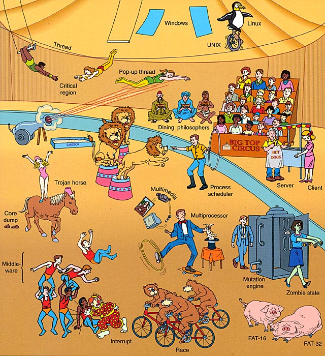
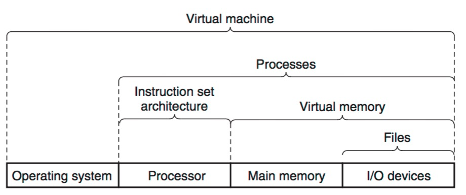

Operating System
---

*来源 Modern Operating System*

## Abstractions 抽象

**抽象**是计算机科学中最为重要的概念之一.

*来源 Computer System, Figure 1.18*

* [Process 进程](process.md)

    A process is the operating system’s abstraction for a running program.

* [Virtual Memory 虚拟内存](memory.md)

    Virtual memory is an abstraction that provides each process with the illusion that it has exclusive use of the main memory

    虚拟内存为每个进程提供了一个假象: 每个进程独占主存, 每个进程看到的内存是一致的; 的基本思路是把一个进程的虚拟内存存储在磁盘上, 然后用主存作为磁盘的高速缓存.

* [File 文件](file.md)

    文件是对 IO 设备的抽象

    A file is a sequence of bytes, nothing more and nothing less. Every I/O device, including disks, keyboards, displays, and even networks, is modeled as a file.

* [Virtual Machine 虚拟机]

    虚拟机

## Case Study

* [Unix](unix.md)

* [Linux](linux.md)

* [Windows](windows.md)

## Further Readings

Books

* Modern Operating System  现代操作系统

* Computer System - A programmer's perspective

- - -

Lectures

* Hints for Computer System Design

* On Building Systems that Will Fail

* End-to-End Arguments in System Designs
