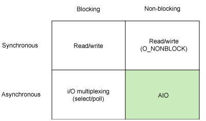

writing...

## Process

The [`fork`](http://man7.org/linux/man-pages/man2/fork.2.html) function runs the same program in a new child process that is a duplicate of the parent.

The child process and the parent process run in separate memory spaces.

The `execve` function loads and runs a new program in the context of the current process. While it overwrites the address space of the current process, it does not create a new process. The new program still has the same PID, and it inherits all of the file descriptors that were open at the time of the call to the `execve` function.

### PID 1

On every Unix system there is one process with the special process identifier 1. It is started by the kernel before all other processes and is the parent process for all those other processes that have nobody else to be child of.

### [Signal](http://man7.org/linux/man-pages/man7/signal.7.html)
...

One of the primary reasons for signals’ derogation is that it is hard to write a proper signal handler that is safe from reentrancy concerns.

## IO Model

## CGroup

Linux Control Group

* Resource Limitation

* Prioritization

* Accounting

* Control

## Namespace
...

Further Reading
---

* Linux System Programming

* Linux Kernel Development

* Understanding the Linux Kernel

- - -

* [Linux Man Page](https://linux.die.net/man/)

* [Linux Source Code](https://github.com/torvalds/linux)

- - -

* [Robert Love on Quora](https://www.quora.com/profile/Robert-Love-1)

* [IBM developerWorks 学习 Linux, 101](https://www.ibm.com/developerworks/cn/linux/l-lpic1-map/)

- - -

* [Rethinking PID 1](http://0pointer.de/blog/projects/systemd.html)
